# PetNido

> ペットオーナーと地域のケア提供者をつなぐ、CtoC ペットケア・マッチングプラットフォーム。

[English](README.md) | [简体中文](README.zh-CN.md) | 日本語

[公開サイト](https://www.petnido.net)

## 概要

PetNido は、個人向けのペットケア依頼・サービスのマッチングプラットフォームです。ペットを飼っている人と、ペットケアを提供したい人を対象とし、1つのアカウントを依頼者とケア提供者の両方として利用できます。

ペットケアに必要な情報を、ケアの種類、ペット、日付、作業、場所、予算などの構造化された項目に分けて扱います。地域、ケアの種類、ペットの種類、ケアの日付で絞り込めます。再利用できるペットプロフィール、自動保存・復元できる下書き、地図で選ぶおおよその場所によって、同じ情報を何度も入力する手間を減らします。依頼を公開する際には、ペット、場所、通貨単位のスナップショットを保存するため、後からプロフィールを変更しても過去の記録は書き換わりません。

現在のバージョンは、主に次の4つの利用導線をカバーしています。

1. ログインと初回案内
2. ケア依頼の公開
3. 公開中のケア依頼を探す
4. マイページの管理

一部の画面やメニューは用意されていますが、サービス管理、通知、マッチング、その他の関連機能は開発中です。

## PetNido を開発した理由

PetNido は、飼い主が自分で世話をできないときに、ペットに合ったケア方法を探す難しさから生まれました。

ペットの種類、性格、健康状態、外出する期間、予算などによっては、従来のペットホテルが合わないことがあります。犬や猫を中心とする施設も多く、費用や環境が一部のペットに余計な負担をかける場合があります。そのため、飼い主が一般的なSNSで個人のケア提供者を直接探すことも少なくありません。

しかし、SNSはペットケアのマッチング専用サービスではありません。ケア提供者を探す投稿には、実際のケア能力とは関係のない返信や、誤った前提に基づく返信が大量に届くことがあります。たとえば、「子どもの頃にうさぎを飼っていたので世話できます。にんじんと白菜をたくさんあげれば大丈夫です」といった内容です。飼い主は、多くのメッセージを読み比べながら、相手がその動物の食事、行動、健康上の注意点を本当に理解しているかを判断しなければなりません。これは大きな負担になり、不適切なケアにつながるリスクもあります。

また、SNSの公開投稿に書かれるのは、ケアの日時、場所、ペットの種類だけになりがちです。ペットの詳しい情報、性格、普段の生活、健康上の注意点、具体的な作業内容は、その後の個別メッセージで共有されます。新しい候補者と話すたびに同じ説明や資料の送付を繰り返す必要があり、時間がかかるだけでなく、重要な内容を伝え漏らしやすくなります。

PetNido は、ペットケアに特化したマッチングプラットフォームを目指しています。ケア提供者は、自分の経験、提供できるサービス、対応できる条件を構造化して事前に公開できます。飼い主は、再利用できるペットプロフィールと詳しいケア依頼を1か所で準備できます。会話を始める前に、ペットの状況、必要な作業、サービス内容に関する情報を双方で確認できるため、候補を比較しやすくなり、やり取りの負担も減らせます。

## プロダクト方針

PetNido は、SNSに散在するペットケアの依頼やサービス情報を、3つの代表的なケア場面として整理しています。依頼やサービスを公開するときは、まずケア場面を選択します。その後、ステップ形式のフォームがペット、ケアの日時、具体的な作業、おおよその場所、予算の入力を案内し、内容を確認できる構造化されたケア記録を作成します。

- **訪問ケア**：飼い主の自宅で、食事、水の交換、散歩、掃除、見守り、投薬などの日常的なケアを行います。外出期間が比較的短い場合、訪問の合間にペットだけで過ごせる場合、または慣れた環境の方が落ち着くペットに適しています。

- **ペット預かり**：ケア提供者の自宅で1泊以上預かり、ペットの数が比較的少ない家庭的な環境でケアします。外出期間が長い場合、長時間ひとりで過ごすことが難しいペット、または日々の状態をこまめに確認する必要があるペットに適しています。

- **カスタムケア**：送迎、通院の付き添い、グルーミング、爪切り、ケージ清掃など、訪問ケアやペット預かりには当てはまらない個別の作業に対応します。

プロダクトでは、次の5つの原則を重視しています。

- 1つのアカウントを、ペットオーナーとケア提供者の両方の役割で利用できる。
- 依頼、ペットプロフィール、保存したおおよその場所を、次回以降の投稿で再利用できる。
- 依頼やサービスを公開するときは、該当するステップに進むとプロフィールの初期値が自動的に読み込まれ、その内容を変更することもできる。
- 公開時にペット、場所、通貨単位のスナップショットを保存し、後からプロフィールを編集しても過去の業務記録を書き換えない。
- 公開画面では、マッチングを補助するためにおおよその場所だけを検索または地図上で選択するよう案内し、番地、建物名、部屋番号などの正確な自宅住所は入力できない。

この構造化されたステップ形式のフローは、現在は主にケア依頼の公開に使われており、サービス公開のフローは引き続き整備中です。

## 現在の開発状況

下表の「デモ可能」は、現在の正式なプロダクト画面から一連のユーザー導線として操作できることを意味します。

| 領域 | 状況 | 現在利用できる内容 |
| --- | --- | --- |
| アカウントとログイン | ✅ デモ可能 | メールアカウント、Google / LINE のログイン入口、初回・継続利用時の分岐 |
| ケア依頼の公開 | ✅ デモ可能 | 訪問、預かり、カスタムの3モード、ステップ入力、下書き、プレビュー、公開 |
| 公開依頼マーケット | ✅ デモ可能 | 公開一覧と詳細、絞り込み、地図表示、公開状態と期限切れルール |
| マイページ | 🟡 画面と一部の機能 | 依頼、サービス、下書き、お気に入り、プロフィール、設定のメニューを提供（一部操作は開発中） |
| サービス公開とサービス市場 | 🚧 開発中 | サービスプロフィール、サービスフォーム、市場の導線は未接続 |
| 相談、応募、予約、チャット | 🚧 開発中 | 画面と業務フローを統合中 |
| マッチング、サイト内通知、メール | 🚧 開発中 | 完成したユーザー導線としては未提供 |
| SNS共有 | 🗓️ 次の段階 | 依頼やサービスの公開範囲を広げるために計画中 |

## 画面と機能の案内

以下では、利用者のタスクごとに画面を整理しています。各セクションでは、そのページの役割と代表的な画面を紹介します。

### 1. ホーム

ホームは PetNido の主な入口であり、プロダクトの考え方を紹介するページです。1つのアカウントを依頼者とケア提供者の両方として利用できること、訪問ケア、ペット預かり、カスタムケアの3つの場面と適したケースを説明します。

訪問者はホームから公開依頼の閲覧、ケア依頼の作成、ログインを開始できます。ログイン後はマイページで、個人プロフィール、ペットプロフィール、関連するメニューを確認できます。マイページの一部機能は開発中です。現在の範囲は[現在の開発状況](#現在の開発状況)を参照してください。

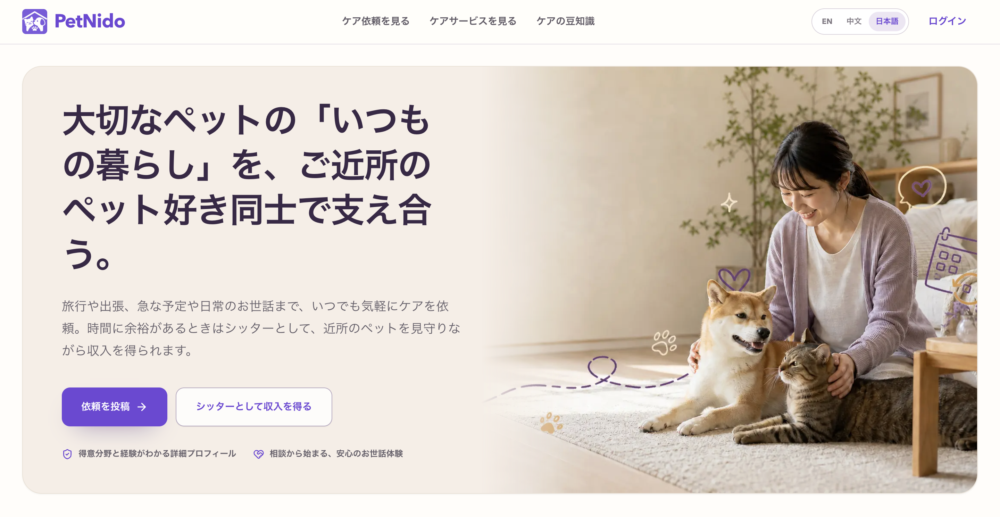
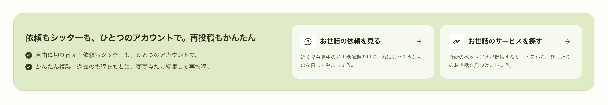
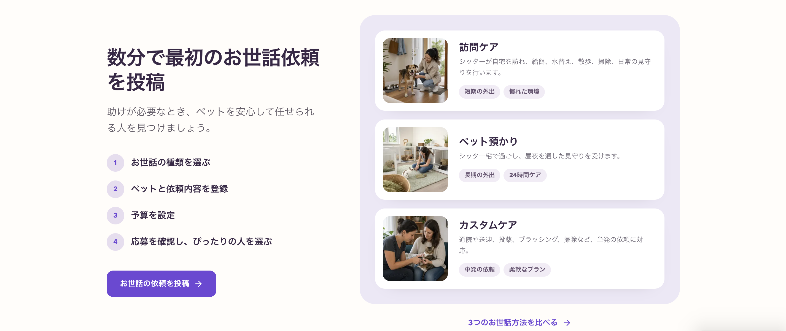

### 2. ログインとアカウント連携

PetNido は、メールアドレスとパスワード、Google、LINE の3つのログイン方法に対応しています。1つの PetNido アカウントに複数のログイン方法を連携できます。

- **メールアドレスとパスワード**：新規ユーザーはメールアドレスを確認してアカウントを登録します。パスワードを設定すると、メールアドレスとパスワードでログインできます。
- **Google**：Google から返された確認済みメールアドレスを使用します。そのメールアドレスに PetNido アカウントがなければ、新しいアカウントを作成します。既存のアカウントがある場合は、メール認証コードで Google 連携を確認するフローに進みます。確認後は、Google がそのアカウントのログイン方法の1つになります。
- **LINE**：初めて LINE でログインするとき、既存アカウントと自動的に統合されることはありません。PetNido アカウントをすでに持っているかを確認します。
  - 既存アカウントがある場合：元のアカウントのメールアドレスを入力し、認証コードを確認して LINE を連携します。
  - アカウントがない場合：新しい PetNido アカウントを作成します。

連携後は、LINE を同じアカウントのログイン方法として利用できます。新しく作成したアカウントでは、初回ログイン後にプロフィール設定と次の操作の選択へ進みます。設定済みのユーザーは目的のページへ直接移動します。メールアドレスとパスワードを設定・確認すると、同じアカウントにメールアドレスとパスワード、Google、または連携済みの LINE でログインできます。

#### メールアドレスとパスワードでログイン

| ログイン方法を選択 | メールアドレスを入力 | 新しいメールアドレスで登録 | 認証コードを入力 |
| --- | --- | --- | --- |
| 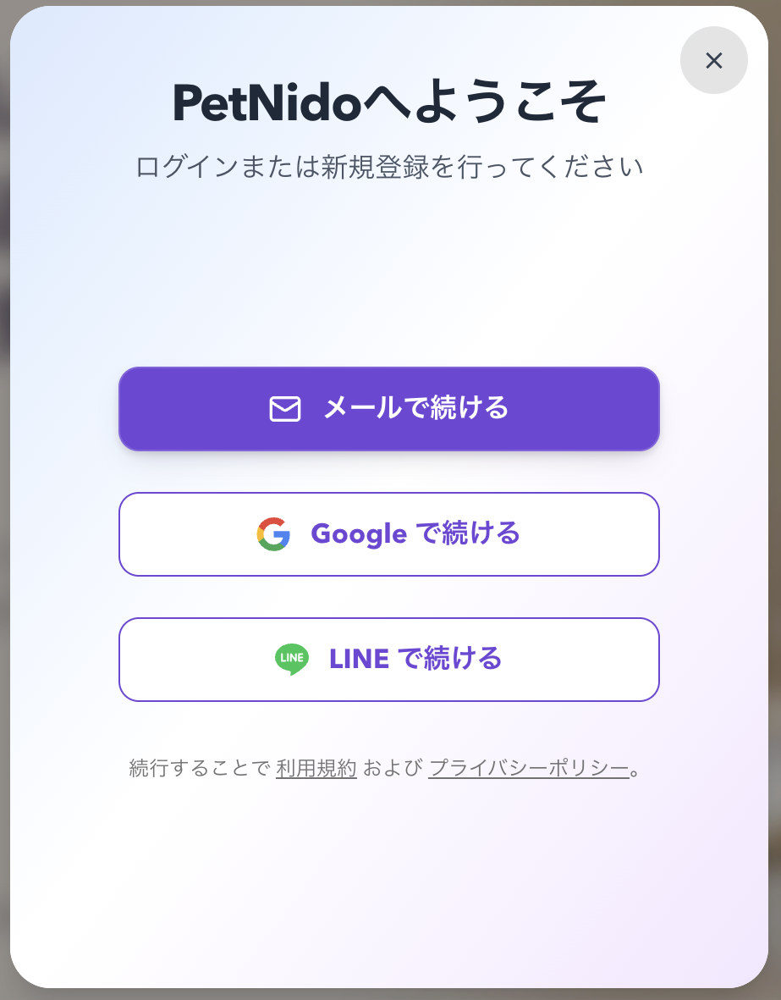 | 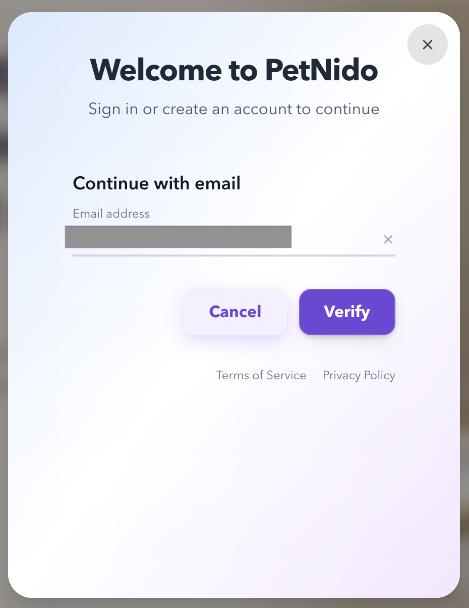 | 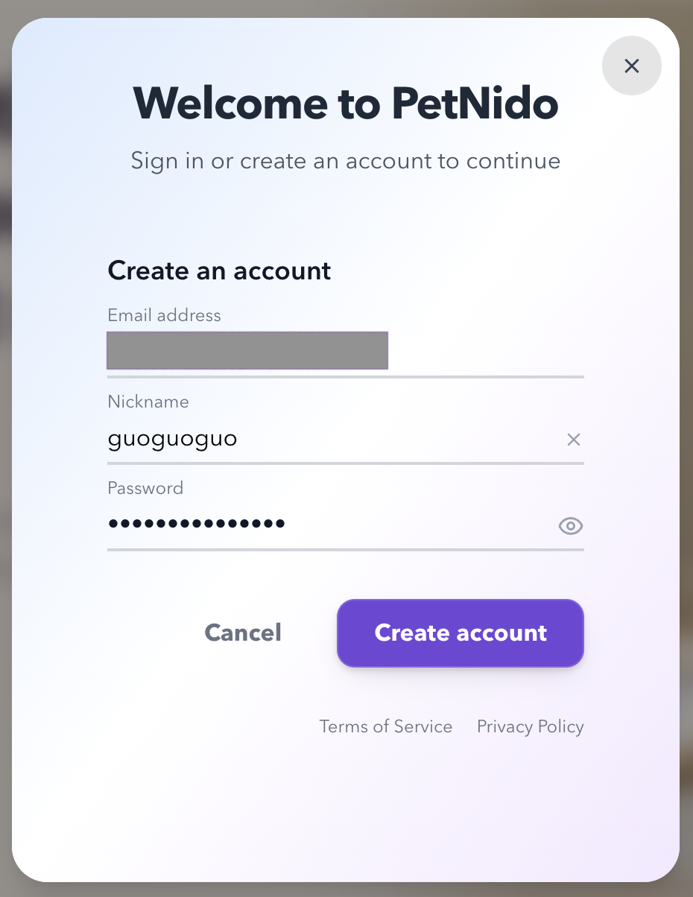 | 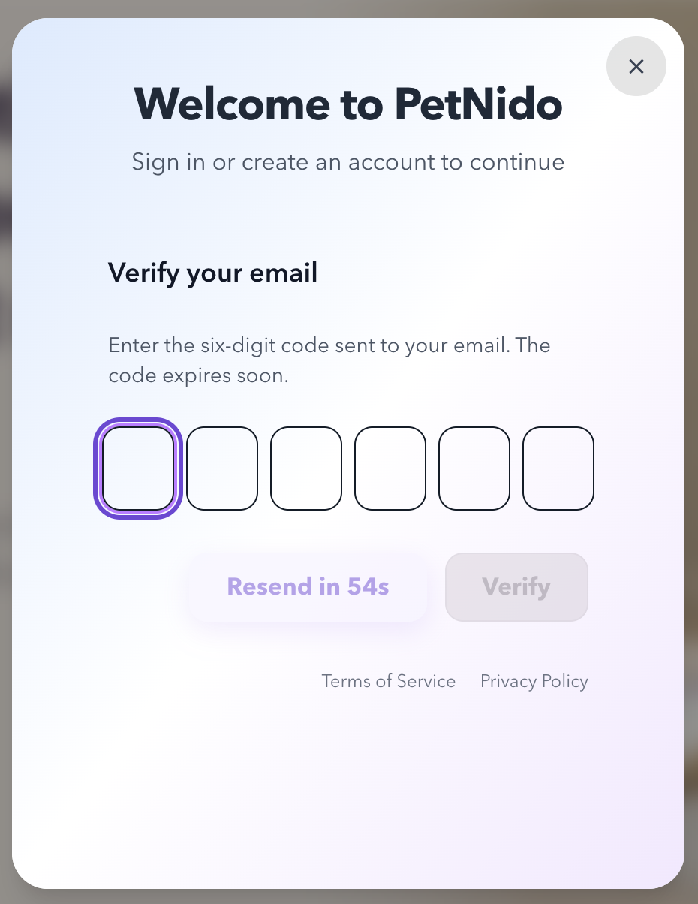 |

#### 初回プロフィール設定と利用目的の選択

| ニックネームとプロフィール画像を設定 | 次の操作を選択 |
| --- | --- |
| 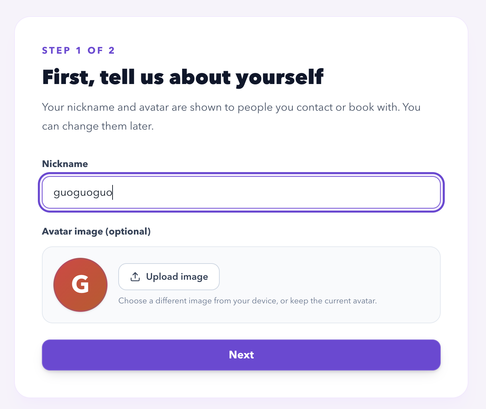 | 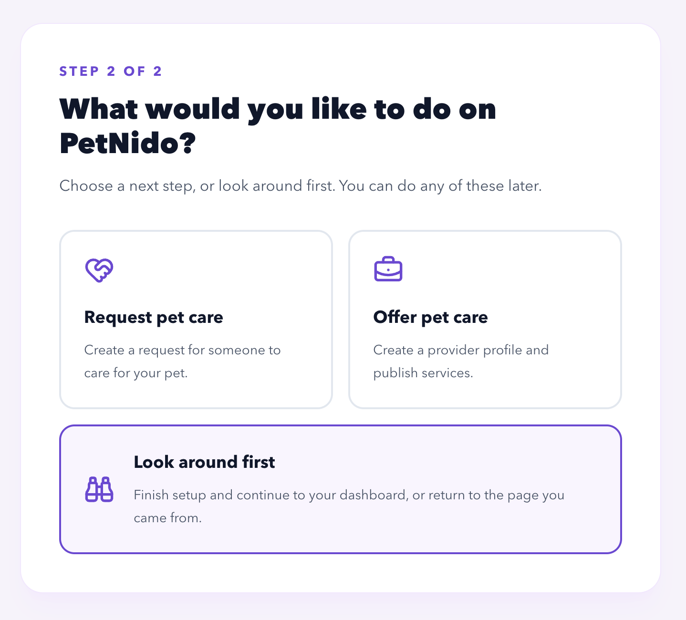 |

### 3. ケア依頼を公開する

PetNido は、SNSで繰り返し見られるペットケアの依頼を、訪問ケア、ペット預かり、カスタムケアの3つのモードに整理しています。

利用者はまずケアモードを選択します。その後、選択したモードに応じたステップ形式のフォームが表示されます。情報を順番に入力し、プレビュー画面で内容全体を確認できます。修正が必要な場合は該当ステップに戻って編集し、最終内容を確認してから公開します。

| ケアモード | 主な入力ステップ |
| --- | --- |
| 訪問ケア | ペット、日付と訪問スケジュール、ケア作業、おおよその場所、予算 |
| ペット預かり | ペット、預かり日程、ケア作業、持ち物、家庭環境との相性、おおよその場所、対応可能な距離と送迎方法、予算 |
| カスタムケア | ペット、日付、ケア作業、要望と注意事項、おおよその場所、予算 |

フォームの内容は変更後に自動保存されます。ログイン前は、下書きが現在のブラウザに保存されます。ログイン後はローカル保存に加えてサーバーにも同期され、後から復元できます。該当するステップに進むと、保存済みのペット、よく使う場所、通貨の初期値が読み込まれますが、内容は変更できます。

以下は訪問ケアの例です。

| ケアモードを選択 | 確認して公開 |
| --- | --- |
| 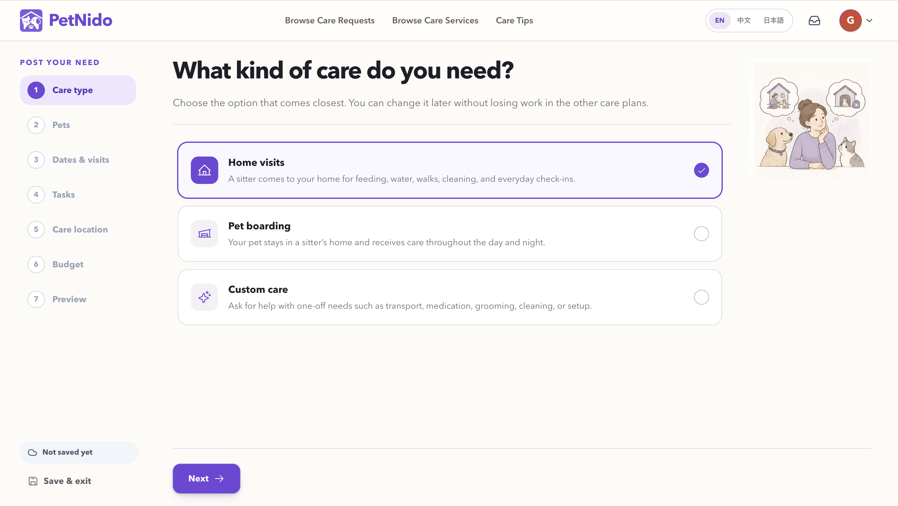 | 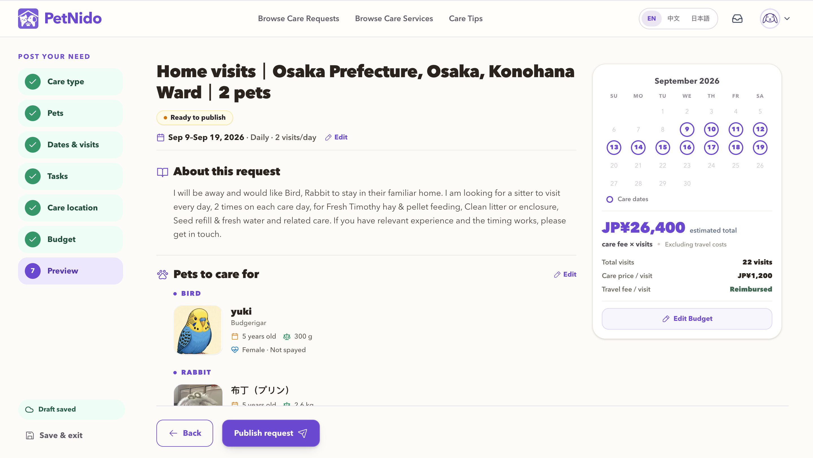 |

### 4. 公開中のケア依頼を探す

公開依頼マーケットは訪問者にも開放されており、公開中かつ期限切れでない依頼だけを表示します。地域、ケアモード、ペットの種類、日付の範囲で絞り込めます。

地域を選択すると、その地点を中心とした半径 25 km 以内を初期範囲として検索します。右側の地図には、現在の検索範囲が円で表示され、条件に合う依頼の分布を確認できます。検索範囲は変更することもできます。

依頼カードを開くと、ケアモード、ペット、日付、作業、おおよその場所、予算など、公開用に整理された依頼の詳細を確認できます。ログインユーザーは依頼をお気に入りに保存し、後からマイページで確認できます。未ログインの訪問者がお気に入りボタンを押すと、先にログイン画面が開きます。

| 公開依頼一覧 | 依頼詳細 |
| --- | --- |
| 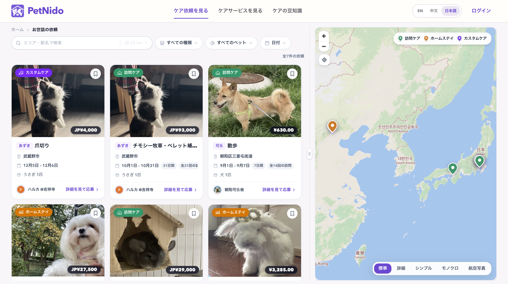 | 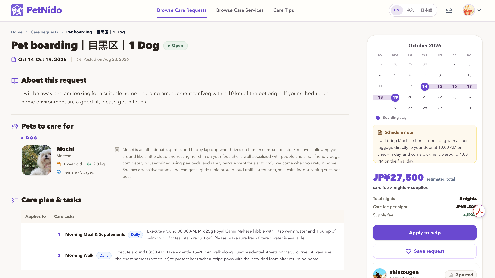 |

### 5. マイページを管理する

マイページには、アクティビティの概要、依頼、サービス、依頼とサービスの下書き、依頼とサービスのお気に入り、個人プロフィール、ペットプロフィール、アカウント設定へのメニューがあります。

一部のメニューは対応する機能が開発中です。メニューが表示されていても、関連する業務フローがすべて完成しているとは限りません。

マイページの概要は、アカウントの状態に応じて内容が変わります。

- 依頼やサービスなどのデータがまだない場合は、個人プロフィールの完成、ペットプロフィールの追加、PetNido の使い方の選択を案内します。
- 依頼やサービスなどのデータがある場合は、対応が必要な項目、最近のアクティビティ、次にできることを表示します。

現在、次の機能を利用またはデモできます。

- 個人プロフィールとペットプロフィールの管理
- 公開済み依頼の一覧と状態による絞り込み
- 公開済み依頼の編集、削除（アーカイブ）、終了、再公開
- 既存の依頼を再利用した新しい依頼の作成
- 依頼下書きの再編集と削除
- 更新日時、完成度、ケアの種類による依頼下書きの並べ替え
- 依頼のお気に入り登録と、マイページでの保存済み依頼の確認
- アカウントのログイン方法の設定と管理

サービス管理、サービスのお気に入り、通知、応募、予約、チャット、その他の関連する業務操作は開発中です。

| 個人プロフィール | ペットプロフィール | 公開済み依頼 | アカウント設定 |
| --- | --- | --- | --- |
| 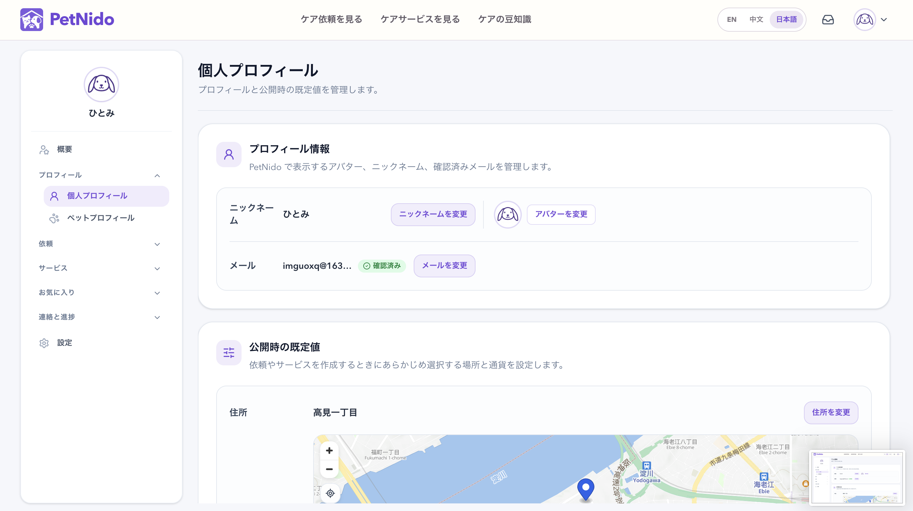 | 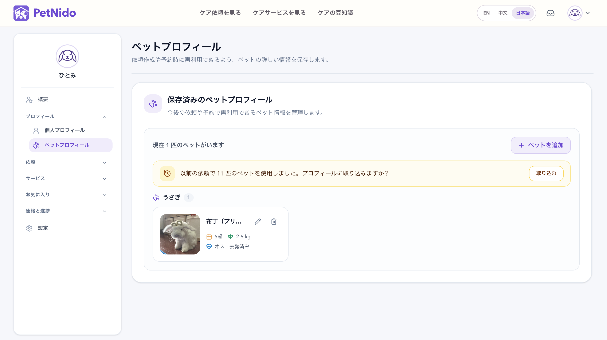 | 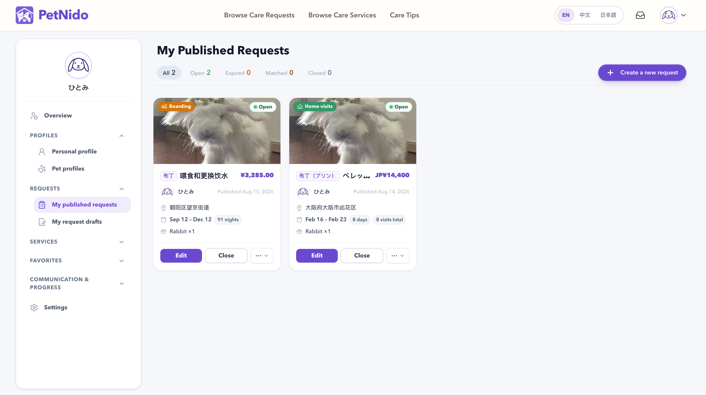 | 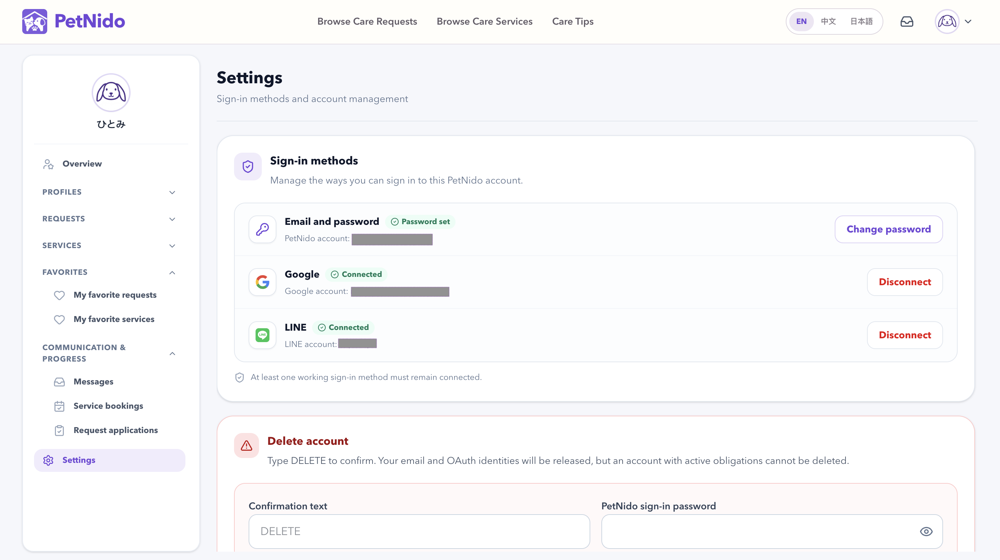 |

### 6. ケアタイプの紹介ページ

ホームから、3種類のケアタイプの紹介ページに進めます。依頼やサービスを公開する前に、それぞれのサービス範囲、適した利用場面、注意点を確認し、自分の状況に合ったケアの種類を選べます。

各ケアタイプのページでは、次の内容を紹介します。

- そのケアタイプに適した状況
- 典型的な利用場面
- 構造化されたケア依頼の例
- このタイプの依頼を公開する前に準備しておく3つのこと
- このタイプのサービスを提供する際に守る3つの指針
- 合わない場合に、ほかの2種類を確認するための案内
- 依頼やサービスの公開ページへの入口

ケア場面の説明と後続の入力フォームをつなぐことで、利用者がステップ入力を始める前に適切なイメージを持てるようにしています。

以下は訪問ケアの紹介ページです。

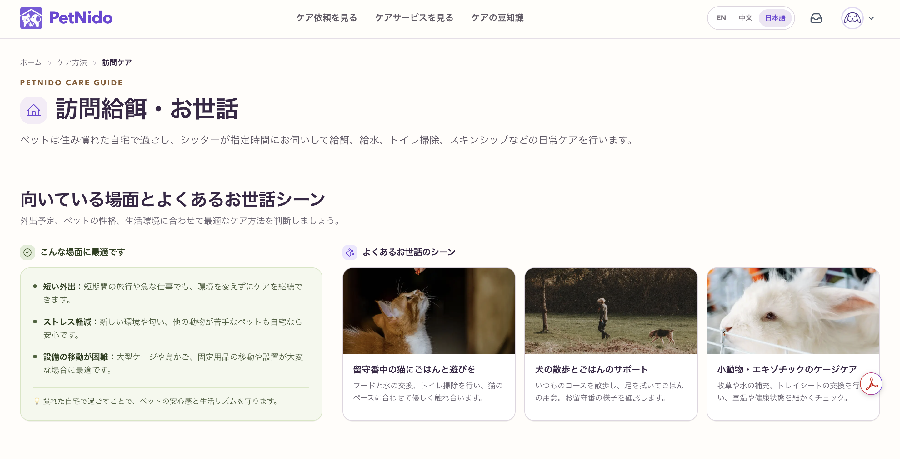
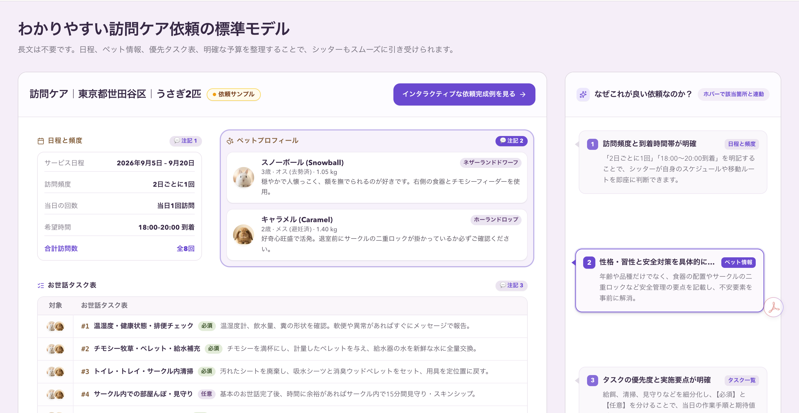
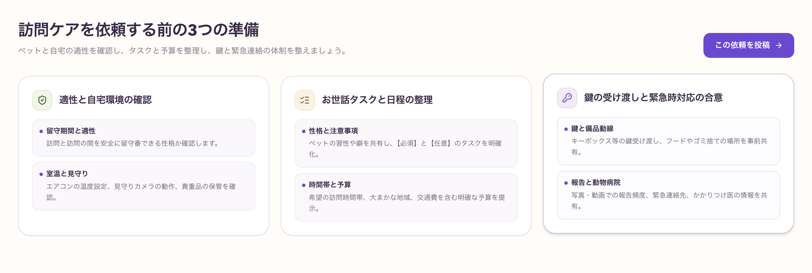
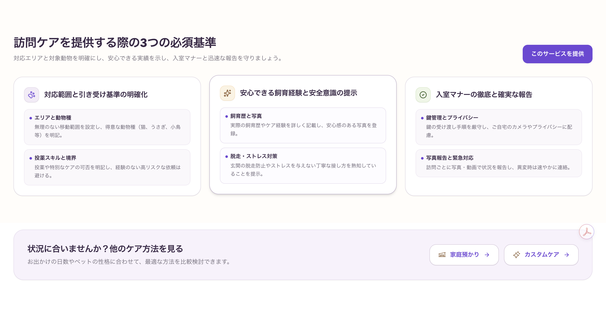

## 技術スタック

| レイヤー | 技術 |
| --- | --- |
| Web | Next.js 14.2、React 18、App Router |
| 開発言語 | TypeScript 5.4 |
| API・サーバー状態 | tRPC 10、TanStack Query |
| データベース | PostgreSQL、Prisma 5.14 |
| 認証 | NextAuth 5 Beta、メールアカウント、Google / LINE OAuth |
| フォーム・バリデーション | React Hook Form、Zod |
| クライアント状態 | Zustand |
| UI | Tailwind CSS 4、Radix UI、Lucide React |
| 地図・地理インタラクション | MapLibre GL JS、MapTiler |
| ジオコーディング・位置検索 | Nominatim / OpenStreetMap |
| 画像ストレージ | Cloudinary |
| テスト | Vitest、Playwright、Storybook |

## 公開サイト

現在の本番サイトは [https://www.petnido.net](https://www.petnido.net) で公開しています。

## 開発者

**Guo Hongqiong（郭紅瓊）**

プロダクト分析、インタラクションデザイン、フルスタック実装、テスト、デプロイまで経験のあるデジタルプロダクト開発者です。

- [GitHub](https://github.com/RedJone888)
- Email: redjoan.guo@gmail.com
- [GuoHongqiong](https://guohongqiong.vercel.app/)

---

PetNido — どんなペットの日常にも、近くのコミュニティから心のこもったケアを。
