# PetNido

> A C2C pet-care matching platform for pet owners and local caregivers.

English | [简体中文](README.zh-CN.md) | [日本語](README.ja.md)

[Live site](https://www.petnido.net)

## Project Overview

PetNido is a pet-care request and service matching platform for individual users. It is designed for pet owners and people who want to provide pet-care services, with one account usable both to request care and to provide it.

The platform breaks pet-care information into structured fields such as care type, pet, dates, tasks, location, and budget. Users can filter by area, care type, pet type, and care dates. Reusable pet profiles, autosaved drafts that can be resumed later, and approximate map locations reduce repeated data entry. When a request is published, snapshots of the pet, location, and currency unit preserve the historical record even if the user's profile changes later.

The current version primarily covers four user paths:

1. Sign-in and first-time onboarding
2. Publishing a care request
3. Browsing public care requests
4. Managing the personal dashboard

Some pages and menu entries are already in place, but service management, notifications, matching, and other related workflows are still being developed.

## Why PetNido

PetNido grew out of a practical difficulty: finding a suitable way to care for a pet when the owner cannot do it themselves.

Depending on the pet's type, temperament, and health, as well as the length of the trip and the budget, a conventional pet hotel may not be a good fit. Some facilities focus mainly on dogs and cats, and their cost or environment can place additional stress on certain pets. Owners therefore often turn to general-purpose social platforms to look for individual caregivers.

But social platforms are not designed for pet-care matching. A post looking for a caregiver may attract many replies that say little about a person's actual care skills, or that reflect unsafe assumptions. For example: “I kept rabbits when I was young, so I can look after yours. Just give it plenty of carrots and cabbage.” The owner must sort through a large number of messages to judge whether each person understands the animal's diet, behaviour, and health needs. This takes time and can expose the pet to the risk of inappropriate care.

Public social-media posts also tend to include only the care dates, location, and type of pet. Detailed information about the pet, its temperament, routines, health considerations, and specific tasks is usually shared later in private messages. Every new conversation requires the owner to explain or forward the same information again, which is time-consuming and makes important details easier to miss.

PetNido aims to be a dedicated pet-care matching platform. Caregivers can publish structured service information in advance, including their experience, available services, and suitable conditions. Owners can prepare reusable pet profiles and complete care requests in one place. Before starting a conversation, both sides can review information relevant to the pet, the care tasks, and the caregiver's offering, making it easier to compare options and reduce communication overhead.

## Product Approach

PetNido distils the scattered pet-care requests and service information found on social platforms into three common, structured care scenarios. When publishing a request or service, users select a scenario first. A step-by-step form then guides them through the pet, care dates and times, tasks, approximate location, and budget to produce a complete, clear record that can be reviewed before publishing.

- **Home visits**: Feeding, changing water, walking, cleaning, companionship, medication, and other daily tasks are carried out at the owner's home. This is suitable when the owner will be away for a relatively short time, the pet can stay alone between visits, or the pet is more comfortable in familiar surroundings.

- **Pet boarding**: The pet stays at the caregiver's home for one or more nights, in a household environment with a relatively small number of pets. This is suitable for longer trips, pets that should not be left alone for long periods, or pets that need close day-to-day observation.

- **Custom care**: Transport, accompanied veterinary visits, grooming, nail trimming, enclosure cleaning, and other personalised tasks that do not fit the home-visit or boarding scenarios.

The product follows five core principles:

- One account can be used in both the pet-owner and caregiver roles.
- Requests, pet profiles, and saved approximate locations can be reused in future requests or services to reduce repeated entry.
- When publishing a request or service, profile defaults are loaded automatically when the user reaches the relevant step, and can still be edited.
- At publication time, the pet, location, and currency unit are saved as snapshots, so later profile changes do not rewrite historical business records.
- Publishing pages guide users to search for or select an easily recognizable location on the map as a service reference point, making it easy for caregivers to intuitively assess the service area.

This structured guided flow is currently used mainly for care-request publishing; the service-publishing workflow is still being completed.

## Current Status

“Demo ready” means that the capability is available through the current official product pages as a connected user flow.

| Area | Status | Current capability |
| --- | --- | --- |
| Account and sign-in | ✅ Demo ready | Email account flow, Google / LINE sign-in entry points, and first-time versus returning-user routing |
| Care-request publishing | ✅ Demo ready | Home-visit, boarding, and custom modes; guided steps, drafts, preview, and publishing |
| Public care-request marketplace | ✅ Demo ready | Public lists and details, filters, map display, visibility status, and expiry rules |
| Personal dashboard | 🟡 Pages and partial flows | Request, service, draft, favorite, profile, and settings menus are available; some operations are still under development |
| Service publishing and marketplace | 🚧 In development | Service profiles, service forms, and the marketplace are not fully connected |
| Consultation, applications, bookings, and chat | 🚧 In development | Pages and business workflows are still being integrated |
| Matching, in-app notifications, and email | 🚧 In development | Not yet available as complete user flows |
| Social-media sharing | 🗓️ Next stage | Planned to broaden the reach of requests and services |

## Product Walkthrough

The sections below are organised around user tasks. Each section explains the role of the page and shows representative screens.

### 1. Home

The home page is PetNido's main entry point and an introduction to the product. It explains that one account can be used both to publish care requests and to provide care, and compares the three care scenarios and their typical use cases.

Visitors can browse public requests, start publishing a care request, or enter the sign-in flow from the home page. After signing in, users can open the personal dashboard to view their profile, pet profiles, and related menus. Some dashboard functions are still under development; see [Current Status](#current-status) for the current scope.

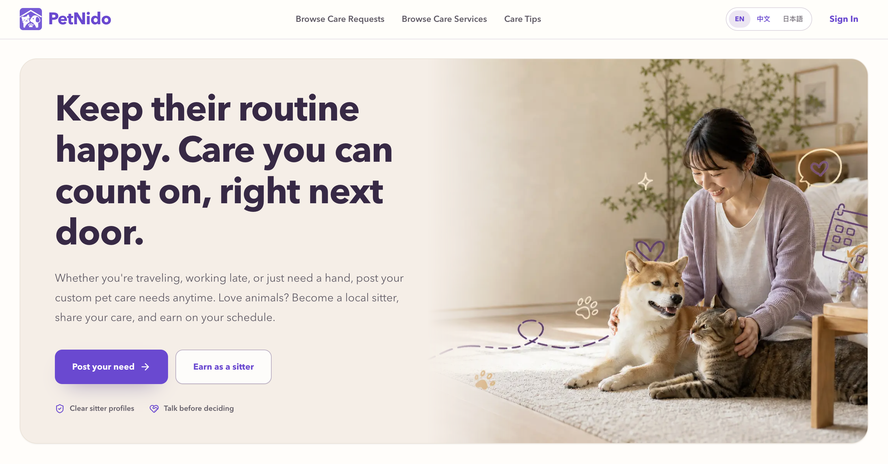
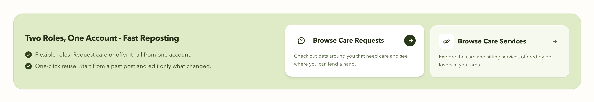
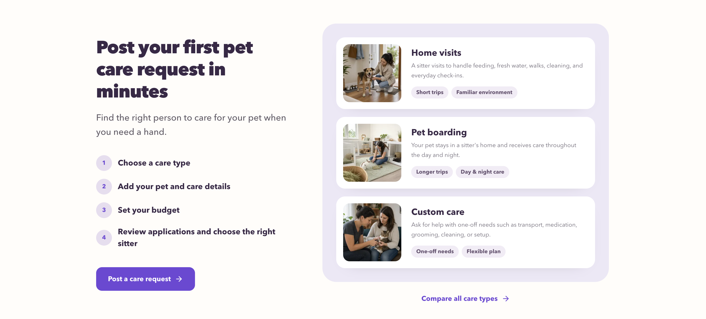

### 2. Sign-in and account linking

PetNido supports three sign-in methods: email and password, Google, and LINE. A single PetNido account can have multiple sign-in methods linked to it.

- **Email and password**: New users verify their email address and register an account. After setting a password, they can sign in with their email and password.
- **Google**: PetNido uses the verified email address returned by Google. If the email is not associated with a PetNido account, a new account is created. If an account already exists, the user enters an email-code confirmation flow to link Google. Once confirmed, Google becomes another sign-in method for that account.
- **LINE**: The first LINE sign-in does not merge accounts automatically. Users are first asked whether they already have a PetNido account.
  - Existing account: enter the original account email and complete code verification to link LINE.
  - No existing account: create a new PetNido account.

After linking, LINE can be used to sign in to the same account. A newly created account continues to profile setup and a choice of next steps after its first sign-in; users who have already completed setup go directly to the intended page. Once an email and password have been set up and the email has been verified, the same account can be accessed with email and password, Google, or the linked LINE account.

#### Email-and-password sign-in

| Choose a sign-in method | Enter an email address | New email: registration | Enter the verification code |
| --- | --- | --- | --- |
| 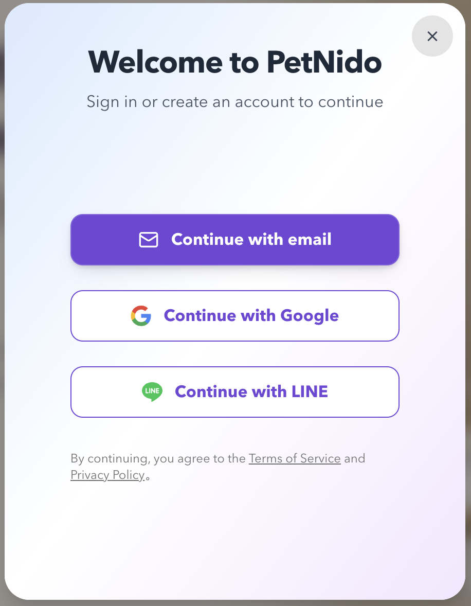 |  |  |  |

#### First-time profile setup and intent selection

| Set a display name and avatar | Choose what to do next |
| --- | --- |
|  |  |

### 3. Publish a care request

PetNido organises recurring pet-care requests seen on social platforms into three modes: home visits, pet boarding, and custom care.

Users choose a care mode first. The form then presents the steps for that mode. Users can enter the information step by step, review the complete request on the preview page, return to any step to edit it, and publish only after confirming the final content.

| Care mode | Main steps |
| --- | --- |
| Home visits | Pet, dates and visit schedule, care tasks, approximate location, budget |
| Pet boarding | Pet, boarding dates, care tasks, supplies, household fit, approximate location, acceptable distance and handover arrangements, budget |
| Custom care | Pet, dates, care tasks, requirements and notes, approximate location, budget |

Form data is saved automatically after changes. For signed-out users, drafts are stored in the current browser. After sign-in, the local draft is also synced to the server so it can be recovered later. When users reach a relevant step, the form loads saved pets, common locations, and currency defaults while still allowing edits.

The following screenshots show the home-visit flow:

| Choose a care mode | Review and publish |
| --- | --- |
|  |  |

### 4. Browse public care requests

The public care-request marketplace is open to visitors and lists only requests that are public and not expired. Visitors can filter by area, care mode, pet type, and date range.

After an area is selected, the system searches within a default radius of 25 km from that point. The map on the right shows the current search radius as a circle and displays the distribution of matching requests. Users can also adjust the search radius.

Opening a request card shows structured public details, including the care mode, pet, dates, tasks, approximate location, and budget. Signed-in users can save requests to their favorites and view them again from the personal dashboard. If a signed-out visitor clicks the favorite button, the sign-in flow opens first.

| Public request list | Request details |
| --- | --- |
| 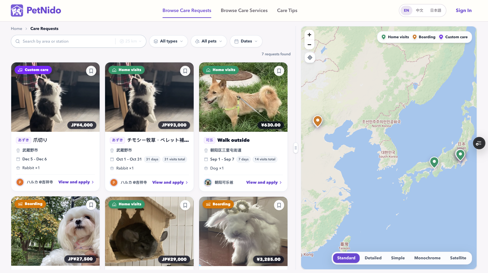 |  |

### 5. Manage the personal dashboard

The personal dashboard provides menu entries for the activity overview, my requests, my services, request and service drafts, request and service favorites, personal profile, pet profiles, and account settings.

Some of these menu entries are still under development. A visible menu entry does not mean that every related workflow is complete.

The dashboard overview changes with the account's current state:

- When the account has no activity data yet, it shows guidance for completing the personal profile, adding pet profiles, and choosing how to use PetNido.
- When the account has activity data, it shows relevant items that need attention, recent activity, and suggested next steps.

Completed or demonstrable capabilities currently include:

- Managing personal and pet profiles;
- Viewing published requests and filtering them by status;
- Editing, deleting (archiving), closing, and reopening published requests;
- Reusing an existing request to create a new one;
- Resuming or deleting request drafts;
- Sorting request drafts by last updated time, completion, and care type;
- Saving requests to favorites and viewing saved requests in the dashboard;
- Configuring and managing account sign-in methods.

Service management, service favorites, notifications, applications, bookings, chat, and other related business operations are still in development.

| Personal profile | Pet profile | Published request | Account settings |
| --- | --- | --- | --- |
| 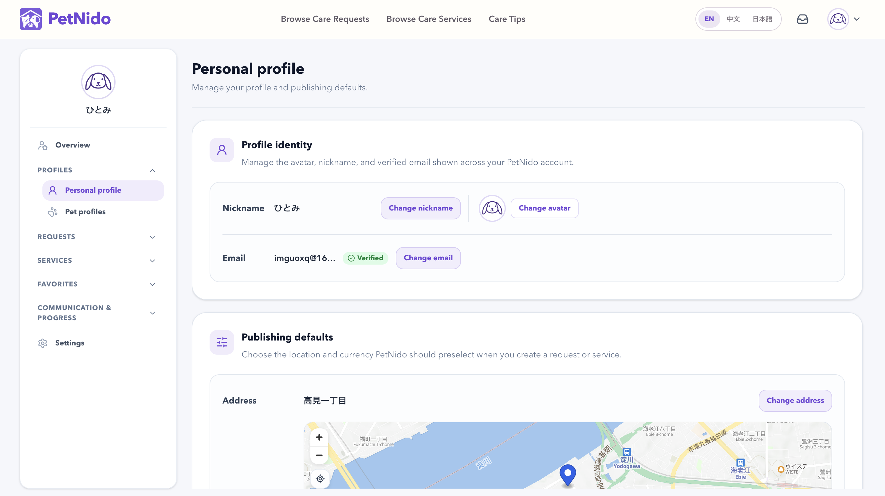 | 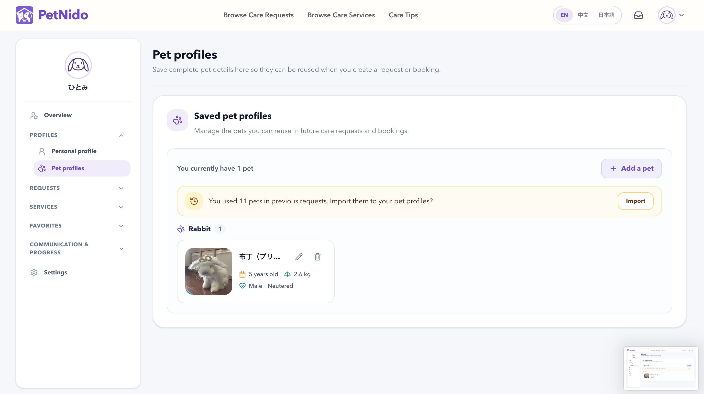 |  |  |

### 6. Care-type guide pages

Users can open a guide for any of the three care types from the home page. Before publishing a request or service, the page explains each mode's scope, suitable use cases, and points to consider, helping users choose the option that fits their situation.

Each care-type page includes:

- Situations the mode is suitable for;
- Typical use cases;
- A structured example of a care request;
- Three preparations to make before publishing this type of request;
- Three guidelines for providing this type of service;
- Suggestions to explore the other two care types when the current one is not a good fit;
- Entry points for publishing a request or service.

The guide connects the scenario explanation with the later form flow, helping users set the right expectations before they start entering information.

The following screenshots show the home-visit care guide:

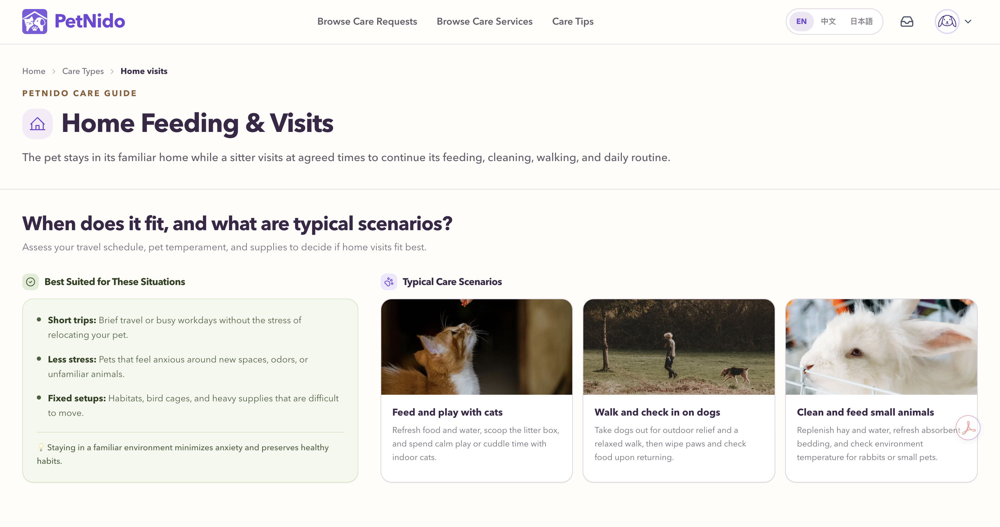
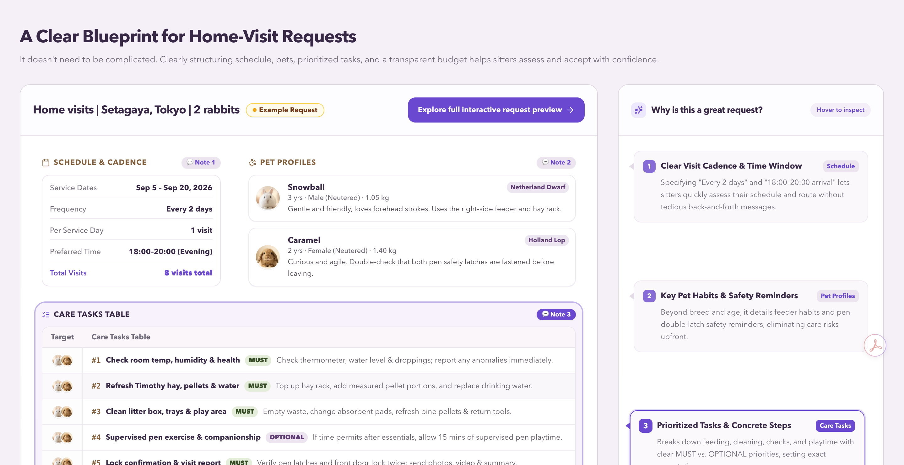
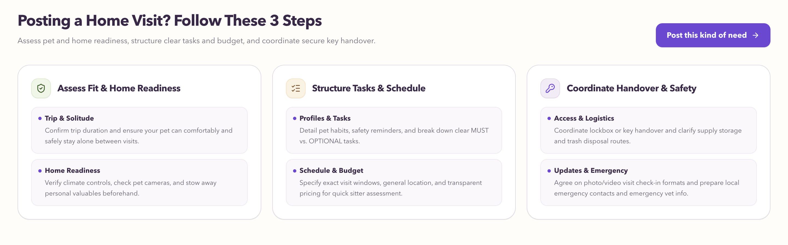
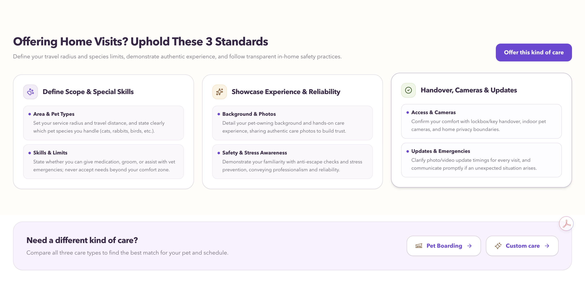

## Tech Stack

| Layer | Technology |
| --- | --- |
| Web | Next.js 14.2, React 18, App Router |
| Language | TypeScript 5.4 |
| API and server state | tRPC 10, TanStack Query |
| Database | PostgreSQL, Prisma 5.14 |
| Authentication | NextAuth 5 Beta, email accounts, Google / LINE OAuth |
| Forms and validation | React Hook Form, Zod |
| Client state | Zustand |
| UI | Tailwind CSS 4, Radix UI, Lucide React |
| Maps and geospatial interaction | MapLibre GL JS, MapTiler |
| Geocoding and location search | Nominatim / OpenStreetMap |
| Image storage | Cloudinary |
| Testing | Vitest, Playwright, Storybook |

## Live Site

The production site is available at [https://www.petnido.net](https://www.petnido.net).

## Author

**Guo Hongqiong（郭红琼）**

Digital product developer with experience in product analysis, interaction design, full-stack implementation, testing, and deployment.

- [GitHub](https://github.com/RedJone888)
- Email: redjoan.guo@gmail.com
- [GuoHongqiong](https://guohongqiong.vercel.app/)

---

PetNido — Thoughtful care for every pet's everyday life, from the nearby community.
