# PetNido

> 面向宠物主人与本地宠物照护者的 C2C 照护匹配平台。

[English](README.md) | 简体中文 | [日本語](README.ja.md)

[线上网站](https://www.petnido.net)

## 项目概览

PetNido 是一个面向个人用户的宠物照护需求与服务匹配平台，服务于养宠者以及希望提供宠物照护服务的个人。同一账号可以在需求发布者和照护者两种身份之间使用。

平台将宠物照护信息拆分为照护类型、宠物、日期、任务、位置和预算等结构化字段，支持按地区、照护类型、宠物类型和照护日期筛选。用户可以复用宠物档案、自动保存并恢复草稿，并通过地图选择用于匹配的大致位置。需求发布后会保存宠物、地点和货币单位快照，以减少重复填写，并避免后续修改个人档案影响历史记录。

当前版本主要覆盖以下四条用户路径：

1. 登录与首次引导
2. 发布照护需求
3. 浏览公开照护需求
4. 管理个人中心

部分页面和菜单入口已经建立，但服务管理、通知、匹配以及其他相关业务仍在逐步开发中。

## 为什么开发 PetNido

PetNido 起源于宠物主人为宠物寻找合适照护方式时遇到的真实困难。

部分宠物主人会因为宠物类型、性格、健康状况、照护时长或预算等原因，发现传统宠物酒店并不一定适合自己的宠物。部分宠物酒店以犬猫照护为主，费用和环境也可能给某些宠物带来额外压力，因此宠物主人常常会转向社交平台寻找个人照护者。

但社交平台并不是为宠物照护设计的专用平台。一篇寻找照护者的帖子发布后，可能会收到大量与实际照护能力无关的回复。例如，有人会说：“我小时候养过兔子，我可以照顾；给它多吃胡萝卜和白菜就可以了。”宠物主人需要从大量信息中判断对方是否了解目标宠物的饮食、行为和健康需求，筛选成本很高，也可能面临错误照护带来的风险。

社交平台上的公开帖子通常只包含照护时间、地点和宠物类型。宠物的详细资料、性格、生活习惯、健康注意事项以及具体任务，往往要进入私聊后再逐项说明。每联系一位新的候选人，宠物主人都需要重新解释或转发相同的信息，既耗时，也容易遗漏关键内容。

PetNido 希望成为一个专门的宠物照护匹配平台。照护者可以提前发布结构化的服务资料，展示自己的照护经验、可提供的服务和适用条件；宠物主人也可以一次性整理宠物档案与完整的照护需求。双方在开始沟通前，就能先了解与宠物情况、照护任务和服务能力相关的信息，从而降低沟通成本，让筛选过程更加清晰。

## 产品方案

PetNido 将社交平台上分散的宠物照护需求和服务信息，归纳为三种常见的结构化照护场景。用户在发布需求或服务时，先选择相应的照护场景，系统再通过分步表单引导用户填写宠物、照护日期与时间、具体任务、大致位置和预算等信息，最终形成一条完整、清晰、可预览的照护记录。

- **上门照护**：在宠物主人家中完成喂食、换水、散步、清洁、陪伴、用药等日常任务。适用于外出时间不长、宠物能够在两次上门之间独处，或宠物更习惯熟悉环境等情况。

- **宠物寄养**：在照护者家中进行跨日照护，让宠物生活在宠物数量相对较少的家庭环境中。适用于外出时间较长、宠物不适合长时间独处，或日常状态需要密切关注等情况。

- **自定义照护**：用于接送、陪诊、洗护、指甲修剪、笼舍清洁等不属于上门照护或宠物寄养的个性化任务。

产品遵循五项核心原则：

- 一个账号同时具备宠物主人和照护者两种角色能力。
- 需求、宠物档案和常用的大致位置可以在后续发布中复用，减少重复填写。
- 发布需求或服务时，进入相应步骤后会自动读取档案默认值，同时允许用户修改。
- 发布时保存宠物、地点和货币单位快照，后续修改个人档案不会改写历史业务记录。
- 发布页面引导用户从地图搜索或点选便于识别的地点作为服务参考位置，方便照护者直观评估服务范围。

目前这套结构化分步流程已主要用于照护需求发布，服务发布相关流程仍在逐步完善。

## 当前状态

下表中的“可演示”表示该能力已经通过当前正式产品页面形成可以连贯操作的用户流程。

| 模块                   | 状态              | 当前能力                                                       |
| ---------------------- | ----------------- | -------------------------------------------------------------- |
| 账号与登录             | ✅ 可演示         | 邮箱账号流程、Google / LINE 登录入口、首次与非首次用户分流     |
| 照护需求发布           | ✅ 可演示         | 上门、寄养、自定义三种模式；分步填写、草稿、预览与发布         |
| 公开需求市场           | ✅ 可演示         | 公开列表与详情、筛选、地图展示、公开状态和过期规则             |
| 个人中心               | 🟡 页面与部分流程 | 已提供需求、服务、草稿、收藏、资料和设置菜单；部分操作仍在开发 |
| 服务发布与服务市场     | 🚧 开发中         | 服务档案、服务表单和服务市场尚未完整接通                       |
| 咨询、应聘、预约与聊天 | 🚧 开发中         | 页面和业务流程仍在整合                                         |
| 匹配、站内通知与邮件   | 🚧 开发中         | 尚未作为完整用户流程提供                                       |
| SNS 分享               | 🗓️ 下一阶段       | 计划用于扩大需求和服务的传播范围                               |

## 当前页面与功能导览

### 1. 首页

首页是 PetNido 的主要入口和产品方案介绍页。页面说明同一账号可以在需求发布者和照护者两种身份之间使用，并通过对比介绍上门照护、宠物寄养和自定义照护三种场景及其适用情况。

访客可以从首页浏览公开需求、开始发布照护需求或进入登录流程；登录后可以进入个人中心，查看个人资料、宠物档案及相关业务菜单。个人中心中部分业务仍在开发中，具体完成状态以“当前状态”部分为准。

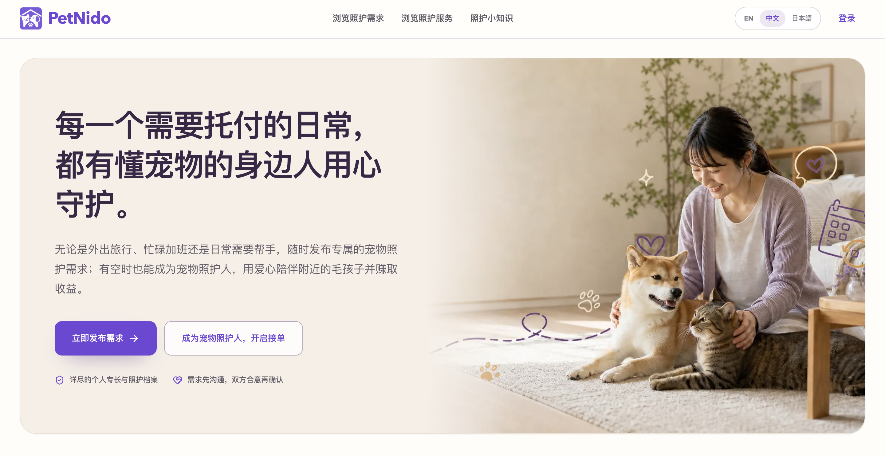
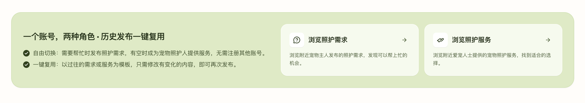
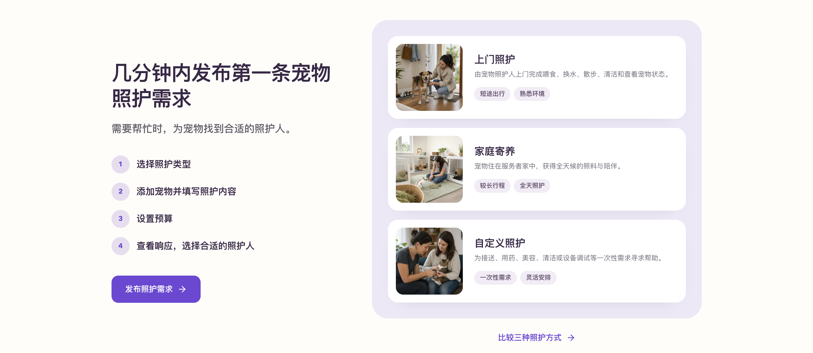

### 2. 登录与账号关联

PetNido 支持邮箱+密码、Google 和 LINE 三种登录方式。同一个 PetNido 账号可以关联多种登录方式。

- **邮箱+密码**：新用户先完成邮箱验证并注册；设置登录密码后，可以使用邮箱和密码登录。
- **Google**：系统读取 Google 返回的已验证邮箱。如果该邮箱尚未对应 PetNido 账号，则创建新账号；如果已经存在，则进入邮箱验证码确认的账号关联流程。确认后，Google 就会成为该账号的一种登录方式。
- **LINE**：首次使用 LINE 登录时不会直接与其他账号合并。系统会先询问用户是否已有 PetNido 账号。
  - 已有账号：输入原账号邮箱并完成验证码验证，确认后绑定 LINE；
  - 没有账号：创建新的 PetNido 账号。

绑定完成后，LINE 可以用于该账号的后续登录。新账号首次完成登录后，会进入资料设置和下一步操作选择；已完成资料设置的用户直接进入目标页面。设置并验证邮箱密码后，同一账号可以使用邮箱+密码、Google 或已绑定的 LINE 登录。

#### 邮箱密码登录

| 选择登录方式                                             | 输入邮箱                                             | 新邮箱进入注册步骤                                   | 输入验证码                                           |
| -------------------------------------------------------- | ---------------------------------------------------- | ---------------------------------------------------- | ---------------------------------------------------- |
| 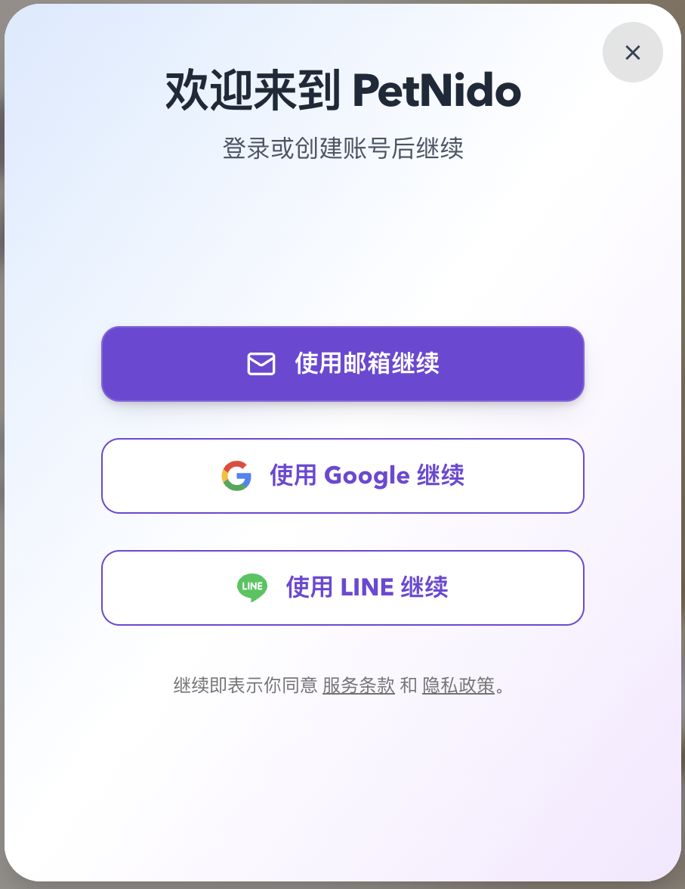 |  |  |  |

#### 引导新用户设置资料和选择使用意图

| 设置昵称和头像                                       | 选择接下来的操作                                     |
| ---------------------------------------------------- | ---------------------------------------------------- |
|  |  |

### 3. 发布照护需求

PetNido 将社交平台上常见的宠物照护需求整理为上门照护、宠物寄养和自定义照护三种模式。

用户先选择照护模式，系统再根据所选模式展示对应的分步表单。用户可以逐步填写信息，并在预览页面查看最终内容；如果需要修改，可以返回相应步骤编辑，确认无误后再提交发布。

| 照护模式   | 主要填写步骤                                                                       |
| ---------- | ---------------------------------------------------------------------------------- |
| 上门照护   | 宠物、日期与上门安排、照护任务、大致位置、预算                                     |
| 宠物寄养   | 宠物、寄养日期、照护任务、物资、家庭环境适配、大致位置、可接受距离与接送安排、预算 |
| 自定义照护 | 宠物、日期、照护任务、要求与注意事项、大致位置、预算                               |

表单内容会在修改后自动保存。未登录用户的草稿保存在当前浏览器本地；登录后会在本地保存的基础上同步到服务端，方便后续恢复。进入相关步骤时，系统会读取已保存的宠物、常用位置和货币等默认值，同时允许用户修改。

以下以上门照护模式为例展示
| 选择照护模式 | 预览并发布 |
| --------------------------------------------------------- | ----------------------------------------------------- |
|  |  |

### 4. 浏览公开照护需求

公开需求市场面向游客开放，列表只展示处于公开状态且尚未过期的照护需求。访客可以按地区、照护模式、宠物类型和日期范围筛选需求。

选择地区后，系统默认以该地点为中心筛选半径 25 km 内的需求，右侧地图会用圆形范围标识当前筛选半径，并显示符合条件的需求分布。用户也可以调整搜索范围。

点击需求卡片可以查看公开的结构化需求详情，包括照护模式、宠物、日期、任务、大致位置和预算等信息。登录用户可以收藏感兴趣的需求，并在个人中心的需求收藏中再次查看；未登录用户点击收藏时会先进入登录流程。

| 公开需求列表                                                | 需求详情                                          |
| ----------------------------------------------------------- | ------------------------------------------------- |
| 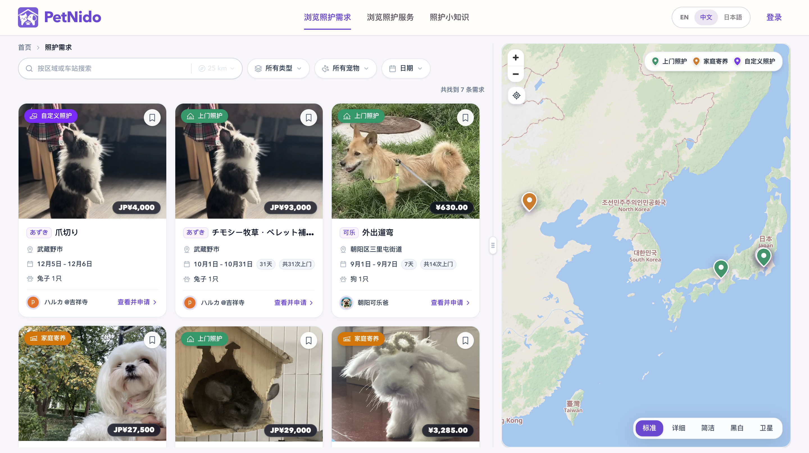 |  |

### 5. 管理个人中心

个人中心提供活动概览、我的需求、我的服务、需求与服务草稿、需求与服务收藏、个人资料、宠物资料和账号设置等菜单入口。

部分菜单对应的业务仍在开发中，菜单入口的存在不代表相关功能已经完整实现。

个人中心概览会根据账号状态展示不同内容：

- 当账号还没有业务数据时，展示完善个人资料、添加宠物资料和选择使用方向等引导；
- 当账号已有业务数据时，展示与当前账号相关的待处理事项、最近活动和下一步操作建议。

当前已完成或可以演示的功能包括：

- 个人资料和宠物资料管理；
- 已发布需求列表及状态筛选；
- 编辑、删除（归档）、关闭、重新开放已发布需求；
- 复用已有需求创建新的需求；
- 继续编辑或删除需求草稿；
- 按更新时间、完成度和照护类型对需求草稿排序；
- 收藏需求，并在个人中心查看已收藏的需求；
- 设置和管理账号登录方式。

服务管理、服务收藏、通知、应聘、预约、聊天及其他相关业务操作仍在开发中。

| 个人资料                                                      | 宠物档案                                                   | 已发布需求                                                         | 账号设置                                               |
| ------------------------------------------------------------- | ---------------------------------------------------------- | ------------------------------------------------------------------ | ------------------------------------------------------ |
| 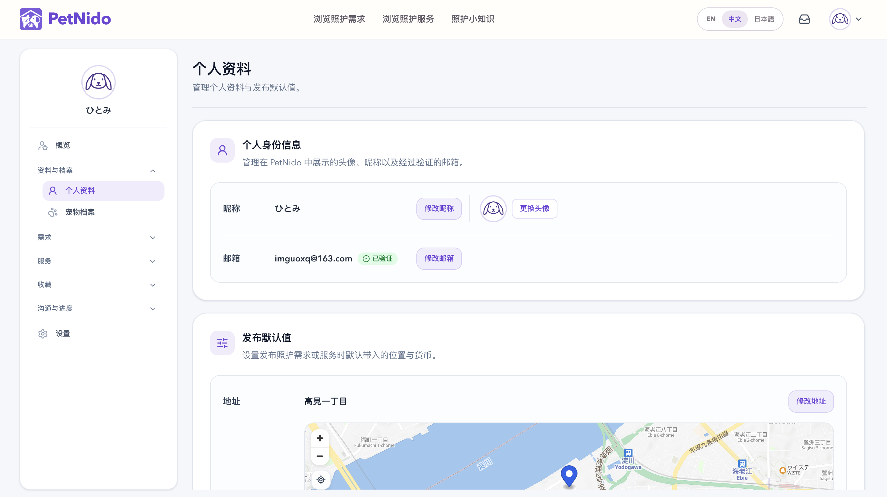 | 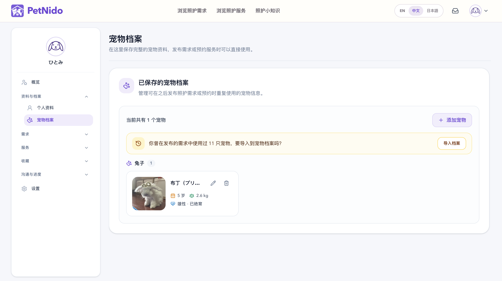 |  |  |

### 2. 照护类型介绍

用户可以从首页进入三种照护类型的介绍页面，在发布需求或服务之前了解不同模式的服务范围、适用场景和注意事项，并选择更适合自己的照护方式。

每个照护类型页面包括：

- 该模式适合的情况；
- 典型使用场景；
- 一份结构化的需求示例；
- 发布此类需求前需要准备的事项；
- 提供此类服务时需要遵守的准则；
- 如果当前模式不适合，推荐查看另外两种照护类型；
- 进入发布需求或发布服务流程的入口。

该页面将照护模式的特点和后续表单内容联系起来，帮助用户在进入分步填写流程前形成合理预期。

以下以上门照护模式为例
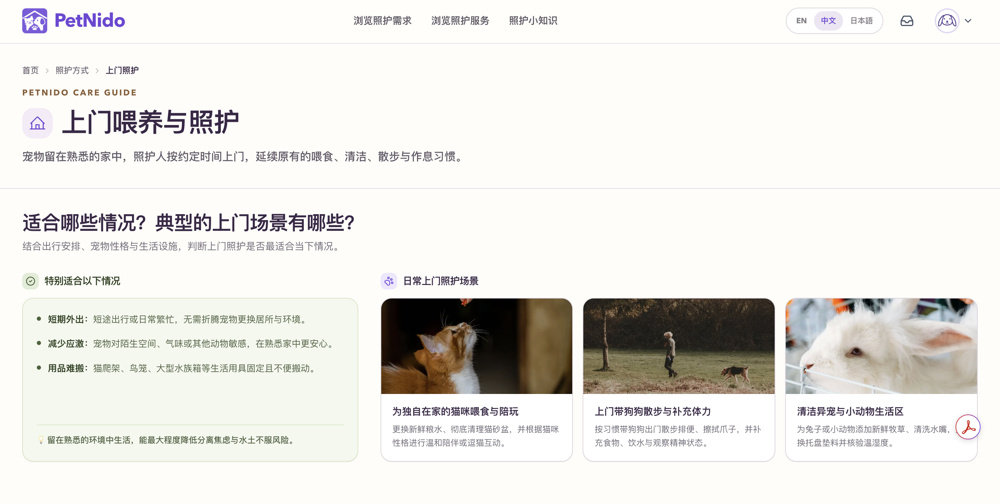
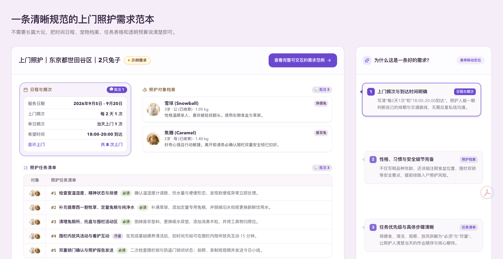

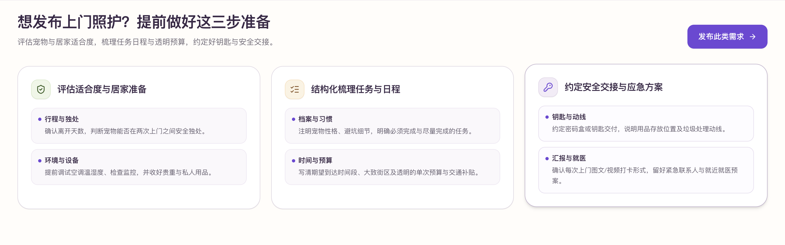
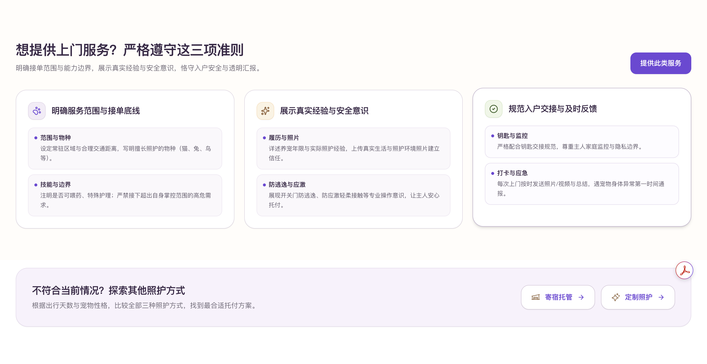

## 技术栈

| 层级               | 技术                                           |
| ------------------ | ---------------------------------------------- |
| Web                | Next.js 14.2、React 18、App Router             |
| 开发语言           | TypeScript 5.4                                 |
| API 与服务端状态   | tRPC 10、TanStack Query                        |
| 数据库             | PostgreSQL、Prisma 5.14                        |
| 认证               | NextAuth 5 Beta、邮箱账号、Google / LINE OAuth |
| 表单与校验         | React Hook Form、Zod                           |
| 客户端状态         | Zustand                                        |
| UI                 | Tailwind CSS 4、Radix UI、Lucide React         |
| 地图与地理交互     | MapLibre GL JS、MapTiler                       |
| 地理编码与位置搜索 | Nominatim / OpenStreetMap                      |
| 图片存储           | Cloudinary                                     |
| 测试               | Vitest、Playwright、Storybook                  |

## 在线体验

当前线上网站已部署在 [https://www.petnido.net](https://www.petnido.net)。

## 开发者

**Guo Hongqiong（郭红琼）**

互联网产品开发者，具备产品分析、交互设计、全栈实现、测试与部署经验。

- [GitHub](https://github.com/RedJone888)
- Email: redjoan.guo@gmail.com
- [GuoHongqiong](https://guohongqiong.vercel.app/)

---

PetNido — 让每一种宠物日常，都能获得来自附近社区的用心照护。
