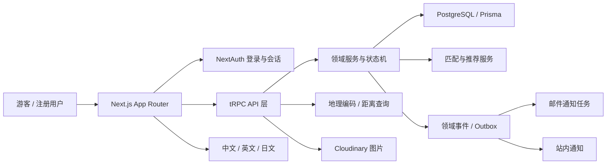
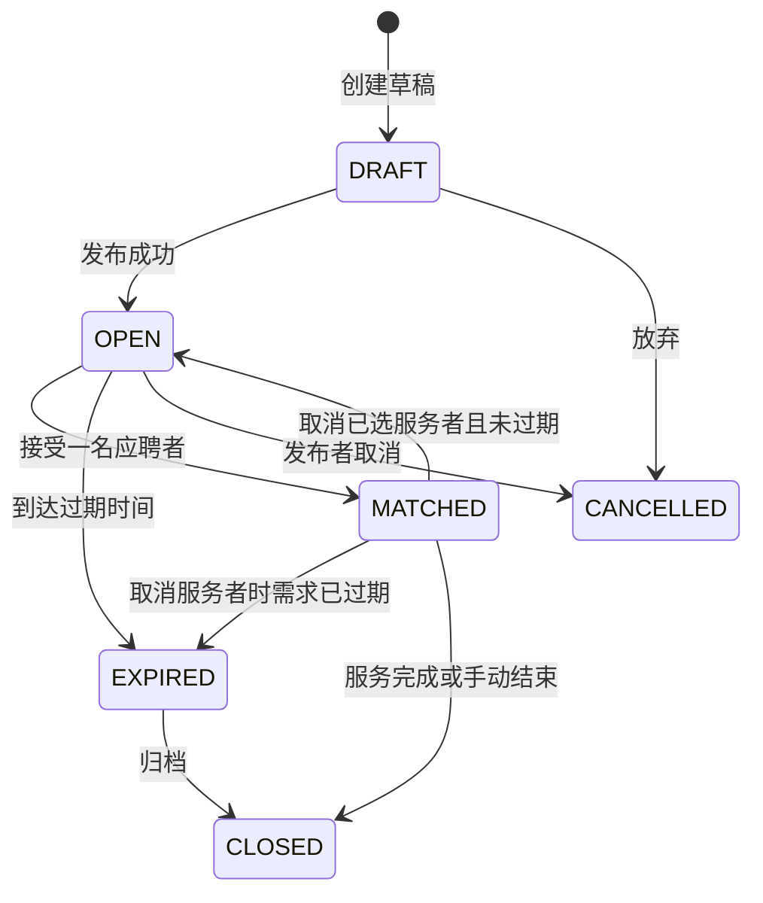
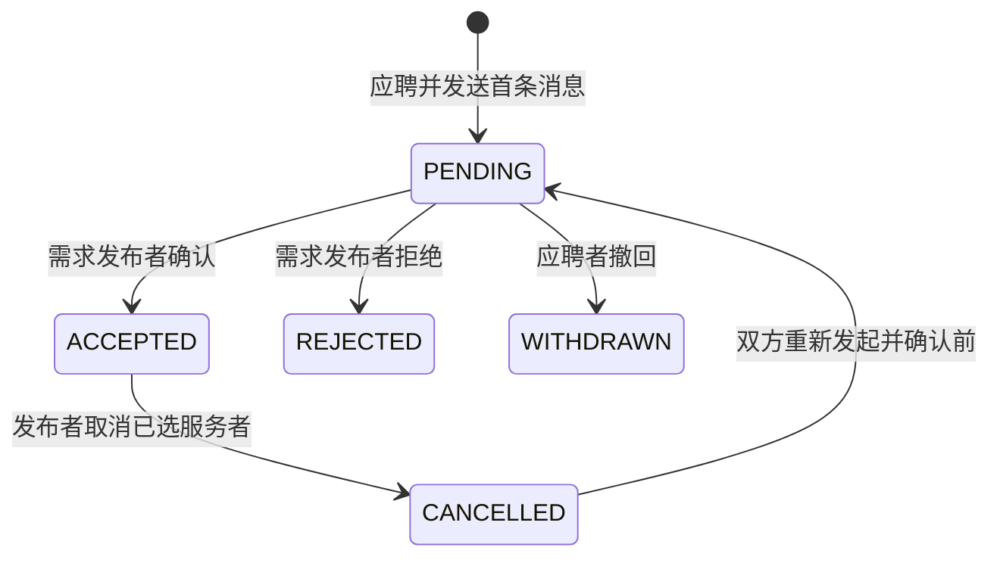
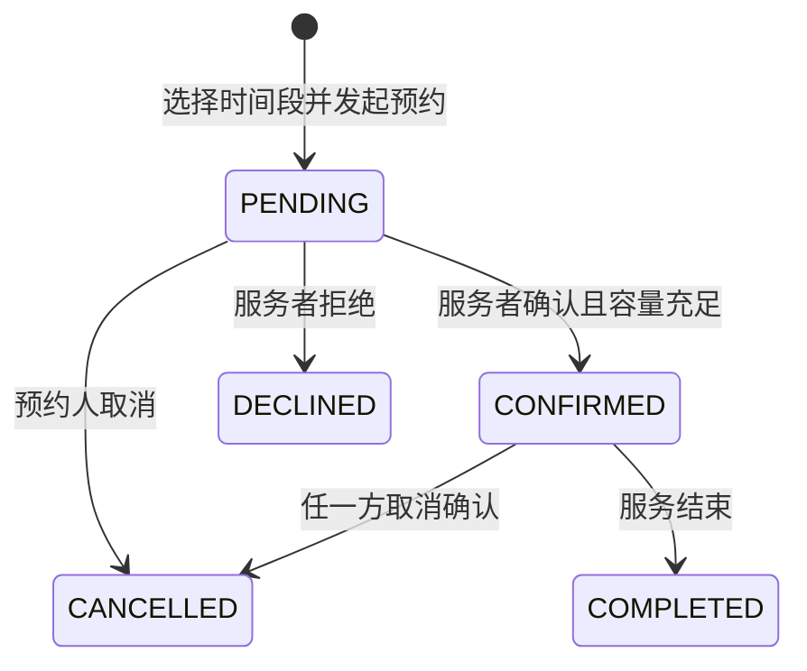
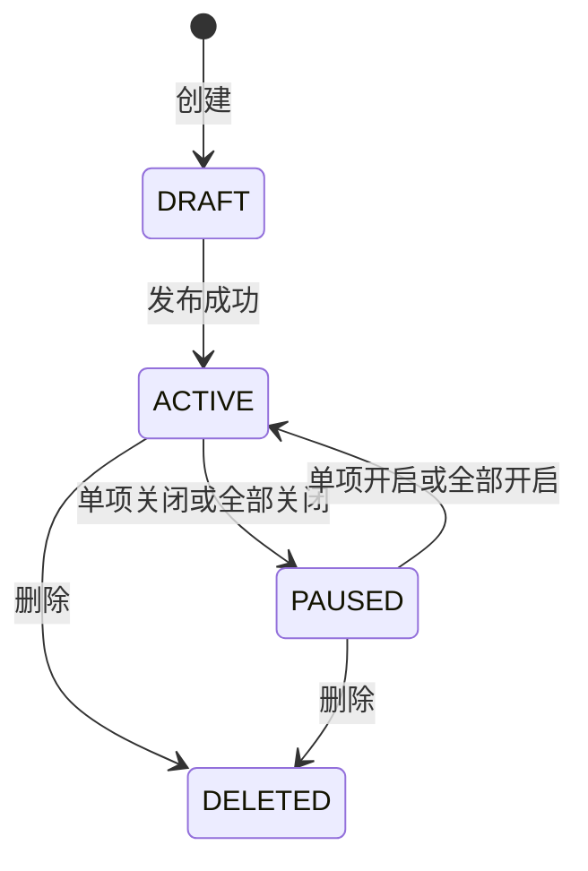
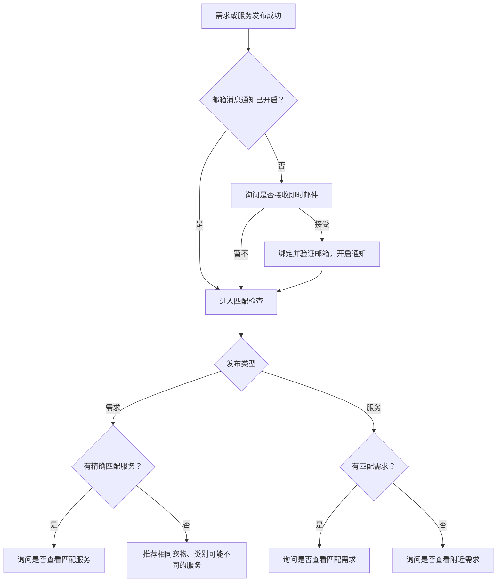

# Petnido 网站开发计划书

> 文档版本：V1.0  
> 编制日期：2026-08-04  
> 依据文档：[Petnido 网站项目计划书 V2.0](./Petnido网站项目计划书_v2.0.md)、[Petnido 完整用户操作流程图 V2.0](./Petnido完整用户操作流程图_v2.0.svg)  
> 适用对象：产品、设计、前端、后端、测试及项目负责人  
> 评估原则：新版产品计划与用户流程定义目标；现有页面、逻辑和数据库仅作为可复用候选，必须经过差距评估

---

## 1. 文档目的

本计划书把 Petnido 的产品要求和完整用户操作流程转化为可以排期、开发、联调、测试和验收的执行方案。

开发目标既不是直接沿用现有实现，也不是不加判断地全部推倒重来，而是先以新版产品计划和用户流程定义目标模型，再评估现有 Next.js 代码、页面设计和数据库中可以复用的部分。对共同点保留，对可适配部分重构，对与目标模型冲突且继续沿用成本更高的部分重写。

项目优先打通以下核心闭环：

1. 游客浏览附近需求、服务者和服务。
2. 注册/登录后延续原操作，不丢失用户意图。
3. 用户发布三类需求，并在自然步骤复用宠物档案和地址。
4. 用户开通接单模式、创建服务档案并发布多项服务。
5. 咨询、应聘或预约自动创建会话，由对方确认后才成功。
6. 需求、应聘、预约、服务均按照明确状态机流转。
7. 发布成功后完成邮箱通知引导和双向匹配推荐。
8. 支持中文、英文、日文，并兼顾多币种、隐私和移动端体验。

本期不包含平台运营与治理、支付结算、评价体系、投诉仲裁、身份认证和营销系统。

---

## 2. 项目现状与开发策略

### 2.1 现有技术基线

当前代码库已经具备以下基础：

| 层级 | 当前技术或能力 |
|---|---|
| Web 框架 | Next.js 14 App Router、React 18、TypeScript |
| API | tRPC 10、Zod |
| 数据库 | PostgreSQL、Prisma 5 |
| 认证 | NextAuth v5 beta，已有邮箱验证码能力与认证模型 |
| 表单 | React Hook Form、Zod、Zustand |
| 数据请求 | TanStack Query |
| UI | Tailwind CSS、Radix UI、Lucide、Sonner |
| 地图与位置 | MapLibre/Leaflet、地理编码接口 |
| 文件 | Cloudinary 上传基础能力 |
| 国际化 | 已有 `zh`、`en`、`ja` 三语消息资源 |
| 测试工具 | Vitest、Playwright、Storybook、Chromatic 依赖已存在 |

### 2.2 已有产品基础

现有项目已有首页、照护类型介绍页、需求公开列表与详情、需求创建页、个人中心、需求 CRUD、服务档案、服务 CRUD、设置页，以及部分消息、通知和应聘界面原型。

数据库已有 `User`、`Profile`、`Pet`、`Need`、`NeedPet`、`ServiceProfile`、`Service`、`Application`、`Booking`、`Message` 等基础模型；但收藏、地址簿、会话聚合、服务关联预约、通知偏好、不可变快照、容量控制等仍不完整。

### 2.3 需求与实现的优先级

发生冲突时，按以下顺序决策：

1. 已确认的新版项目计划书与完整用户操作流程图。
2. 本开发计划中评审通过的领域规则、状态机和验收标准。
3. 经产品、设计和技术共同确认的最新页面设计。
4. 现有可运行页面、前端交互和数据库模型。
5. 旧原型、模拟数据、注释和未接入的代码。

现有代码“能运行”不等于符合新产品要求；新设计“视觉完整”也不等于数据模型和异常分支已经成立。每个功能必须同时做产品、交互、数据、权限和状态五个维度的适配判断。

### 2.4 复用决策方法

每个现有模块在进入迭代前标记为以下四类之一：

| 类别 | 判定标准 | 处理方式 |
|---|---|---|
| 保留 `KEEP` | 业务语义、数据来源、权限和状态均与目标一致 | 保留，补测试和三语 |
| 适配 `ADAPT` | 核心结构可用，但字段、入口或交互有有限差异 | 局部重构，保持外部行为一致 |
| 重构 `REFACTOR` | UI 或数据的一部分有价值，但逻辑耦合、模拟数据或模型不完整 | 提取可复用组件，重写领域逻辑或数据访问 |
| 重写 `REBUILD` | 业务语义或状态模型根本冲突，适配成本高于重写 | 保留视觉参考或迁移脚本，重新实现 |

决策时比较“迁移成本 + 长期维护成本 + 数据风险”，而不是单纯比较代码量。未经过评审的现有页面不能直接被列为开发完成。

### 2.5 总体开发策略

- 暂定保留 Next.js、tRPC、Prisma、PostgreSQL 和三语资源作为技术基座；若迭代 0 发现阻断性问题，再单独评审替换，而不是默认所有实现都必须沿用。
- 先依据新版流程设计目标领域模型、状态机和页面合同，再决定旧数据库如何迁移。
- 页面视觉组件、地图输入、上传组件、卡片和表单控件可以优先复用；业务动作必须重新通过服务端规则验证。
- 对已有但互相重叠的页面流程先选定唯一正式入口，不同时维护两个不同业务语义的实现。
- 所有核心写操作通过服务端事务完成，前端不得自行拼接业务状态。
- 将静态收藏、消息、通知、预约和推荐原型替换为真实数据，替换完成前不得作为已完成功能验收。
- 新旧流程并行期间使用功能开关和兼容读取；完成数据迁移与回归后再移除旧入口和旧字段。
- Stripe 文件和支付相关代码不纳入本期交付，也不接入业务流程。

### 2.6 共通点：现有资产中值得保留的部分

| 领域 | 共通点 | 初步建议 |
|---|---|---|
| 技术框架 | Next.js App Router、TypeScript、tRPC、Prisma 与目标 Web 产品相容 | `KEEP` 技术基座，补齐分层、错误码和测试 |
| 三种业务类型 | 现有 `VISIT/FOSTER/OTHER` 与上门/寄养/自定义概念对应 | `ADAPT` 名称和专属数据结构，不丢弃已有映射 |
| 需求基础能力 | 已有需求列表、详情、创建、编辑、状态和公开查询骨架 | 复用页面组件和部分 CRUD，重构发布事务与可见性 |
| 服务基础能力 | 已有服务档案、多服务、地点、币种、时间和价格字段 | 复用基础表单与卡片，扩展模式细节和状态模型 |
| 服务档案默认值 | 数据库已有默认地点和默认货币字段 | 保留字段语义，修改写入时机为“发布成功后” |
| 宠物 | 已有用户宠物和需求宠物概念 | 保留用户宠物主表，重做发布时快照和任务关联 |
| 地点 | 已有经纬度、地址输入、地图与地理编码组件 | 复用组件，增加地址簿、隐私层和公开模糊位置 |
| 图片 | 已有附件模型和 Cloudinary 上传能力 | 复用上传链路，补归属、状态、EXIF 与删除规则 |
| 认证 | 已有 NextAuth、邮箱验证码和认证页面 | 复用认证基座，新增首次引导和登录意图恢复 |
| 三语 | 已有中、英、日消息资源 | 保留国际化基础，清理页面中的硬编码文案 |
| 页面视觉 | 首页、详情卡片、分步需求原型包含较丰富的业务表达 | 作为交互与组件资产，不能直接视作已接通后端 |

### 2.7 差异与冲突清单

以下是根据当前代码、Prisma 模型、新版项目计划和用户流程得到的初步 Fit-Gap。迭代 0 需要逐条验证并更新状态。

| 编号 | 领域 | 现有页面/逻辑/数据库 | 新版目标 | 差异或冲突 | 建议处理 |
|---:|---|---|---|---|---|
| 1 | 首次登录判断 | 现有认证能登录，但数据库没有明确的 onboarding 完成时间 | 首次注册完善头像昵称并选择意图；非首次登录直达个人中心 | 无法可靠区分首次与非首次；也容易把 OAuth 首次登录误判 | `REFACTOR`：增加 `onboardingCompletedAt`，以资料状态而非登录方式判断 |
| 2 | 登录后行为 | 现有认证弹层与部分页面有入口，但没有统一业务意图合同 | 登录后恢复收藏、咨询、应聘、预约或发布动作 | 页面各自处理会造成跳转和草稿丢失 | `REBUILD` 统一 `returnTo + pendingAction` 机制 |
| 3 | 个人资料 | `Profile` 只有 `bio/isSitter/isOwner`，头像昵称主要在 `User` | 头像、昵称、宠物档案、地理位置、地址档案 | 字段边界不清，缺地址簿和完整资料状态 | 重新确定 `User/Profile` 边界，迁移已有 name/image |
| 4 | 地址 | 需求和服务直接存地址与经纬度，没有 `UserAddress` | 在发布自然步骤读取默认地址，成功后写回个人档案 | 无法多地址复用；发布失败和档案更新无法原子化 | `REBUILD` 地址簿；保留地址组件和历史快照字段 |
| 5 | 需求创建入口 | 同时存在旧 Dashboard `NeedForm` 和新的 guided flow | 应有一个正式三模式发布流程 | 两套表单的数据结构、步骤、文案和后端接入程度不同 | 以新版流程逐屏评审；选择唯一正式入口，抽取旧表单可用控件后下线重复入口 |
| 6 | 需求草稿 | 旧表单和 guided flow 使用不同 localStorage key/结构 | 可恢复草稿，但成功发布才同步正式档案 | 两套草稿版本可能冲突，跨设备不可恢复 | 统一版本化草稿 schema；首发可本地保存，后续支持服务端草稿 |
| 7 | 宠物数据 | `Pet` 字段简单；`NeedPet` 混合 `petIds`、数量、描述和标签 | 用户宠物档案 + 发布时不可变宠物快照 + 按宠物分配任务 | 关联和快照边界不清；档案变更可能影响历史或无法追溯 | 保留 `Pet` 主表，重构 `NeedPetSnapshot/NeedPetTask`，迁移旧 `NeedPet` |
| 8 | 上门需求 | 数据库只有频率、customDays/customTimes；新 guided UI 已表达更多任务 | 每几天、当天几次、每次期望时间、每只宠物每次任务 | UI 草稿比数据库表达力更强，无法完整落库 | 复用 guided UI 概念，新增访问计划和任务明细表 |
| 9 | 寄养需求 | 数据库只有距离和单一接送方式；guided UI 有部分物资/任务草稿 | 物资、费用、每日/定期任务、环境、禁忌、接送方向和交通费 | 现有正式 schema 丢失大量核心信息 | `REBUILD` 寄养明细模型；guided UI 只作为设计输入 |
| 10 | 自定义需求 | 当前用 `OTHER` + 通用 requirement | 明确宠物、时间、地点、任务和金额 | 可表达但缺结构化任务，筛选困难 | `ADAPT`：保留自由描述，同时增加任务类别和结构化字段 |
| 11 | 需求状态/过期 | 数据库有 OPEN/MATCHED/CLOSED/CANCELLED；`EXPIRED` 只存在展示类型 | 过期自动从公开列表移除，个人列表和收藏仍可见 | 过期是计算状态还是持久状态尚未统一；缺明确 `expiresAt` | 保留现有主要状态；新增 `expiresAt`，公开查询强制判断；是否落 `EXPIRED` 由技术评审确定 |
| 12 | 需求公开查询 | 已有 `listAll` 和公开页面；详情查询当前为 protected | 游客可浏览列表和详情，只有动作要求登录 | 详情权限与目标冲突；公开字段可能包含精确地址 | 拆成 `getPublic` 和 `getMine`，定义字段级隐私 DTO |
| 13 | 需求筛选 | 已有筛选 UI 骨架和部分列表查询 | 地点、预算、宠物、任务类别、时间筛选 | 任务类别和部分模式字段没有可索引数据 | 保留筛选组件，重建查询 input、索引与 URL 状态 |
| 14 | 服务档案 | 已有默认地点、币种、介绍、经验和 `toggleSitterStatus` | 首次确认接单，服务档案可控制所有服务 | `Profile.isSitter`、`ServiceProfile` 和开关含义可能重复 | 统一“服务者身份”和“当前接单状态”，迁移后只保留一个事实来源 |
| 15 | 服务模型 | 已有多服务、地点、币种、基础可用时间、宠物类型、价格规则 | 三模式各自字段、体型/年龄、例外日期、优惠、寄养环境和容量 | 当前通用模型不足；`isActive` 无法区分草稿/暂停/删除 | 保留通用主表，新增模式明细/宠物政策/可用规则；升级状态枚举 |
| 16 | 服务发布默认值 | API 已能读取服务档案地点和币种，但表单主要依赖 initialData | 在相应步骤提供默认值，发布成功后才写回档案 | 读取与写回的时机和事务未形成完整闭环 | `ADAPT` 当前查询，服务发布事务内统一更新默认值 |
| 17 | 服务公开页面 | 有 `/public/sitters`，但完整服务列表/详情能力不足 | 游客分别浏览服务者和具体服务 | 服务者与服务信息层级混合，预约目标不明确 | 建立独立 provider/service DTO 和路由，复用卡片视觉 |
| 18 | 收藏 | 需求详情只用组件本地 `isFavorite` | 登录后真实收藏，过期需求仍在收藏夹 | 刷新即丢失，缺模型/API/收藏夹 | `REBUILD` 数据模型和 API；复用按钮与视觉状态 |
| 19 | 消息 | `Message` 直接关联 from/to；注释明确“可以再加 conversationId”；消息页偏原型 | 双方按需求/服务上下文聊天，支持未读和系统状态消息 | 无会话聚合、上下文、参与者、已读、分页和唯一规则 | `REBUILD` 会话模型；保留消息页面布局中可用组件 |
| 20 | 咨询 | 无完整咨询领域接口 | 咨询创建或复用会话 | 与普通消息、应聘、预约关系未定义 | 用 `Conversation.context` 统一，不另造孤立咨询表 |
| 21 | 应聘 | Prisma 有 `Application`，但当前 appRouter 未注册应聘路由；页面动作含模拟状态 | 点击应聘先发消息，待对方确认才成功；接受后需求隐藏 | 数据模型只有基础状态，缺会话、处理时间、事务和并发规则 | 保留主表概念，重构 API/状态机并与会话、需求事务整合 |
| 22 | 服务资料提示 | 现有 Application 可关联用户，但无完整提示流程 | 有服务档案则提示查看；没有则提示聊天核验经验 | 目标提示依赖服务档案公开 DTO 和会话上下文 | 在应聘确认页和消息上下文卡片实现，不写成数据库状态 |
| 23 | 预约模型 | `Booking` 注释称可从服务发起，但实际没有 `serviceId`；默认状态为 `CONFIRMED` | 从具体服务选择时间，先 `PENDING`，服务者确认后成功 | 与核心业务直接冲突，且无法做服务容量 | `REBUILD` Booking 关系和默认状态；迁移旧记录需单独映射 |
| 24 | 预约容量 | 当前 Service 无最大数量，Booking 无宠物数量和可用性锁定 | 查看日期成功预约数，确认时校验最大宠物数量 | 无法计算、无法防超卖 | 新增容量与预约宠物快照；事务/条件更新 + 并发测试 |
| 25 | 通知 | 导航栏使用 mockNotifications；通知页为空壳 | 真实站内通知、未读数和状态变化通知 | 现有视觉与真实数据脱节 | 保留铃铛组件，重建 Notification 模型、查询和已读逻辑 |
| 26 | 邮件通知 | 设置页邮件开关是本地 state；有 nodemailer/验证码能力 | 用户可绑定验证邮箱；新消息邮件；发布后未开启则询问 | 验证邮件与业务通知没有偏好模型、事件可靠性或重试 | 新增偏好和 Outbox；复用现有邮件基础设施 |
| 27 | 发布后推荐 | 有 matches 页面入口，但没有完整匹配领域路由 | 需求发布后匹配服务；服务发布后匹配需求；支持降级推荐 | 缺统一可搜索字段、评分、解释和空结果规则 | 在需求/服务模型稳定后新建 matching 服务，不从 UI 假数据倒推模型 |
| 28 | 国际化 | 有三语文件，但现有常量、表单和 guided flow 中大量日文或英文硬编码 | 所有主要流程和邮件可切换三语 | 基础存在但覆盖不完整，同页可能混合语言 | 保留资源体系；清理硬编码并加 CI key 检查和逐语 E2E |
| 29 | 金额 | Need/PriceRule 用整数，Application/Booking 使用 Float | 各币种按最小单位整数保存 | 同一业务金额类型不一致，会产生舍入问题 | 统一 Money 值对象和整数列，迁移 Float 前先校验旧数据 |
| 30 | 时间 | 日期字段较粗，缺明确业务时区和时段模型 | 支持日期范围、每日次数、时间段、例外日期和过期 | 跨时区、边界日和预约重叠可能错误 | 统一 UTC + IANA 时区；新增范围和例外规则 |
| 31 | 服务批量管理 | 有单项 toggle/delete；无完整批量 API | 全部开关、批量地点、批量货币，同时保留单项修改 | 批量更新和已有预约影响未处理 | 新增事务式 bulk API、影响预览和二次确认 |
| 32 | 删除语义 | 当前服务有直接 delete API，附件存在级联删除 | 可删除服务，但历史预约和消息应保留 | 物理删除可能破坏历史链路 | 改软删除；有业务记录时禁止物理删除 |
| 33 | 隐私 | Need 存精确地址，现有常量甚至对某些类型提示到房号 | 公开浏览只显示必要位置，精确地址受控 | 产品匹配需要位置，但公开披露边界未实现 | 分离精确地址快照和公开区域；API 使用不同 DTO |
| 34 | 测试与 CI | 依赖中有 Vitest/Playwright/Storybook，但脚本不完整 | 每次迭代可自动验证核心闭环 | 工具存在不代表质量门禁建立 | 保留工具，补脚本、测试数据、迁移检查和 PR 门禁 |
| 35 | 内容页 | 已有照护类型和使用说明页面 | 三类介绍 + 按宠物/事项分类的知识链接 | 类型页可复用，知识分类和链接数据仍缺 | `ADAPT` 类型页；新增可维护的知识数据源和失效检查 |

### 2.8 迭代 0 的交付物：不是代码复用结论，而是证据化盘点

迭代 0 必须产出以下文档后，才能锁定后续估算：

1. 页面清单：每个路由的用户角色、数据来源、真实/模拟状态、对应新版流程节点。
2. 组件清单：可独立复用的视觉组件、表单控件、地图、上传和布局。
3. API 清单：现有 procedure 的权限、输入、输出、调用页面和缺失测试。
4. 数据字典：每个表/枚举的真实含义、数据量、空值率、旧数据样例和目标字段映射。
5. 差距矩阵：本节每一项更新为 `KEEP/ADAPT/REFACTOR/REBUILD`，注明负责人和依据。
6. 原型验证：用一条上门需求、一条寄养需求、一条服务预约跑通目标数据模型。
7. 迁移方案：保留、回填、双写、切换、清理和回滚步骤。

在盘点完成前，本计划中的工期属于参考区间，不应承诺为固定上线日期。

### 2.9 不足与待完善事项总表

本节补充 2.7 中“新旧冲突”以外的不足，包括边界条件、工程质量和产品定义空白。标记为“已确认”的项目来自当前代码或现有数据库；标记为“待验证”的项目需要在迭代 0 通过代码、数据和供应商环境进一步确认。未出现在清单中不代表自动满足要求，审计期间发现的新问题必须追加到本表。

#### A. 产品与用户体验不足

| 编号 | 不足 | 证据状态 | 影响 | 优先级 | 处理方向 |
|---:|---|---|---|---:|---|
| UX-01 | 缺少统一的游客受限动作拦截规范 | 已确认 | 不同页面登录行为不一致 | P0 | 全局动作守卫与意图恢复 |
| UX-02 | 首次引导没有“跳过后从哪里再次进入”的完整规则 | 待确认 | 用户可能无法找到发布入口 | P0 | 个人中心保留明显的双角色入口 |
| UX-03 | 发布长表单的退出、恢复、版本升级和过期草稿规则不统一 | 已确认 | 草稿丢失或无法解析 | P0 | 统一草稿版本、迁移和清除提示 |
| UX-04 | 两套需求表单在桌面/移动端信息架构不一致 | 已确认 | 用户体验割裂、维护成本翻倍 | P0 | 确定唯一流程，响应式共享步骤模型 |
| UX-05 | 发布过程缺少服务端校验失败后的字段定位和恢复策略 | 已确认 | 长表单提交失败后难修复 | P0 | 错误摘要、步骤跳转、保留输入 |
| UX-06 | 宠物档案内嵌创建后的编辑、去重、取消规则未定义 | 待确认 | 可能生成重复宠物 | P0 | 临时 ID、相似档案提示、事务内写入 |
| UX-07 | 地址默认值被用户修改后，是覆盖旧默认地址还是另存地址未明确 | 待确认 | 资料被意外覆盖 | P0 | 发布确认页提供“更新默认/另存”选择，或明确统一规则 |
| UX-08 | 上门跨多日且每天不同次数/时间的编辑体验仍需验证 | 已确认 | 复杂需求无法准确表达 | P0 | 日程预览、例外日和批量复制 |
| UX-09 | 寄养定期与不定期任务的触发条件、排序和冲突提示不足 | 已确认 | 服务者可能误解执行时间 | P0 | 结构化频率 + 自然语言摘要 |
| UX-10 | 自定义任务类别体系尚未定义 | 待确认 | 无法有效筛选和推荐 | P0 | 建立可扩展任务 taxonomy，保留“其他” |
| UX-11 | 预算“固定/区间/可商议”和交通/物资费用的显示方式未统一 | 待确认 | 列表价格不可比较 | P0 | Money/费用规则统一组件 |
| UX-12 | 服务优惠的类型、叠加、有效期和展示规则未定义 | 待确认 | 报价含义不清 | P1 | 首发限制为简单折扣或文字说明 |
| UX-13 | 可用时间规则复杂，但缺面向用户的日历摘要和冲突解释 | 已确认 | 用户无法判断何时可预约 | P0 | 服务端展开规则，前端提供月历与文字摘要 |
| UX-14 | 服务详情“某日有几个成功预约”的日期选择和时区提示未定义 | 待确认 | 数量与用户所见日期不一致 | P0 | 使用服务地点时区并明确标注 |
| UX-15 | 咨询、应聘、预约三个按钮的关系和重复操作提示不足 | 已确认 | 产生重复会话或误操作 | P0 | 同一上下文复用会话，动作状态前置展示 |
| UX-16 | 应聘被拒绝、撤回、需求已匹配时的页面反馈和下一步未完整设计 | 待确认 | 用户不知道是否还能继续沟通 | P0 | 状态页、替代推荐和只读会话规则 |
| UX-17 | 预约被拒绝、取消确认、服务暂停后的替代路径未完整设计 | 待确认 | 流程中断 | P0 | 提供改期、重新申请或看相似服务入口 |
| UX-18 | 取消已选服务者是否需要填写原因、对方是否可再次应聘未确定 | 待确认 | 状态机产生歧义 | P0 | 确认取消策略并记录原因 |
| UX-19 | 过期需求详情直达链接的展示内容和 SEO 策略未定义 | 待确认 | 收藏/分享链接体验不一致 | P1 | 保留只读详情，明确过期标识和 noindex 规则 |
| UX-20 | 服务删除、有预约时暂停、批量更新影响范围缺少预览 | 已确认 | 用户误改多条服务 | P0 | 影响计数、差异预览和二次确认 |
| UX-21 | 消息发送失败、离线、重复发送和草稿恢复没有设计 | 待确认 | 用户以为消息已送达 | P0 | 发送状态、幂等键、重试和本地草稿 |
| UX-22 | 消息中的系统事件与普通消息视觉层级未定义 | 待确认 | 确认/取消信息容易被忽略 | P0 | 不可编辑系统卡片和状态时间线 |
| UX-23 | 邮箱通知引导的关闭冷却期和再次开启入口未定义 | 待确认 | 频繁打扰或用户找不到设置 | P0 | 设置冷却期，并在设置页常驻入口 |
| UX-24 | 推荐列表的“为什么推荐”、类别降级警示和空结果文案不足 | 待确认 | 用户误以为类别完全匹配 | P0 | 推荐理由标签与显著的降级说明 |
| UX-25 | 三语切换后当前表单内容、日期和枚举是否保持未定义 | 待确认 | 切换语言导致输入丢失 | P0 | 只切显示层，不重建业务草稿 |
| UX-26 | 无障碍、低带宽、地图不可用和图片上传失败的替代流程未实现 | 已确认 | 部分用户无法完成核心动作 | P0 | 文本地址、可跳过图片、键盘与错误恢复 |

#### B. 数据与业务规则不足

| 编号 | 不足 | 证据状态 | 影响 | 优先级 | 处理方向 |
|---:|---|---|---|---:|---|
| DATA-01 | 当前模型缺少统一 `createdAt/updatedAt/deletedAt` 审计约定 | 已确认 | 难追踪和软删除 | P0 | 所有核心实体统一时间字段 |
| DATA-02 | 多个外键缺少明确的 `onDelete` 行为 | 已确认 | 删除用户或父记录时可能失败或误删 | P0 | 为每个关系定义 Restrict/Cascade/SetNull 策略 |
| DATA-03 | 核心查询索引不足 | 已确认 | 公开筛选和消息分页随数据增长变慢 | P0 | 按查询计划建立复合索引并压测 |
| DATA-04 | 地理位置使用 Float，经纬度有效范围和精度无约束 | 已确认 | 脏数据导致距离错误 | P0 | 输入校验、精度规范；评估 PostGIS |
| DATA-05 | 地址文本、公开区域和精确地址没有分层 | 已确认 | 隐私泄露 | P0 | 精确地址与公开位置 DTO 分离 |
| DATA-06 | 用户档案和服务档案的地点字段含义重叠 | 已确认 | 默认值来源不唯一 | P0 | 明确个人默认地址与接单默认区域 |
| DATA-07 | `Pet.age` 使用整数，无法自然表达年龄段、出生日期和年龄变化 | 已确认 | 匹配随时间失真 | P0 | 优先保存出生日期；未知时保存年龄段快照 |
| DATA-08 | 宠物体型、性别、绝育、健康、用药等字段不完整 | 已确认 | 服务适配和照护说明不足 | P0 | 明确必填/可选与敏感字段访问范围 |
| DATA-09 | 图片附件同时关联多种对象，缺数据库级“只能属于一个对象”约束 | 已确认 | 附件归属不一致 | P0 | 加归属校验或拆关系表 |
| DATA-10 | 附件 `status` 使用裸整数 | 已确认 | 语义不清、非法状态 | P1 | 改为枚举并加入生命周期任务 |
| DATA-11 | 需求 `endDate` 与公开过期时间混用风险 | 已确认 | 服务结束前/后隐藏时点不清 | P0 | 独立 `applicationDeadline/expiresAt` |
| DATA-12 | 需求标题当前必填，但新版分步流程是否自动生成未定义 | 待确认 | 用户多一步输入或列表无标题 | P1 | 明确自动标题模板及可编辑规则 |
| DATA-13 | 任务类别和宠物类型 taxonomy 版本化缺失 | 已确认 | 新类别上线后旧记录解释困难 | P1 | 稳定代码值 + 三语显示 + 版本兼容 |
| DATA-14 | 服务可用性模型只支持单一范围和星期模式 | 已确认 | 无法表达排除日期、多个时段和节假日例外 | P0 | 规则表 + 例外表 + 展开算法 |
| DATA-15 | 服务价格规则只有 label/price，缺数量、优惠和生效条件 | 已确认 | 无法稳定报价 | P0 | 结构化 price rule；首发限制复杂度 |
| DATA-16 | `Application.price` 与需求预算/服务价格的关系未定义 | 已确认 | 容易被误当作最终成交价 | P1 | 本期去除或定义为提议金额，明确非支付 |
| DATA-17 | Booking 缺服务关联、宠物快照、数量、时区和取消信息 | 已确认 | 无法满足预约要求 | P0 | 重建预约主模型和明细 |
| DATA-18 | 当前 Booking 默认 `CONFIRMED` 与“对方确认后成功”冲突 | 已确认 | 未确认预约被当成成功 | P0 | 默认 `PENDING`，迁移旧数据单独审计 |
| DATA-19 | Message 无编辑/删除策略、内容长度和类型约束 | 已确认 | 滥用或数据异常 | P0 | 类型枚举、长度限制；首发不允许编辑系统消息 |
| DATA-20 | 会话唯一性和两个用户之间多个业务上下文的区分缺失 | 已确认 | 消息串错需求/服务 | P0 | contextType/contextId + participant 唯一键 |
| DATA-21 | 收藏的多态对象完整性无法只靠普通外键保证 | 待确认 | 对象删除后产生孤儿收藏 | P1 | 明确多态策略、清理任务或拆表 |
| DATA-22 | 通知、邮件和业务事件之间没有幂等关联 | 已确认 | 重复通知或漏发 | P0 | Outbox eventId + 唯一键 |
| DATA-23 | 需求接受应聘后的其他待处理应聘如何存档未定义 | 待确认 | 状态显示不一致 | P0 | 增加 `CLOSED_BY_MATCH` 或明确不可接受原因 |
| DATA-24 | 取消已匹配服务者后原 Application 是否恢复待处理未定义 | 待确认 | 重新公开后历史关系混乱 | P0 | 保留取消记录，重新应聘创建新 attempt 或显式 reopen |
| DATA-25 | 服务暂停对既有 PENDING/CONFIRMED 预约的影响未定义 | 待确认 | 预约被隐性取消 | P0 | 暂停只阻止新预约，历史预约单独处理 |
| DATA-26 | 服务批量改地点/币种是否影响已有预约和历史快照未定义 | 待确认 | 已确认信息被篡改 | P0 | 只改服务当前版本和默认值；预约保存快照 |
| DATA-27 | 货币小数位不同，现有整数列没有 scale 元数据 | 已确认 | JPY 与 USD 格式/换算错误 | P0 | Currency metadata 定义 minor unit |
| DATA-28 | 时区、夏令时和跨午夜预约重叠算法缺失 | 已确认 | 可用性和容量计算错误 | P0 | 用区间算法、IANA 时区和 DST 测试 |
| DATA-29 | 推荐结果无版本、分数明细和去重机制 | 已确认 | 无法解释与调优 | P1 | 首发实时算分，记录最少曝光/点击事件 |
| DATA-30 | 旧数据是否为测试数据、是否需要保留尚未盘点 | 待验证 | 决定迁移还是清库 | P0 | 做数据剖析，按环境制定迁移/清理方案 |

#### C. API、权限与可靠性不足

| 编号 | 不足 | 证据状态 | 影响 | 优先级 | 处理方向 |
|---:|---|---|---|---:|---|
| API-01 | `need.getById` 当前要求登录，与游客详情目标不符 | 已确认 | 游客无法完整浏览 | P0 | 新增脱敏 `getPublic`，保留私有查询 |
| API-02 | 应聘、预约、消息、通知路由未在当前 `appRouter` 中形成完整可用闭环 | 已确认 | UI 只能模拟 | P0 | 按领域新增路由并集成测试 |
| API-03 | 缺统一授权策略和资源所有权辅助函数 | 已确认 | 各 procedure 容易漏校验 | P0 | owner/provider/participant policy 层 |
| API-04 | 状态转换可由通用 `updateStatus` 直接调用的风险 | 已确认 | 绕过业务前置条件 | P0 | 移除通用状态写入，改为语义命令 API |
| API-05 | 列表 API 分页、稳定排序和最大 page size 规范不足 | 已确认 | 性能和重复数据问题 | P0 | 游标分页、稳定二级排序 |
| API-06 | 公开 DTO 与本人 DTO 没有统一分层 | 已确认 | 敏感字段误返回 | P0 | 明确 Public/Owner/Counterparty 投影 |
| API-07 | 核心写操作缺统一幂等键 | 已确认 | 双击或重试产生重复记录 | P0 | 客户端 actionId + 服务端唯一约束 |
| API-08 | 并发接受应聘无锁或条件更新规则 | 已确认 | 一个需求匹配多人 | P0 | 事务 + 条件更新 + 冲突码 |
| API-09 | 预约容量确认无并发保护 | 已确认 | 超卖 | P0 | 事务隔离/锁/条件计数策略与压测 |
| API-10 | 业务错误码、三语错误映射和可重试标志未统一 | 已确认 | 前端只能显示泛化错误 | P0 | DomainError 规范 |
| API-11 | 邮箱验证码与业务消息发送缺独立限流策略 | 待验证 | 滥发邮件或骚扰 | P0 | 用户/IP/对象多维限流 |
| API-12 | 上传接口的文件签名、归属、病毒/内容风险策略未完整验证 | 待验证 | 恶意文件或越权绑定 | P0 | MIME/大小/签名/归属验证；内容治理虽不在本期，基础安全必须做 |
| API-13 | 地理编码第三方失败、配额、缓存和超时处理不足 | 已确认 | 发布流程卡死 | P0 | 超时、缓存、降级文本地址和供应商抽象 |
| API-14 | 邮件发送缺可靠队列、重试、退信和去重 | 已确认 | 漏通知或重复邮件 | P0 | Outbox Worker + 指标 |
| API-15 | 需求过期仅依赖定时任务会有窗口期 | 设计风险 | 过期需求短暂公开 | P0 | 定时任务 + 查询时条件双保险 |
| API-16 | 缺标准化审计日志记录关键状态变化 | 已确认 | 难排查取消/确认争议 | P0 | 记录操作者、前后状态、原因、时间，不记敏感正文 |
| API-17 | 缺数据导出、账号删除对历史业务数据的处理规则 | 待确认 | 隐私合规风险 | P1 | 法务/地区要求评审，设计匿名化策略 |
| API-18 | 第三方依赖密钥和环境变量完整性校验未形成门禁 | 待验证 | 部署后才发现配置缺失 | P0 | 启动时 env schema 校验 |

#### D. 前端工程不足

| 编号 | 不足 | 证据状态 | 影响 | 优先级 | 处理方向 |
|---:|---|---|---|---:|---|
| FE-01 | guided need flow 单文件体积非常大，混合类型、文案、状态和视图 | 已确认 | 难测试、难复用、修改风险高 | P0 | 拆为步骤 schema、领域 mapper、状态 store 和小组件 |
| FE-02 | 页面中存在大量英文/日文/中文硬编码 | 已确认 | 三语切换不完整 | P0 | 全部迁入 i18n 资源，lint/CI 禁止新增硬编码 |
| FE-03 | 同一业务存在多套常量、表单 schema 和 mapper | 已确认 | 枚举和校验漂移 | P0 | 建立共享领域 schema 和适配层 |
| FE-04 | 收藏、应聘、通知设置等使用本地 state 模拟成功 | 已确认 | 用户误以为已保存 | P0 | 接真实 API；未接入时禁用生产入口 |
| FE-05 | 多处 `console.log/error` 和模拟 alert 留在业务代码 | 已确认 | 噪声、潜在敏感信息、体验不完整 | P1 | 结构化日志与用户可见错误组件 |
| FE-06 | localStorage 草稿缺版本迁移、容量错误和隐私评估 | 已确认 | 新版本解析失败或共享设备泄露 | P0 | 版本化、最小化、过期清理；敏感字段谨慎保存 |
| FE-07 | 页面加载、空、错误、无权限、离线状态覆盖不完整 | 已确认 | 异常时白屏或无下一步 | P0 | 统一 AsyncState 组件和路由 error boundary |
| FE-08 | 表单校验主要集中提交时，跨步骤依赖提示不足 | 已确认 | 用户到最后才发现错误 | P0 | 逐步校验 + 全局错误摘要 |
| FE-09 | 日期、币种、地址组件尚未完全共享统一格式规则 | 已确认 | 页面显示不一致 | P0 | 建立 formatters 和 design-system wrappers |
| FE-10 | 移动端长流程、底部操作栏、软键盘和地图交互尚未系统测试 | 待验证 | 手机上无法提交 | P0 | 真机矩阵与 Playwright mobile 项目 |
| FE-11 | 可访问性依赖已安装，但业务组件没有完整自动化证据 | 已确认 | 不满足核心可访问性目标 | P0 | Storybook a11y + 键盘 E2E |
| FE-12 | 图片上传的进度、取消、重试、压缩和排序持久化不完整 | 待验证 | 长表单体验差 | P1 | 上传状态机和后台清理 |
| FE-13 | 服务端组件与客户端组件边界未统一，部分大页面全量 client | 已确认 | 首屏 JS 和维护成本偏高 | P1 | 列表/详情服务端读取，交互岛客户端化 |
| FE-14 | URL 筛选状态、浏览器前进后退和分享筛选链接未统一 | 已确认 | 返回列表丢筛选条件 | P0 | search params 为筛选事实来源 |
| FE-15 | 旧 `/public/*` 与拟议新路由并存，重定向和 canonical 未定义 | 已确认 | 重复内容和死链接 | P1 | 路由迁移表、永久重定向和 canonical |

#### E. 测试、交付与运维不足

| 编号 | 不足 | 证据状态 | 影响 | 优先级 | 处理方向 |
|---:|---|---|---|---:|---|
| QA-01 | 主应用几乎没有可见的领域单元/集成/E2E 测试 | 已确认 | 重构没有安全网 | P0 | 从状态机和三条核心闭环开始补测试 |
| QA-02 | package scripts 缺统一 lint/typecheck/test/e2e 命令 | 已确认 | CI 无标准入口 | P0 | 迭代 0 补齐 |
| QA-03 | 缺数据库迁移测试和生产数据样例回放 | 已确认 | migration 上线失败 | P0 | 空库 + 脱敏旧库快照双测 |
| QA-04 | 缺并发应聘和并发预约测试 | 已确认 | 状态竞争问题无法提前发现 | P0 | 集成并发用例和容量压测 |
| QA-05 | 缺跨时区、DST、月底、闰日等时间边界测试 | 已确认 | 时间逻辑出错 | P0 | 固定时钟与时区参数化测试 |
| QA-06 | 缺三语关键流程和缺失 key 自动检查 | 已确认 | 发布后出现混合语言 | P0 | CI key parity + 三语 E2E |
| QA-07 | 缺访问控制矩阵测试 | 已确认 | 越权读写风险 | P0 | 游客、本人、对方、无关用户参数化测试 |
| QA-08 | 缺公开隐私快照测试 | 已确认 | 精确地址或敏感宠物信息泄露 | P0 | DTO snapshot/contract tests |
| QA-09 | 缺邮件沙箱、去重、重试和退信测试环境 | 已确认 | 无法安全验收邮件 | P0 | Staging mail sink 和事件断言 |
| QA-10 | 缺地图服务 mock 和降级测试 | 已确认 | CI 依赖外部网络且不稳定 | P0 | provider adapter + fixture |
| OPS-01 | 尚未明确生产托管、数据库、对象存储、邮件供应商和任务运行环境 | 待确认 | 无法形成可执行部署方案 | P0 | 架构决策记录 ADR |
| OPS-02 | 缺可观察性规范和告警阈值 | 已确认 | 故障发现晚 | P0 | 日志、指标、trace 与告警 |
| OPS-03 | 缺备份、恢复演练、RPO/RTO 目标 | 待确认 | 数据丢失后无法恢复 | P0 | 制定目标并季度演练 |
| OPS-04 | 缺功能开关和灰度发布实现 | 已确认 | 新旧流程切换风险高 | P0 | 用户/环境级 feature flag |
| OPS-05 | 缺旧字段停止写入、清理和回滚的迁移运行手册 | 已确认 | 长期双模型漂移 | P0 | 每次迁移包含退出条件和清理版本 |
| OPS-06 | 缺数据保留期限、临时文件和过期草稿清理策略 | 待确认 | 成本和隐私风险 | P1 | 生命周期任务和政策 |
| OPS-07 | 缺供应商故障降级与费用配额监控 | 待确认 | 地图、图片或邮件突然不可用 | P1 | 配额告警、熔断和手动降级 |

### 2.10 仍需产品或业务确认的关键问题

这些问题不能由现有代码替产品做决定。若不确认，开发必须采用本计划中的临时默认值，并把决定记录为 ADR/产品决策：

1. “需求过期时间”是服务开始时间、应聘截止时间，还是发布者单独设置的时间？建议独立设置 `applicationDeadline`，默认不晚于服务开始时间。
2. 需求取消已选服务者后，原服务者能否再次应聘？建议保留旧记录并允许新建一次申请，防止历史被覆盖。
3. 预约容量按订单数、宠物数，还是不同宠物体型折算？本计划暂按宠物数量。
4. 服务暂停是否影响已经待确认和已确认的预约？建议不自动取消历史预约，只禁止新预约。
5. 服务者批量修改地点/币种是否立即影响公开服务？建议先展示影响服务数量，确认后只更新当前服务版本，不改预约快照。
6. 精确地址在什么时点向对方开放？建议只在双方确认后，且发布者可选择更晚开放；首发前需隐私评审。
7. 咨询后再应聘/预约是否复用同一会话？建议同一对象、同一双方复用，系统消息标记动作转换。
8. 同一用户能否对同一需求重复应聘或对同一时段重复预约？建议同一有效状态下禁止重复；取消后允许新 attempt。
9. 需求发布者接受一人后，其他应聘者显示“未被选择”还是“需求已结束”？建议明确显示后者，不自动标记个人能力被拒绝。
10. 服务价格和需求预算是否允许区间与面议？建议允许，但筛选使用最大预算/起价并明确展示。
11. 交通费和物资费是包含在总预算还是额外支付？建议结构化记录，并在总览明确“包含/另计/实报/协商”。
12. 优惠首发支持哪些形式？建议只支持固定折扣说明或数量阶梯，暂不做优惠码和复杂叠加。
13. 用户输入的宠物健康、用药和家庭地址属于何种敏感级别，双方能看到哪些字段？需要隐私政策与页面权限共同确认。
14. 账号删除后，历史需求、预约、消息和图片如何处理？建议保留必要业务记录并匿名化个人标识，具体依适用地区法规确认。
15. 三语内容以哪一种语言为产品文案源？建议确定单一 source locale，再由人工审核另外两种语言。
16. 知识链接的来源标准、免责声明和失效维护责任人是谁？本期虽不做治理后台，仍需确定内容责任。
17. 是否允许服务者在没有任何公开服务时保持接单模式开启？建议允许保存档案，但公开服务者列表只展示至少一项开启服务的人。
18. 服务详情公开显示的是服务地点、服务者常驻区域还是二者？建议以每项服务快照为准，服务档案地点仅作默认值。
19. 需求和服务修改后，已发起的应聘/预约看到旧版本还是新版本？建议业务动作创建快照，页面同时提示源内容已更新。
20. 是否需要草稿跨设备同步？本计划 P0 默认仅本地草稿；若首发即要求跨设备，应新增服务端 Draft 模型并调整工期。

### 2.11 清单管理规则

- 每个不足必须进入开发看板，状态使用“待确认、已确认、处理中、已解决、接受风险”。
- P0 不足若未解决或未被明确接受风险，不得进入正式发布。
- “接受风险”必须记录影响、临时措施、责任人和最晚修复版本。
- 迭代评审时同步更新本文，不允许只在聊天或口头会议中关闭问题。
- 新版设计和代码发生变化后，重新执行页面—API—数据库—流程节点的追踪检查。

---

## 3. 范围与优先级

### 3.1 P0：首发必须完成

- 注册、登录、首次注册判断和登录后返回原操作。
- 个人资料、宠物档案、地址簿。
- 服务档案、接单模式和服务默认地址/货币。
- 上门、寄养、自定义三类需求发布。
- 上门、寄养、自定义三类服务发布。
- 公开需求、服务者、服务浏览与筛选。
- 收藏、咨询、站内聊天。
- 应聘与需求确认状态机。
- 预约、时间段、容量和确认状态机。
- 需求自动过期及公开可见性规则。
- 邮箱通知开关、邮箱验证及消息邮件。
- 发布后匹配与降级推荐。
- 中文、英文、日文切换。
- 基础隐私、安全、响应式、可访问性和测试。

### 3.2 P1：首发后尽快补充

- 服务批量开启、关闭、修改地点和货币。
- 更精细的服务日历例外规则与重复可用时间。
- 匹配结果解释、排序权重调优和推荐反馈。
- 消息附件、已读回执和更细通知分类。
- 知识内容后台导入脚本和失效链接检查。

### 3.3 本期不做

- 管理员运营后台、内容审核、举报、投诉、仲裁。
- 实名认证、服务者资质审核和背景调查。
- 在线支付、平台抽佣、退款、发票和钱包。
- 评价、评分、等级、勋章。
- 自动翻译聊天、视频通话和复杂营销活动。

---

## 4. 总体技术架构

### 4.1 分层原则

| 层级 | 责任 |
|---|---|
| 页面层 | 路由、布局、服务端数据预取、SEO 与权限边界 |
| 组件层 | 表单步骤、卡片、筛选器、状态提示、对话框 |
| API 层 | 输入校验、身份验证、授权、幂等键、错误映射 |
| 领域服务层 | 发布、应聘、预约、取消、过期、匹配等业务规则 |
| 数据层 | Prisma 查询、事务、唯一约束、索引和迁移 |
| 异步任务层 | 邮件、站内通知、需求过期、知识链接检查 |

### 4.2 关键技术决策

1. 金额统一使用最小货币单位的整数存储，例如日元为 1、美元为分，禁止使用浮点数。
2. 时间统一以 UTC 存储，并同时记录业务时区；页面按用户或服务地点时区展示。
3. 地理距离首发可用经纬度加服务端距离计算；数据量增长后迁移到 PostGIS。
4. 需求和服务详情保存发布时快照，档案后续变更不能篡改历史内容。
5. 应聘和预约确认使用数据库事务、条件更新和唯一约束防止重复确认。
6. 邮件发送不阻塞用户主要操作，通过 Outbox/任务表异步重试。
7. 搜索接口只返回公开位置粒度，精确门牌地址仅向业务需要的当事人开放。

---

## 5. 核心领域模型与数据库改造

### 5.1 模型改造原则

- 优先复用现有模型和主键，使用可回滚的 Prisma Migration 增量迁移。
- 每次迁移分别执行“新增可空字段 → 回填 → 增加约束 → 切换代码”，避免一次性破坏旧数据。
- 不直接删除现有枚举值；先完成映射和数据回填，再在后续版本清理。
- 所有状态变化记录时间、操作者和可选原因，便于用户查看和问题排查。

### 5.2 计划新增或调整的数据模型

| 模型 | 关键字段 | 用途与约束 |
|---|---|---|
| `User` | `onboardingCompletedAt`、`locale`、`timezone` | 区分首次注册与非首次登录；记录语言和时区 |
| `Profile` | `nickname`、`avatarUrl`、`locationDisplay` | 完整个人资料；昵称和头像用于公开展示 |
| `Pet` | 类型、品种、体型、年龄段、健康备注、照护说明 | 可复用宠物档案；只能由主人管理 |
| `UserAddress` | 标签、地址文本、经纬度、是否默认、隐私显示区 | 支持多个地址；同一用户最多一个默认地址 |
| `ServiceProfile` | 接单状态、介绍、默认地点、默认货币、经验 | 服务者统一档案和批量操作入口 |
| `Need` | 模式、时间、地点快照、金额、状态、过期时间、已选应聘者 | 公开条件为 `OPEN` 且未过期 |
| `NeedPetSnapshot` | 宠物档案来源 ID、发布时完整快照 | 档案更新不影响已发布需求 |
| `NeedVisitPlan` | 上门日期规则、每天次数、期望时段 | 表达上门模式频率和日程 |
| `NeedPetTask` | 宠物快照、任务类型、描述、执行时段/频率 | 表达“哪只宠物在何时做什么” |
| `NeedBoardingDetail` | 物资、环境、禁忌、接送方式、距离、费用规则 | 表达寄养模式完整信息 |
| `Service` | 模式、地点/货币快照、状态、容量、价格规则 | 多服务独立开关、编辑和删除 |
| `ServiceAvailability` | 日期范围、星期、节假日、排除日期、时段 | 支持规则和例外日期 |
| `ServicePetPolicy` | 宠物类型、体型、年龄段、限制条件 | 用于展示和匹配 |
| `Conversation` | 参与双方、关联需求/服务、最后消息时间 | 聚合消息；同一业务意图避免重复会话 |
| `ConversationParticipant` | 会话、用户、最后已读时间 | 支持未读数和后续多人能力 |
| `Message` | 会话、发送者、类型、正文、系统事件 | 咨询、应聘、预约及状态变化共用消息流 |
| `Favorite` | 用户、对象类型、对象 ID、创建时间 | 收藏需求/服务；唯一约束防重复 |
| `Application` | 需求、申请人、会话、状态、撤回/处理时间 | 只有需求发布者可接受或拒绝 |
| `Booking` | 服务、预约人、服务者、时间范围、数量、状态、会话 | 成功预约占用服务容量 |
| `NotificationPreference` | 邮件开关、消息分类、验证状态 | 控制消息邮件；关闭时不发送 |
| `Notification` | 用户、类型、业务对象、已读时间 | 站内通知真实数据 |
| `OutboxEvent` | 事件类型、载荷、状态、重试次数、下次执行时间 | 可靠发送邮件和异步通知 |

### 5.3 必要索引和约束

- `Need(status, expiresAt, startDate)`：公开列表和过期任务。
- `Need(addressLat, addressLon)`、`Service(areaLat, areaLon)`：附近查询。
- `Service(status, serviceType)`：公开服务筛选。
- `Application(needId, sitterId)` 唯一：同一用户不能重复应聘同一需求。
- `Favorite(userId, targetType, targetId)` 唯一：防止重复收藏。
- `Booking(serviceId, startAt, endAt, status)`：容量与冲突查询。
- `Conversation(contextType, contextId, participantKey)` 唯一：同一上下文复用会话。
- `Message(conversationId, createdAt)`：按时间分页。
- `Notification(userId, readAt, createdAt)`：未读数。
- 所有金额字段添加非负校验；所有时间范围要求结束时间晚于开始时间。

### 5.4 旧枚举映射

| 当前值 | 目标业务名称 |
|---|---|
| `VISIT` | `HOME_VISIT`（上门） |
| `FOSTER` | `BOARDING`（寄养） |
| `OTHER` | `CUSTOM`（自定义） |
| `Need.MATCHED` | `MATCHED` / 已找到服务者 |
| `Service.isActive` | 迁移为 `DRAFT`、`ACTIVE`、`PAUSED`、`DELETED` |

枚举改名会影响 Prisma 生成类型。建议第一阶段保留数据库旧值，在领域层使用统一业务名称；稳定后再执行数据库枚举迁移。

---

## 6. 核心状态机

### 6.1 需求状态

公开列表只能查询 `OPEN AND expiresAt > now()`。过期需求仍可出现在发布者个人列表和收藏夹，但不得再咨询、应聘或进入推荐结果。

### 6.2 应聘状态

接受某一应聘时，在同一事务中把需求改为 `MATCHED`，并把其他待处理应聘标记为不再可接受；取消后仅在需求未过期时恢复 `OPEN`。

### 6.3 预约状态

服务详情显示指定日期已有的成功预约数量，不暴露其他预约人的身份。确认操作必须重新检查服务状态、时间可用性和最大宠物容量。

### 6.4 服务状态

删除采用软删除；存在待处理或已确认预约时，应先提示影响并禁止直接删除，允许暂停。

---

## 7. 页面与路由开发计划

### 7.1 公共页面

| 建议路由 | 页面 | 主要内容与动作 | 登录要求 |
|---|---|---|---|
| `/` | 首页 | 定位、附近需求、推荐服务者、三类服务入口、语言切换 | 否 |
| `/needs` | 需求列表 | 地点、预算、宠物、任务、时间筛选；列表/地图视图 | 浏览否，动作是 |
| `/needs/[id]` | 需求详情 | 状态、时间、宠物、任务、模糊位置、预算、收藏、咨询、应聘 | 浏览否，动作是 |
| `/services` | 服务列表 | 地点、类别、宠物、时间、价格筛选 | 否 |
| `/services/[id]` | 服务详情 | 服务档案、能力、照片、价格、可用时间、日期预约数 | 浏览否，动作是 |
| `/providers` | 服务者列表 | 附近服务者、接单状态、服务摘要 | 否 |
| `/providers/[id]` | 服务者详情 | 公开档案和所有已开启服务 | 否 |
| `/care-types` | 类型说明 | 上门、寄养、自定义的差异和适用场景 | 否 |
| `/knowledge` | 照护知识 | 按宠物类型和照护事项分类的标题与外链 | 否 |

现有 `/public/needs` 和 `/public/sitters` 可先保留并添加兼容重定向，最终统一为简洁公共 URL。

### 7.2 认证与首次引导

| 建议路由/形态 | 页面或弹层 | 核心规则 |
|---|---|---|
| 全局认证弹层 | 注册/登录 | 保存 `returnTo` 和待执行动作；完成后继续原操作 |
| `/auth/verify` | 邮箱验证 | 验证验证码或验证链接，处理过期与重发 |
| `/onboarding/profile` | 首次资料 | 必填昵称，头像可上传或跳过 |
| `/onboarding/choice` | 首次意图 | 发布需求、提供服务、暂时跳过 |
| `/onboarding/provider` | 服务档案引导 | 确认开启接单模式，填写个人介绍 |

首次注册的判断依据是 `onboardingCompletedAt`，不能仅依赖“本次是注册还是登录”。非首次用户登录后直接进入个人中心，不弹出查看新消息提示。

### 7.3 发布需求

建议统一路由为 `/needs/new`，使用分步表单和本地草稿；步骤随模式动态变化。

| 步骤 | 通用/模式 | 数据来源与保存规则 |
|---|---|---|
| 选择类型 | 通用 | 上门、寄养、自定义 |
| 选择宠物 | 通用 | 有档案则选择；无档案可在流程中新建；未成功发布前不写入正式档案 |
| 时间 | 通用 | 日期范围、时区；上门增加频率和每日次数 |
| 任务 | 上门 | 每次时段、每只宠物的具体任务 |
| 寄养要求 | 寄养 | 自带/家庭准备物资、每日与其他任务、环境要求、禁忌 |
| 接送与范围 | 寄养 | 接送方式、出发地、可接受距离、交通费用 |
| 地点 | 通用 | 默认使用个人资料地址，可修改；没有则在流程中填写 |
| 预算 | 通用 | 币种、金额、交通费/物资费规则 |
| 预览确认 | 通用 | 隐私提示、快照预览、发布 |
| 成功页 | 通用 | 提交后事务保存需求、宠物档案和地址，再进行邮箱提醒和推荐 |

### 7.4 发布服务

建议统一路由为 `/services/new`。第一次进入前确认开启接单模式并创建服务档案。

| 步骤 | 通用/模式 | 数据来源与保存规则 |
|---|---|---|
| 选择类型 | 通用 | 上门、寄养、自定义 |
| 服务对象 | 通用 | 宠物类型、体型、年龄段、限制 |
| 服务内容 | 通用 | 能力、经验、证明或环境照片 |
| 地点/范围 | 通用 | 优先读取服务档案默认地点，允许修改 |
| 可用时间 | 通用 | 长期/日期范围、平日/周末/节假日、例外日期 |
| 寄养环境 | 寄养 | 地址、环境照片、已有宠物、物资、条件和最大宠物数 |
| 价格优惠 | 通用 | 读取默认币种，设置单位、费用和优惠 |
| 预览确认 | 通用 | 发布为公开服务 |
| 成功页 | 通用 | 提交后事务保存服务，并更新服务档案中的地点/币种默认值 |

### 7.5 个人中心

| 建议路由 | 页面 | 核心动作 |
|---|---|---|
| `/dashboard` | 概览 | 用户自行查看消息、需求、预约、服务状态，不强制弹窗 |
| `/dashboard/profile` | 个人资料 | 头像、昵称、位置、语言、时区 |
| `/dashboard/pets` | 宠物档案 | 新建、编辑、删除宠物 |
| `/dashboard/addresses` | 地址簿 | 新建、编辑、默认地址、隐私说明 |
| `/dashboard/needs` | 我的需求 | 草稿、公开、已匹配、过期、关闭；编辑或取消服务者 |
| `/dashboard/services` | 我的服务 | 多服务编辑、暂停、开启、删除 |
| `/dashboard/provider` | 服务档案 | 介绍、默认地点/币种、接单模式、批量操作 |
| `/dashboard/applications` | 应聘管理 | 我发出的应聘、收到的应聘、接受/拒绝/撤回 |
| `/dashboard/bookings` | 预约管理 | 发起、收到、确认、拒绝、取消、完成 |
| `/messages` | 消息中心 | 会话列表、未读数、上下文卡片、发送消息 |
| `/dashboard/favorites` | 收藏夹 | 包括已过期需求；过期项明确标记且禁用动作 |
| `/dashboard/notifications` | 通知中心 | 系统状态通知和已读管理 |
| `/dashboard/settings` | 设置 | 邮箱绑定、邮件通知、语言、隐私 |

---

## 8. API 与服务端开发计划

所有写接口均使用 `protectedProcedure`，校验资源所有权，并把业务错误映射为稳定错误码。列表接口使用游标分页。

### 8.1 计划路由

| tRPC 路由 | 主要过程 | 说明 |
|---|---|---|
| `auth` | `checkEmail`、`sendCode`、`verifyCode`、`completeOnboarding` | 延续现有认证能力，增加首次状态 |
| `profile` | `getMine`、`updateMine` | 个人资料 |
| `pet` | `listMine`、`create`、`update`、`delete` | 宠物档案 |
| `address` | `listMine`、`create`、`update`、`setDefault`、`delete` | 地址簿 |
| `need` | `searchPublic`、`getPublic`、`listMine`、`create`、`update`、`cancel` | 三模式需求和公开规则 |
| `serviceProfile` | `getMine`、`activate`、`update`、`bulkUpdate` | 接单模式与默认项 |
| `service` | `searchPublic`、`getPublic`、`listMine`、`create`、`update`、`setStatus`、`delete` | 多服务与公开规则 |
| `favorite` | `listMine`、`toggle`、`remove` | 需求和服务收藏 |
| `conversation` | `listMine`、`get`、`markRead` | 会话与未读数 |
| `message` | `send`、`list` | 普通消息和系统消息 |
| `application` | `create`、`listForNeed`、`listMine`、`accept`、`reject`、`withdraw`、`cancelAccepted` | 应聘状态机 |
| `booking` | `getAvailability`、`getDailyConfirmedCount`、`create`、`confirm`、`decline`、`cancel`、`complete` | 预约与容量 |
| `notification` | `listMine`、`unreadCount`、`markRead` | 站内通知 |
| `notificationPreference` | `getMine`、`requestEmailOptIn`、`verifyAndEnable`、`disable` | 发布后邮箱引导 |
| `matching` | `forNeed`、`fallbackForNeed`、`forService`、`nearbyNeeds` | 双向推荐 |
| `knowledge` | `listCategories`、`listLinks` | 三语知识链接 |

### 8.2 关键事务

#### 发布需求事务

1. 校验草稿、时间、金额、地址和模式专属字段。
2. 创建或更新用户流程内新增的宠物档案。
3. 创建或更新地址，并按用户选择设置默认地址。
4. 创建需求及宠物、地址、任务不可变快照。
5. 写入 `NEED_PUBLISHED` Outbox 事件。
6. 提交后返回 `needId`、邮箱通知状态和推荐入口。

任何一步失败必须整体回滚，避免需求发布失败但档案已经写入。

#### 发布服务事务

1. 校验服务档案已启用接单模式。
2. 校验三类服务字段、可用时间、价格和容量。
3. 创建服务及地点、货币、规则快照。
4. 更新服务档案默认地点和默认货币。
5. 写入 `SERVICE_PUBLISHED` Outbox 事件。

#### 接受应聘事务

1. 锁定或条件更新目标需求，要求其仍为公开且未过期。
2. 校验操作者为需求发布者，目标应聘为 `PENDING`。
3. 将应聘设为 `ACCEPTED`，需求设为 `MATCHED`。
4. 关闭其他待处理应聘的“可接受”能力。
5. 写入会话系统消息、双方站内通知和邮件事件。

#### 确认预约事务

1. 校验服务仍开启且操作者为服务者。
2. 重新计算预约时段内已确认宠物数量。
3. 校验可用时间、例外日期和最大容量。
4. 以条件更新确认预约；并发冲突时返回“容量刚刚发生变化”。
5. 写入系统消息、站内通知和邮件事件。

---

## 9. 关键用户流程实现

### 9.1 游客动作与登录回跳

1. 用户浏览时不强制登录。
2. 点击收藏、咨询、应聘、预约或发布时，保存：目标 URL、动作类型、对象 ID、临时表单数据。
3. 打开认证弹层或登录页。
4. 登录成功后判断 `onboardingCompletedAt`：
   - 首次用户先完成头像/昵称和意图选择；
   - 非首次用户直接恢复原动作；若只是主动登录，则进入个人中心。
5. 恢复动作前重新校验对象状态，避免对已过期需求或已关闭服务继续操作。

### 9.2 应聘需求

1. 登录校验。
2. 检查需求公开、未过期且不是本人发布。
3. 展示应聘确认页和首条消息输入框。
4. 若应聘者有公开服务档案，向需求发布者显示查看入口；没有则显示“暂无服务资料，请通过聊天确认经验”的提示。
5. 创建会话、首条消息和 `PENDING` 应聘。
6. 需求发布者在会话或应聘管理页接受/拒绝。
7. 接受后需求隐藏；取消已选服务者后，未过期则重新公开。

### 9.3 预约服务

1. 登录校验并选择开始/结束时间、宠物和数量。
2. 查询该日期成功预约数量和剩余容量。
3. 创建会话、首条消息和 `PENDING` 预约。
4. 服务者确认时再次进行并发容量校验。
5. 确认后双方看到成功状态；取消确认后释放容量并发送系统消息。

### 9.4 发布后的邮箱引导与推荐

拒绝邮箱通知不会阻塞发布结果或推荐；系统在一段冷却期内不重复强提醒。

---

## 10. 匹配与推荐方案

### 10.1 精确匹配硬条件

- 对象状态公开且未过期/未暂停。
- 服务类别相同。
- 至少覆盖目标宠物类型；有体型/年龄限制时也必须满足。
- 时间范围有交集，可用日期没有被排除。
- 地理距离不超过需求或服务范围。
- 货币不作为硬性条件，但显示币种差异；首发不做汇率换算报价。

### 10.2 排序评分

建议首发权重如下，可通过配置调整：

| 维度 | 权重 | 说明 |
|---|---:|---|
| 时间覆盖 | 30 | 完整覆盖高于部分覆盖 |
| 距离 | 25 | 越近分数越高 |
| 宠物适配 | 20 | 类型、体型、年龄全部满足 |
| 任务/服务内容 | 15 | 任务标签覆盖度 |
| 预算/价格接近 | 10 | 仅用于排序，不自动承诺成交价 |

首发不使用评分和评价作为匹配因素，因为评价体系不在本期范围。

### 10.3 降级推荐

- 需求无精确匹配：保持宠物类型和距离条件，放宽服务类别，明确标注“类别不同，请确认服务内容”。
- 服务无精确匹配：展示附近仍公开的需求，并优先相同宠物类型。
- 任何过期需求、暂停服务、已匹配需求都不得进入推荐。

### 10.4 可解释性

每条推荐显示 2—3 个原因，例如“距你 2.1 km”“可照顾猫”“时间覆盖 8 月 12—16 日”。不能使用无法验证的“最适合”等绝对化措辞。

---

## 11. 消息、通知与邮件

### 11.1 会话规则

- 咨询、应聘和预约都会创建或复用会话。
- 会话顶部固定显示关联的需求/服务卡片及当前状态。
- 应聘和预约的状态变化写入不可编辑的系统消息。
- 消息使用游标分页，支持未读数和最后已读时间。
- 首发只支持文本；图片附件列为 P1。

### 11.2 邮件触发事件

| 事件 | 接收者 | 是否受邮件开关控制 |
|---|---|---|
| 收到新消息 | 对方 | 是 |
| 收到应聘 | 需求发布者 | 是 |
| 应聘被接受/拒绝/取消 | 应聘者 | 是 |
| 收到预约 | 服务者 | 是 |
| 预约被确认/拒绝/取消 | 对方 | 是 |
| 邮箱验证、安全相关 | 当前用户 | 否 |

邮件正文只显示必要摘要和站内跳转链接，不包含精确地址、宠物医疗隐私等敏感内容。

### 11.3 可靠性

- 写业务状态和 Outbox 事件使用同一数据库事务。
- Worker 以幂等事件 ID 发送邮件；失败指数退避，达到阈值后标记人工排查。
- 邮件链接包含合法站内地址，不在 URL 中携带敏感数据。

---

## 12. 国际化、多币种与时区

### 12.1 三语要求

- 所有可见文本、校验错误、状态名称、邮件模板和 SEO 信息支持中文、英文、日文。
- 不得在新组件中写死中文或日文；CI 增加缺失 key 检查。
- 路由可保持无语言前缀，以用户设置和浏览器语言决定界面；分享页面需有稳定默认语言。
- 知识链接按语言提供标题和来源，不自动翻译第三方正文。

### 12.2 多币种

- 每个需求和服务保存自己的币种快照。
- 服务档案币种只是下次发布默认值，修改不会改变既有服务。
- 格式化统一使用 `Intl.NumberFormat`。
- 首发不做自动换汇，不汇总不同币种为一个金额。

### 12.3 时间

- 数据库存 UTC 和 IANA 时区，例如 `Asia/Tokyo`。
- 表单明确显示时区；跨时区查看时显示服务地点时区，必要时同时显示用户本地时间。
- 需求过期以需求记录的业务时区计算，再转换为 UTC 执行。

---

## 13. 安全、隐私与可访问性

### 13.1 权限与安全

- 每个写接口同时校验登录状态、资源所有权和当前状态。
- 应聘、预约、消息发送、验证码和地理编码接口设置频率限制。
- 对用户文本做长度限制和安全输出编码；图片校验类型、大小和归属。
- 登录回跳仅允许站内相对 URL，防止开放重定向。
- 关键写操作支持幂等键，防止重复点击创建两条记录。
- 日志不得写入精确地址、验证码、消息全文和认证令牌。

### 13.2 位置隐私

- 公开列表和详情只显示区域或模糊坐标。
- 精确地址默认只对本人可见；业务确认后的开放范围由后续隐私规则决定。
- 图片应清除 EXIF 地理信息，或由上传服务完成标准化处理。

### 13.3 可访问性

- 核心流程可完全使用键盘操作。
- 表单字段有可读标签、错误关联和焦点回退。
- 对话框正确管理焦点；状态不能只靠颜色表达。
- 地图信息提供文本列表替代方案。
- 目标为 WCAG 2.1 AA 的核心标准。

---

## 14. 测试计划

### 14.1 测试分层

| 层级 | 工具 | 覆盖重点 |
|---|---|---|
| 单元测试 | Vitest | 金额、时间、距离、匹配评分、状态转换、权限函数 |
| 组件测试 | Storybook + Vitest | 三模式表单、筛选器、状态徽标、确认弹层、多语言 |
| API 集成测试 | Vitest + 测试数据库 | tRPC 输入、授权、事务、唯一约束、公开过滤 |
| E2E | Playwright | 注册、发布、咨询、应聘、预约、取消、过期、邮箱引导 |
| 可访问性 | Storybook a11y + Playwright | 键盘、标签、对比度、焦点 |
| 性能 | k6 或同类工具 | 搜索、消息列表、并发预约确认 |

### 14.2 P0 E2E 场景

1. 游客浏览需求，点击应聘，注册后完成首次资料并回到应聘确认。
2. 非首次用户主动登录后直接进入个人中心，不出现消息提示弹窗。
3. 发布需求时从已有宠物档案选择宠物，从默认地址读取并修改；成功后档案正确更新，需求保留快照。
4. 无宠物/地址用户在流程中填写；发布失败时正式档案不产生半成品。
5. 第一次发布服务时创建服务档案，成功后保存默认地点与币种；第二次发布自动带出且允许修改。
6. 应聘产生会话和待确认状态；接受后需求从公开列表消失；取消后未过期需求重新出现。
7. 预约展示日期成功预约数；两人并发预约最后一个名额时只有一方能确认。
8. 需求过期后公开页不可见，但发布者个人列表和收藏者收藏夹可见，并禁用咨询/应聘。
9. 邮箱通知未开通时发布后出现引导；拒绝不阻塞；开通后新消息触发一次邮件。
10. 需求有精确匹配时显示服务；无匹配时显示相同宠物的降级推荐。
11. 服务发布后显示匹配需求；无匹配时提供附近需求入口。
12. 中文、英文、日文下完成登录、发布、应聘和预约，不出现缺失 key。

### 14.3 质量门禁

合并到主分支前必须满足：

- TypeScript 类型检查通过。
- ESLint/格式检查通过。
- Prisma schema 校验和迁移检查通过。
- 单元与集成测试通过。
- 核心页面 Storybook 可访问性无严重问题。
- P0 E2E 冒烟测试通过。
- 新增 API 有授权与错误场景测试。

当前 `package.json` 尚未暴露统一的 `lint`、`typecheck`、`test`、`test:e2e` 脚本，第一迭代应补齐并接入 CI。

---

## 15. 迭代计划

以下按 2 名全栈工程师、1 名产品/设计、1 名兼职测试的参考配置估算，每个迭代 2 周。若团队配置不同，应保持依赖顺序，重新计算日历时间。

### 迭代 0：基线审计与工程门禁（2 周）

**目标**：冻结领域语言，建立可安全迭代的基线。

- 梳理现有页面、tRPC、Prisma 和模拟数据。
- 确定旧枚举映射、迁移方案和功能开关。
- 补充 lint、typecheck、unit、e2e 脚本及 CI。
- 建立测试数据库、种子数据和三类测试账号。
- 定义统一错误码、金额、时间、位置和权限工具。

**验收**：现有主流程可构建；CI 可阻止类型、迁移和核心测试失败的代码进入主分支。

### 迭代 1：认证、首次引导与基础档案（2 周）

- 增加 `onboardingCompletedAt`、语言和时区。
- 完成头像/昵称首次引导及意图选择。
- 实现 return-to-intent。
- 完成个人资料、宠物档案和地址簿 API/页面。
- 确保非首次登录直接进入个人中心。

**验收**：游客受限动作登录后可恢复；首次和非首次路径完全符合流程图。

### 迭代 2：需求模型与三模式发布（2 周）

- 增加需求模式专属明细、任务、宠物和地址快照。
- 重构分步表单，按自然步骤读取宠物与地址档案。
- 实现发布事务、草稿、编辑和预览。
- 完成上门模式与自定义模式。

**验收**：两类需求可发布、编辑、查看；成功才同步档案，失败不留半成品。

### 迭代 3：寄养需求、公开搜索与过期（2 周）

- 完成寄养物资、环境、禁忌、任务、接送、范围和费用。
- 完成公开需求过滤、分页、地图/列表和隐私位置。
- 实现定时过期和读取时双保险过滤。
- 个人列表与公开列表正确区分过期需求。

**验收**：三类需求闭环完成，公开可见性规则自动生效。

### 迭代 4：服务档案与三模式服务发布（2 周）

- 开启接单确认、服务介绍、默认地点/货币。
- 重构三模式服务表单、时间规则、价格和照片。
- 完成寄养环境、容量和宠物政策。
- 发布成功后更新服务档案默认值。

**验收**：一个用户可创建多个服务，默认值可复用且不影响历史服务快照。

### 迭代 5：公开服务、收藏与批量管理（2 周）

- 服务/服务者公开列表、详情和筛选。
- 收藏真实持久化，收藏夹保留过期需求。
- 服务单项暂停、开启、编辑、软删除。
- 服务档案批量开启/关闭、地点/币种修改与确认弹层。

**验收**：游客可完整浏览；服务者可单项或批量维护服务。

### 迭代 6：会话、消息与站内通知（2 周）

- 会话模型、消息分页、未读数和已读状态。
- 咨询自动创建/复用会话。
- 关联需求/服务卡片和系统消息。
- 替换当前消息、通知页面模拟数据。

**验收**：双方可以稳定实时轮询或刷新看到消息，未读数准确；首发若未接 WebSocket，可采用短轮询。

### 迭代 7：应聘闭环（2 周）

- 应聘创建、服务档案提示、接受、拒绝、撤回。
- 接受应聘与需求隐藏的事务。
- 取消已选服务者并按过期条件恢复公开。
- 会话内状态卡片和通知。

**验收**：重复和并发接受不会产生两个成功服务者，所有状态转换可追踪。

### 迭代 8：预约与容量（2 周）

- 时间段选择、可用性计算、每日成功预约数。
- 预约创建、确认、拒绝、取消和完成。
- 容量并发控制与释放。
- 预约双方列表和会话状态。

**验收**：容量永不超卖；暂停服务不能产生新预约；取消后容量立即恢复。

### 迭代 9：邮箱通知与匹配推荐（2 周）

- 邮箱偏好、绑定验证、发布后引导。
- Outbox Worker、邮件模板、重试和去重。
- 需求到服务、服务到需求的精确与降级推荐。
- 推荐原因、空结果和附近入口。

**验收**：邮箱选择不阻塞发布；通知不重复；推荐排除不公开对象。

### 迭代 10：三语、内容、性能与发布准备（2 周）

- 补齐三语、邮件模板、SEO 和知识页面。
- 响应式、键盘操作、屏幕阅读器和地图替代信息。
- 查询索引、图片优化、缓存和分页性能。
- 数据迁移演练、安全复核、全量回归、灰度发布与回滚演练。

**验收**：所有发布门禁通过，P0 验收场景在预发布环境全部通过。

### 15.1 总体工期参考

- P0 首发：约 22 周（含迭代 0，共 11 个双周迭代）。
- 若并行增加 1 名后端和 1 名前端，可把页面与领域开发并行，目标缩短至约 16—18 周，但状态机、数据库迁移和 E2E 依赖不能省略。
- 预留 10%—15% 缓冲用于旧数据迁移、三语校对、地图服务差异和预约并发问题。

---

## 16. 工作分解与负责人建议

| Epic | 工作包 | 主要角色 | 前置依赖 |
|---|---|---|---|
| E0 | 工程基线、CI、测试环境 | Tech Lead | 无 |
| E1 | 认证、首次引导、意图恢复 | 全栈 | E0 |
| E2 | 个人、宠物、地址档案 | 全栈 | E0、E1 |
| E3 | 需求模型与发布 | 后端 + 前端 | E2 |
| E4 | 服务档案与发布 | 后端 + 前端 | E2 |
| E5 | 公开搜索、过期和收藏 | 全栈 | E3、E4 |
| E6 | 消息与站内通知 | 后端 + 前端 | E1 |
| E7 | 应聘状态机 | 后端 + 前端 | E3、E6 |
| E8 | 预约与容量 | 后端 + 前端 | E4、E6 |
| E9 | 邮件通知 | 后端 | E1、E6 |
| E10 | 匹配推荐 | 后端 + 产品 | E3、E4、E5 |
| E11 | 三语、知识和内容 | 前端 + 内容 | 可并行 |
| E12 | 安全、性能、可访问性和发布 | 全员 | 所有 P0 Epic |

每个 Epic 必须有一名直接负责人；跨端功能以领域闭环为单位交付，不以“前端完成但无 API”作为完成状态。

---

## 17. 发布与运维计划

### 17.1 环境

| 环境 | 用途 | 数据要求 |
|---|---|---|
| Local | 日常开发 | 可重复种子数据 |
| Test/CI | 自动化测试 | 每次隔离或重置数据库 |
| Staging | 联调、验收、迁移演练 | 脱敏的类生产数据 |
| Production | 正式服务 | 自动备份、监控、审计 |

### 17.2 CI/CD 流程

1. Pull Request 执行类型、Lint、单元、集成、Prisma 和 E2E 冒烟检查。
2. 合并后自动部署 Staging 并运行迁移检查。
3. 正式发布前备份数据库，先执行向后兼容迁移，再灰度开启功能。
4. 观察错误率、邮件失败、状态转换冲突和搜索延迟。
5. 回滚优先关闭功能开关和回滚应用版本；数据库迁移采用前向修复，避免破坏性回滚。

### 17.3 定时任务

- 每 5—15 分钟标记过期需求；公开查询始终额外使用时间条件。
- 每分钟处理 Outbox 邮件和通知事件。
- 每日清理过期验证码、临时上传和过期草稿。
- 每周检查知识页面外链有效性（P1）。

### 17.4 监控指标

- API 错误率和 P95 延迟。
- 注册/登录验证码发送与验证成功率。
- 需求/服务发布成功率和各步骤退出率。
- 应聘创建、接受及状态冲突率。
- 预约确认、容量冲突及取消率。
- 消息发送成功率、未读数一致性。
- Outbox 堆积、邮件发送失败和重复率。
- 公开搜索无结果率与推荐点击率。

---

## 18. 风险与应对

| 风险 | 影响 | 应对措施 |
|---|---|---|
| 现有 Prisma 模型过于扁平 | 三模式字段难扩展、迁移复杂 | 先新增明细表与快照表，分阶段回填，不直接重写 |
| 前端已有模拟交互被误认为完成 | 联调时暴露大量缺口 | 迭代 0 建立真实/模拟数据清单，模拟数据页面显式标记 |
| 预约并发超卖 | 用户收到错误确认 | 事务、条件更新、唯一约束和并发测试 |
| 需求过期任务延迟 | 过期内容仍被看到 | 定时标记 + 所有公开查询强制时间过滤 |
| 地址泄露 | 严重隐私问题 | 模糊公开坐标、字段级返回控制、日志脱敏 |
| 邮件服务不稳定 | 用户错过消息 | Outbox、重试、站内通知为事实来源 |
| 三语文案不同步 | 流程不可用或含混 | CI 检查 key，核心流程逐语 E2E，产品校对 |
| 地图/地理编码配额或准确度 | 地址选择失败 | 缓存、降级为文本输入、可替换供应商接口层 |
| 匹配结果过少 | 发布后体验空洞 | 精确匹配后提供透明的降级推荐和附近入口 |
| 工期受需求细节扩张影响 | 延迟首发 | 严守 P0/P1 和本期不做清单，新增范围进入变更评审 |

---

## 19. 验收追踪矩阵

| 产品要求/用户轨迹 | 对应 Epic | 关键验收证据 |
|---|---|---|
| 游客浏览、动作需登录 | E1、E5 | return-to-intent E2E |
| 首次资料和意图选择 | E1 | 首次/非首次分支 E2E |
| 宠物/地址自然步骤复用，成功后保存 | E2、E3 | 发布事务集成测试 |
| 服务档案默认地点/币种 | E4 | 连续发布两项服务 E2E |
| 三类需求 | E3 | 各模式 schema 与 E2E |
| 三类服务及多服务管理 | E4、E5 | CRUD、批量操作测试 |
| 公开筛选与过期规则 | E5 | 时间边界与公开查询测试 |
| 收藏保留过期需求 | E5 | 收藏夹 E2E |
| 咨询和站内聊天 | E6 | 会话复用、未读测试 |
| 应聘后确认才成功 | E7 | 状态机和并发接受测试 |
| 取消服务者后恢复公开 | E7 | 未过期/已过期分支测试 |
| 预约时间、成功数量、容量 | E8 | 并发容量 E2E |
| 发布后邮箱通知询问 | E9 | 接受/拒绝/已开启分支测试 |
| 需求发布后推荐服务 | E10 | 精确与降级推荐测试 |
| 服务发布后推荐需求 | E10 | 匹配与附近需求测试 |
| 三语、类型介绍、照护知识 | E11 | 三语 key、页面和链接检查 |

---

## 20. Definition of Done

一项功能只有同时满足以下条件才能标记完成：

- 产品交互、空状态、错误状态和权限状态均已实现。
- 数据库迁移可在空库和现有测试数据上成功执行。
- 服务端授权、输入校验、事务和幂等已实现。
- 中文、英文、日文文案齐全。
- 单元/集成测试已覆盖主要分支，核心路径有 E2E。
- 响应式和键盘操作通过检查。
- 不记录或返回超出需要的隐私数据。
- 监控事件和关键错误日志已添加。
- 产品和测试按验收标准签字，相关文档已更新。

---

## 21. 开发启动清单

开发开始前，项目负责人需要确认：

- [ ] 产品计划书 V2.0 和完整流程图 V2.0 作为本期需求基线。
- [ ] P0/P1 和“不做范围”已确认。
- [ ] 需求、应聘、预约、服务状态机已评审。
- [ ] 旧数据库数据量、质量和迁移窗口已确认。
- [ ] 邮件、地图、Cloudinary 和生产数据库供应商已确定。
- [ ] 三语文案负责人和审核流程已确定。
- [ ] 预约容量按“宠物数量”还是“订单数量”计算已在 UI 和数据层统一；本计划默认按宠物数量。
- [ ] 精确地址向已确认对方开放的具体时点已完成隐私评审；评审前默认不自动开放。
- [ ] 功能开关、灰度发布和回滚负责人已确定。

---

## 22. 首个开发任务建议

第一批可以直接进入开发看板的任务如下：

1. 为现有页面、API 和 Prisma 模型建立“保留/重构/删除/模拟数据”清单。
2. 补齐 `lint`、`typecheck`、`test`、`test:e2e` 命令和 CI。
3. 编写状态机纯函数及单元测试，禁止页面直接修改状态。
4. 设计并评审第一阶段非破坏性 Prisma Migration。
5. 实现 `User.onboardingCompletedAt` 和登录意图恢复。
6. 实现宠物档案和地址簿领域模型及 API。
7. 为需求发布事务建立集成测试骨架。
8. 建立三语 key 完整性检查和核心 E2E 测试数据。

完成以上任务后，再进入三模式需求和服务表单的全面开发，可显著减少后续返工。
