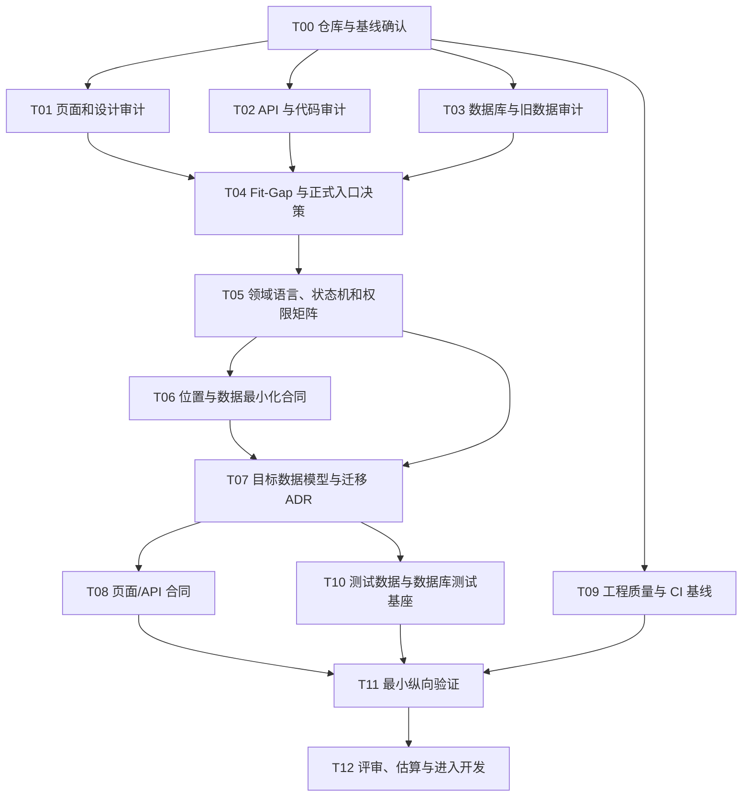

# Petnido 第一批开发任务

> 文档版本：V1.0
>
> 编制日期：2026-08-04
>
> 开发分支：`codex/petnido-v2-development`
>
> 基线提交：`f172180`
>
> 依据：[项目计划书 V2.0](./Petnido网站项目计划书_v2.0.md)、[开发计划书 V1.0](./Petnido开发计划书_v1.0.md)、[完整流程图 Mermaid 源文件 V2.0](./Petnido完整用户操作流程图_v2.0.mmd)

---

## 1. 第一批任务的目标

第一批不是直接全面开发需求、服务、消息和预约页面，而是先建立一套可信的产品—页面—API—数据库基线，并验证新版设计能在目标数据模型上成立。

本批完成后，团队应能够明确回答：

1. 现有每个页面和模块是保留、适配、重构还是重写。
2. 两套需求发布流程中，哪些视觉和交互可以复用，哪个成为正式入口。
3. 现有数据库中的数据是否需要迁移，如何迁移，哪些旧字段停止写入。
4. 新版需求、服务、应聘、预约和消息状态如何流转。
5. 地图位置、宠物资料和服务默认值如何读取、保存及形成快照。
6. 工程是否具备类型检查、测试、迁移验证和持续集成门禁。
7. 后续功能开发能否在不依赖模拟数据的情况下按统一合同推进。

### 1.1 完成定义

第一批只有满足以下条件才算完成：

- 页面、API、数据表和设计稿清单均完成，并有明确责任人。
- 所有 P0 差异都有 `KEEP / ADAPT / REFACTOR / REBUILD` 结论和证据。
- 目标领域模型和迁移方案通过评审，但不要求本批完成全部生产迁移。
- 状态机、权限矩阵、公开数据合同和位置隐私合同冻结。
- CI 能自动执行类型、Lint、单元测试、Prisma 校验和最小 E2E 冒烟。
- 一条最小纵向验证链路通过，证明目标 schema、tRPC、页面和测试可以协同工作。
- 后续迭代任务可以按依赖和验收标准进入开发。

### 1.2 本批不做

- 不完成三类需求和三类服务的全部生产功能。
- 不全面重做现有 UI。
- 不接支付、评价、治理或审核系统。
- 不迁移生产数据库，除非已有正式备份、数据报告和回滚方案。
- 不把现有模拟收藏、消息、通知或预约直接包装成“完成”。

---

## 2. 已确认的产品约束

以下规则是本批设计、审计和技术验证的硬约束：

| 编号 | 决定 | 开发影响 |
|---:|---|---|
| D-01 | 需求结束时间就是需求过期时间 | 所有公开查询、应聘、咨询和匹配统一判断 `endDate > now()` |
| D-02 | 取消已选服务者后保留历史，未结束需求重新公开 | Application 不能覆盖历史；重新应聘产生新 attempt |
| D-03 | 只有寄养服务使用预约容量 | 容量按预约宠物数量计算；上门/自定义不使用宠物数容量 |
| D-04 | 服务暂停不取消历史预约 | 暂停只阻止新预约，已有预约单独处理 |
| D-05 | 批量修改不改预约快照 | 批量操作先显示影响数量，只改当前服务和服务档案默认值 |
| D-06 | 不收集精确家庭地址 | 不保存楼号、楼层、房号；只保存地图经纬度和非精确显示标签 |
| D-07 | 同一业务上下文复用会话 | 咨询升级为应聘/预约时写系统消息，不新建重复会话 |
| D-08 | 有效状态下禁止重复动作 | 取消后可创建新 attempt，历史记录保留 |
| D-09 | 其他应聘显示需求已结束 | 不把未被选中表述为个人能力被拒绝 |
| D-10 | 预算和价格支持固定、区间、面议 | Money schema 和筛选合同必须区分类型 |
| D-11 | 交通/物资费用结构化 | 包含、固定另计、实报、协商分别建模 |
| D-12 | 首发优惠保持简单 | 只做固定说明或数量阶梯，不做优惠码和叠加 |
| D-13 | 宠物健康资料为普通受保护资料 | 可用于相关照护页面；不进入公开摘要、邮件和普通日志 |
| D-14 | 删除账号后必要记录匿名化保留 | 数据模型为后续匿名化预留稳定主体关系 |
| D-15 | 三语使用单一 source locale | CI 检查三语 key 一致性，其他语言人工审核 |
| D-16 | 知识链接记录来源和免责声明 | 首发使用可维护的静态数据源 |
| D-17 | 无公开服务时可保持接单模式 | 公开服务者列表要求至少一项 ACTIVE 服务 |
| D-18 | 服务地点以服务快照为准 | 服务档案位置只作为新服务默认值 |
| D-19 | 业务动作保存内容快照 | 源需求/服务修改后，历史应聘/预约不被篡改 |
| D-20 | P0 草稿仅本地保存 | 统一版本化 localStorage schema，不开发跨设备草稿 |

---

## 3. 执行顺序



建议用时为 10 个工作日；以下估算是人日，不是自然日。页面、API 和数据库审计可以并行。

---

## 4. 任务总览

| ID | 任务 | 建议角色 | 估算 | 依赖 | 优先级 |
|---|---|---|---:|---|---:|
| T00 | 仓库与基线确认 | Tech Lead | 0.5 人日 | 无 | P0 |
| T01 | 页面、路由和设计审计 | 产品 + 前端 + 设计 | 2 人日 | T00 | P0 |
| T02 | API、领域代码和模拟逻辑审计 | 后端 + 前端 | 2 人日 | T00 | P0 |
| T03 | Prisma 与旧数据审计 | 后端/DB | 2 人日 | T00 | P0 |
| T04 | Fit-Gap 结论与正式入口决策 | 产品 + Tech Lead | 1 人日 | T01—T03 | P0 |
| T05 | 领域语言、状态机和权限矩阵 | 产品 + 后端 + 测试 | 2 人日 | T04 | P0 |
| T06 | 地图位置与数据最小化合同 | 前后端 + 产品 | 1 人日 | T05 | P0 |
| T07 | 目标数据模型与迁移 ADR | 后端/DB | 3 人日 | T05、T06 | P0 |
| T08 | 页面、表单和 tRPC 合同 | 前后端 | 2 人日 | T07 | P0 |
| T09 | 脚本、测试与 CI 基线 | Tech Lead/测试 | 2 人日 | T00 | P0 |
| T10 | 测试数据库、种子和 fixtures | 后端/测试 | 1.5 人日 | T07、T09 | P0 |
| T11 | 最小纵向验证 | 全栈 + 测试 | 3 人日 | T08—T10 | P0 |
| T12 | 评审、重新估算与开发准入 | 全员 | 1 人日 | T11 | P0 |

---

## 5. 详细任务

### T00：仓库与基线确认

**目的**：确保后续审计基于稳定分支和可重复环境。

**具体工作**：

- [x] 将现有有效修改建立本地 Git 检查点：`f172180`。
- [x] 创建开发分支：`codex/petnido-v2-development`。
- [x] 从 Git 排除 `.audit/`、`.codex-audit/`、`.codex-qa/`、`.docx-assets/`、字体缓存、`.DS_Store`、`*.tsbuildinfo` 和原型构建产物。
- [ ] 记录 Node、npm、PostgreSQL、Prisma 的实际版本。
- [ ] 检查 `.env.example` 是否覆盖运行所需变量，不提交真实密钥。
- [ ] 在干净安装环境执行 `npm ci`、Prisma generate 和当前 build，记录基线错误。
- [ ] 确认根项目与 `home-visits-prototype` 的边界，原型不得被生产构建意外引用。

**产出物**：

- `docs/audit/environment-baseline.md`
- 更新后的 `.env.example`（如缺失）
- 一份基线 build/test 结果

**验收**：

- 新成员根据文档可以启动项目或明确看到同样的已知阻塞。
- Git 状态不会出现本地 QA 图片、渲染结果、字体缓存和编译缓存。
- 所有已知基线错误都有编号，不在后续任务中被静默忽略。

### T01：页面、路由和设计审计

**目的**：确定当前页面和新版流程的真实对应关系，不以“页面存在”替代“功能完成”。

**具体工作**：

- [ ] 导出 `src/app` 全部路由，记录页面角色、是否登录、入口、下一步和返回路径。
- [ ] 标记页面数据来源：真实 API、静态数据、组件本地 state、localStorage 或 mock。
- [ ] 对首页、公共需求、服务者、需求详情、个人中心、消息、通知、需求发布、服务发布逐页截图核对。
- [ ] 对两套需求发布流程逐步骤比较：字段、顺序、校验、草稿、预览、后端接入和移动端。
- [ ] 记录新版流程缺少的页面：首次引导、位置档案、收藏夹、应聘管理、预约管理、服务公开详情等。
- [ ] 检查所有硬编码中文、英文、日文及混合语言页面。
- [ ] 检查空状态、加载、失败、无权限、过期、暂停和移动端状态。
- [ ] 为每个页面标记 `KEEP / ADAPT / REFACTOR / REBUILD` 候选结论。

**产出物**：

- `docs/audit/page-route-inventory.md`
- `docs/audit/need-flow-comparison.md`
- `docs/audit/missing-screen-list.md`

**验收**：

- 每个正式路由只有一个目标用途。
- 两套需求表单的差异逐字段可追踪。
- 所有 mock 页面和模拟按钮都有明确标记。
- 页面清单可以映射到完整用户流程图的具体节点。

### T02：API、领域代码和模拟逻辑审计

**目的**：确认哪些前端动作已经真实落库，哪些只是界面原型。

**具体工作**：

- [ ] 列出全部 tRPC router/procedure、权限类型、输入输出和调用页面。
- [ ] 识别未注册 router、空 router、注释掉的 API 和未使用 hooks。
- [ ] 检查 `need.getById` 等接口的游客/登录权限是否符合目标。
- [ ] 搜索 `mock`、本地 state 模拟成功、`alert`、`console`、TODO 和未实现跳转。
- [ ] 检查通用 `updateStatus` 是否可能绕过状态机前置条件。
- [ ] 检查文件上传、地理编码、邮箱验证码的错误、限流和环境依赖。
- [ ] 标记重复的 schema、mapper、枚举、金额和日期工具。
- [ ] 为每个 procedure 标记保留、适配、重构或重写。

**产出物**：

- `docs/audit/api-procedure-inventory.md`
- `docs/audit/mock-and-placeholder-register.md`
- `docs/audit/domain-code-duplication.md`

**验收**：

- 页面中的每个关键按钮都能追溯到真实 API 或被明确标为未实现。
- 不再用 UI 已存在推断功能已完成。
- API 清单包含授权、幂等、事务和测试缺口。

### T03：Prisma 与旧数据审计

**目的**：决定旧数据库是迁移、部分迁移还是只保留结构参考。

**具体工作**：

- [ ] 输出所有 Prisma model、enum、relation、unique、index 和 onDelete 策略。
- [ ] 统计各表记录数、空值率、重复率、状态分布和日期范围。
- [ ] 抽样检查 Need、NeedPet、Service、Application、Booking、Message 的真实记录。
- [ ] 确认数据属于生产、测试、演示还是混合数据。
- [ ] 检查 `addressRaw/baseAreaRaw/areaRaw` 是否含楼号、楼层、房号等精确地址文本；报告只给数量和脱敏样例。
- [ ] 检查 Application/Booking 的 Float 金额能否无损迁移为最小货币单位整数。
- [ ] 检查 Booking 缺 `serviceId`、默认 `CONFIRMED` 对旧记录的实际影响。
- [ ] 检查附件孤儿记录、重复归属和临时文件。
- [ ] 形成旧字段到目标字段的初步映射和不可迁移项。

**安全要求**：

- 不在审计 Markdown、终端日志或提交中写入完整地址、邮箱、消息正文或完整坐标。
- 只读执行数据审计；本任务不修改生产数据。

**产出物**：

- `docs/audit/prisma-data-dictionary.md`
- `docs/audit/data-profile-redacted.md`
- `docs/audit/legacy-to-target-mapping.md`

**验收**：

- 对每个旧表给出“保留、迁移、归档、清理”建议。
- 精确地址旧数据有停止写入和后续清理建议。
- 未确认旧数据性质前，不执行破坏性迁移。

### T04：Fit-Gap 结论与正式入口决策

**目的**：把审计证据转成明确开发决定。

**具体工作**：

- [ ] 汇总 T01—T03，逐项更新开发计划书 2.7 和 2.9。
- [ ] 为每个页面、API、数据模型标记 `KEEP / ADAPT / REFACTOR / REBUILD`。
- [ ] 决定正式需求发布入口和旧入口下线方式。
- [ ] 决定公共 URL 是否从 `/public/*` 迁移为 `/needs`、`/services`、`/providers`。
- [ ] 决定现有 Dashboard 页面哪些可继续承载新版个人中心。
- [ ] 建立功能开关清单，定义新旧流程并行和切换条件。
- [ ] 给所有 `REBUILD` 项说明为什么适配成本更高。

**产出物**：

- `docs/decisions/fit-gap-decision-register.md`
- `docs/decisions/route-migration-map.md`
- `docs/decisions/feature-flag-plan.md`

**验收**：

- 每项决定有证据、负责人和目标迭代。
- 不存在两个同时被定义为“正式”的需求发布流程。
- 后续估算不再把模拟交互计为已完成工作量。

### T05：领域语言、状态机和权限矩阵

**目的**：冻结后续前后端共同使用的业务语义。

**具体工作**：

- [ ] 统一命名：`HOME_VISIT / BOARDING / CUSTOM` 与旧枚举映射。
- [ ] 定义 Need、Application、Booking、Service、Conversation 的合法状态与命令。
- [ ] 明确需求 `endDate` 即过期时间，并列出所有受影响的查询和动作。
- [ ] 明确取消已选服务者后保存历史、新建 attempt 的规则。
- [ ] 明确服务暂停、删除、批量更新对历史预约的影响。
- [ ] 明确只有 BOARDING 使用 `maxPetCapacity` 和 `bookedPetCount`。
- [ ] 建立游客、资源所有者、业务对方、无关登录用户的读写权限矩阵。
- [ ] 为非法状态转换定义稳定错误码。
- [ ] 将状态转换先实现为无数据库依赖的纯函数并编写单元测试。

**产出物**：

- `docs/domain/glossary.md`
- `docs/domain/state-machines.md`
- `docs/domain/authorization-matrix.md`
- `src/domain/*/state-machine.ts` 及单元测试

**验收**：

- 页面不能通过传任意 status 绕过状态机。
- “需求结束后是否公开”“预约何时成功”“谁能确认”都有唯一答案。
- 状态机单元测试覆盖所有合法和主要非法转换。

### T06：地图位置与数据最小化合同

**目的**：从数据入口开始保证平台不采集精确家庭地址。

**具体工作**：

- [ ] 定义统一 `MapLocation`：`lat`、`lon`、可选非精确 `regionLabel`、可选显示精度。
- [ ] 明确禁止字段：楼号、楼层、房号、门禁、到达说明和门牌级反向地理编码文本。
- [ ] 设计地图搜索：用户可搜索地区/车站帮助定位，但保存时只提交地图坐标及非精确标签。
- [ ] 移除新目标 schema 中的 `addressRaw/baseAreaRaw/areaRaw` 依赖。
- [ ] 定义个人默认位置、服务档案默认位置、需求位置快照和服务位置快照。
- [ ] 定义公开列表、详情、业务对方和日志分别允许返回的位置字段。
- [ ] 编写 Zod Contract Test，确保请求包含精确地址字段时被拒绝或丢弃。
- [ ] 为旧地址字段制定停止写入、读取隔离和清理顺序。

**产出物**：

- `docs/contracts/location-data-contract.md`
- `src/lib/zod/location.ts`
- 位置请求/响应 Contract Test

**验收**：

- 新表单没有门牌、建筑物、楼层、房号输入框。
- 新 API 和目标数据库模型没有精确地址文本字段。
- 普通日志、邮件和分析事件不包含完整坐标。
- 地图不可用时可以通过区域搜索后选点完成，不退回保存文字地址。

### T07：目标数据模型与迁移 ADR

**目的**：在写新页面和 API 前确定可演进的数据结构。

**具体工作**：

- [ ] 设计 User/Profile、Pet、UserLocation、ServiceProfile 的边界。
- [ ] 设计三类 Need 的主表、模式明细、PetSnapshot、Task 和 LocationSnapshot。
- [ ] 设计三类 Service 的主表、模式明细、PetPolicy、Availability 和价格规则。
- [ ] 设计 Conversation、Participant、Message、Favorite、Application、Booking、Notification 和 Outbox。
- [ ] Booking 必须关联具体 Service；默认状态为 `PENDING`。
- [ ] 只有寄养 Service 有最大宠物容量；Booking 保存预约宠物快照和宠物数。
- [ ] 金额统一为最小货币单位整数，并保存 Currency。
- [ ] 时间统一 UTC + IANA 时区，需求结束时间同时决定过期。
- [ ] 为主要查询设计 unique、index、foreign key 和 onDelete。
- [ ] 设计非破坏性迁移阶段：新增、回填、双读/双写、切换、停止旧写入、清理。
- [ ] 明确旧精确地址文本不迁入新位置模型。

**产出物**：

- `docs/adr/ADR-001-target-domain-model.md`
- `docs/adr/ADR-002-legacy-data-migration.md`
- `docs/domain/target-schema.mmd`
- Prisma schema 草案或独立 RFC diff

**验收**：

- 三种需求和服务可以完整表达，不依赖 JSON 临时兜底完成核心筛选。
- 应聘和预约可以在数据库约束下防重复、保历史。
- 寄养容量可以在并发确认时正确计算。
- 新位置模型无法保存精确地址文本。
- 迁移步骤可回滚应用，不要求破坏性回滚数据库。

### T08：页面、表单和 tRPC 合同

**目的**：让前后端可以按同一输入输出并行开发。

**具体工作**：

- [ ] 为注册/首次引导定义 `returnTo + pendingAction` 合同。
- [ ] 为个人资料、宠物、地图位置和服务档案定义读写 DTO。
- [ ] 为三类需求建立分步表单 schema、步骤条件和发布 command。
- [ ] 为三类服务建立分步表单 schema、步骤条件和发布 command。
- [ ] 为公开列表和详情定义 Public DTO，禁止旧地址文本泄漏。
- [ ] 为 Application、Booking 和 Conversation 定义语义命令 API。
- [ ] 为固定/区间/面议价格及费用规则定义 Money DTO。
- [ ] 为错误码定义三语展示映射和可重试标志。
- [ ] 定义列表的 cursor、排序、筛选 URL 参数和最大 page size。

**产出物**：

- `docs/contracts/page-api-contracts.md`
- `docs/contracts/error-codes.md`
- `src/lib/zod` 目标 schema 草案及测试

**验收**：

- 页面不需要猜测 API 字段或自行改变业务状态。
- 所有 Public DTO 通过数据最小化测试。
- 相同 schema 不在多个页面重复定义。

### T09：工程质量与 CI 基线

**目的**：在大规模重构前建立自动化安全网。

**具体工作**：

- [ ] 在 `package.json` 增加 `lint`、`typecheck`、`test`、`test:integration`、`test:e2e`、`prisma:validate`。
- [ ] 配置 Vitest 单元测试和独立数据库集成测试环境。
- [ ] 配置 Playwright desktop/mobile 冒烟项目。
- [ ] 添加 Prisma generate/schema validate/migration drift 检查。
- [ ] 添加三语 key parity 检查。
- [ ] 添加禁止新提交精确地址字段名或门牌输入文案的检查；允许迁移代码白名单。
- [ ] 添加 GitHub Actions 或当前 CI 平台工作流。
- [ ] 记录现有失败；只允许经过批准的临时基线，不允许静默跳过。

**产出物**：

- 更新后的 `package.json`
- 测试和 CI 配置
- `docs/testing/test-strategy.md`

**验收**：

- 本地与 CI 使用同一命令。
- 一个故意的类型错误、状态机测试失败或 Prisma 错误能阻止合并。
- QA 截图、渲染产物、字体缓存和真实 `.env` 不会进入 Git。

### T10：测试数据库、种子和 fixtures

**目的**：让后续功能可以在稳定、无隐私风险的数据上重复测试。

**具体工作**：

- [ ] 建立独立测试数据库配置和自动清理策略。
- [ ] 创建游客、普通用户、需求发布者、服务者、双角色用户。
- [ ] 为上门、寄养、自定义分别创建公开、匹配、结束、取消测试记录。
- [ ] 创建寄养容量边界数据：有空位、刚好满、并发最后一个位置。
- [ ] 创建有/无服务档案、有/无宠物档案、有/无默认地图位置的用户。
- [ ] 所有位置使用虚构地图坐标，不使用真实家庭地址。
- [ ] 提供固定时钟和 `Asia/Tokyo` 等时区 fixture。

**产出物**：

- 测试 seed/fixture 工具
- `docs/testing/test-fixtures.md`

**验收**：

- 测试可重复执行且相互隔离。
- fixture 能覆盖首次/非首次、结束时间过期、寄养容量和位置档案关键分支。
- 测试数据不包含真实个人信息。

### T11：最小纵向验证

**目的**：在全面开发前验证目标架构，而不是交付完整业务功能。

**验证范围**：选择“上门需求”作为基础链路，同时用一个独立的寄养容量测试验证模式专属规则。

**具体工作**：

- [ ] 登录用户在宠物步骤选择 fixture 宠物。
- [ ] 在地点步骤读取默认地图坐标并允许重新选点。
- [ ] 提交一个最小上门需求到试验 schema/API。
- [ ] 发布事务成功后才更新宠物/位置档案，并保存宠物和位置快照。
- [ ] 公共查询返回该需求，但 `endDate <= now()` 后立即排除。
- [ ] Contract Test 证明请求和响应不含精确地址文本。
- [ ] 建立一个寄养服务及两笔并发预约确认测试，按宠物数量阻止容量超额。
- [ ] 证明状态命令、权限错误和幂等键能正常工作。
- [ ] 验证三语错误映射至少各一条。

**说明**：

该验证可以位于 feature flag 后或测试专用路由，不要求立即替换生产页面。验证结束后，团队根据质量决定保留为正式基础还是清理试验代码。

**产出物**：

- 一条可运行的最小纵向代码链路
- API 集成测试
- 两条 Playwright 冒烟：发布/过期、寄养容量并发
- `docs/validation/vertical-slice-result.md`

**验收**：

- 页面、schema、tRPC、Prisma 和测试使用同一领域定义。
- 发布失败不会产生宠物或位置半成品。
- 需求在结束时间后无需等待定时任务也不会公开。
- 只有寄养服务执行宠物容量检查。
- 不采集或持久化精确地址文本。

### T12：评审、重新估算与开发准入

**目的**：根据证据重新确认后续工期和任务顺序。

**具体工作**：

- [ ] 产品评审页面和领域差距结论。
- [ ] 技术评审目标 schema、迁移和纵向验证结果。
- [ ] 测试评审 P0 场景和质量门禁。
- [ ] 对开发计划的 11 个迭代重新估算。
- [ ] 将 P0 功能拆成可在 1—3 天内完成的看板任务。
- [ ] 给所有未解决 P0 不足指定负责人和截止迭代。
- [ ] 确认是否允许进入“认证与档案”正式开发。

**产出物**：

- `docs/reviews/batch-0-review.md`
- 更新后的开发计划和迭代看板
- Go / Conditional Go / No-Go 结论

**验收**：

- 没有未归属的 P0 冲突。
- 所有后续任务都有依赖、验收和负责角色。
- 只有满足第一批完成定义后才进入大规模功能开发。

---

## 6. 第一批必须建立的测试用例

| ID | 用例 | 预期结果 |
|---|---|---|
| TEST-01 | `endDate` 未来、状态 OPEN | 需求可出现在公开查询 |
| TEST-02 | `endDate` 等于或早于当前时间 | 需求不公开、不咨询、不应聘、不匹配，但个人记录可见 |
| TEST-03 | 上门或自定义预约 | 不读取或扣减宠物容量 |
| TEST-04 | 寄养预约 2 只宠物，剩余容量 2 | 可确认并占满容量 |
| TEST-05 | 两个寄养预约并发抢最后容量 | 只有满足宠物总数上限的一方成功 |
| TEST-06 | 请求包含楼号、楼层或房号字段 | API 拒绝或忽略，数据库不写入 |
| TEST-07 | 地图搜索并选点 | 只保存 lat/lon 和非精确 regionLabel |
| TEST-08 | 发布事务中途失败 | 宠物和默认位置不产生半成品更新 |
| TEST-09 | 取消已选服务者，需求尚未结束 | 旧申请保留，需求重新公开，可创建新 attempt |
| TEST-10 | 暂停有预约的服务 | 既有预约保留，新预约被阻止 |
| TEST-11 | 咨询后发起应聘 | 复用会话并增加系统消息 |
| TEST-12 | 宠物健康信息展示 | 相关档案/需求可见，公开摘要、邮件和日志不可见 |

---

## 7. 第一批结束时的目录建议

```text
docs/
├── adr/
│   ├── ADR-001-target-domain-model.md
│   └── ADR-002-legacy-data-migration.md
├── audit/
│   ├── environment-baseline.md
│   ├── page-route-inventory.md
│   ├── api-procedure-inventory.md
│   ├── prisma-data-dictionary.md
│   └── data-profile-redacted.md
├── contracts/
│   ├── location-data-contract.md
│   ├── page-api-contracts.md
│   └── error-codes.md
├── decisions/
│   ├── fit-gap-decision-register.md
│   ├── route-migration-map.md
│   └── feature-flag-plan.md
├── domain/
│   ├── glossary.md
│   ├── state-machines.md
│   ├── authorization-matrix.md
│   └── target-schema.mmd
├── testing/
│   ├── test-strategy.md
│   └── test-fixtures.md
└── validation/
    └── vertical-slice-result.md
```

审计文档属于可提交的文字产物；本地 QA 截图、渲染文件、字体缓存、真实数据库转储和包含个人信息的日志不得提交。

---

## 8. 开发准入检查表

- [ ] 现有页面、API、数据库和设计已完成证据化盘点。
- [ ] 两套需求发布流程已确定唯一正式入口。
- [ ] 所有 P0 项有复用/重构/重写结论。
- [ ] 需求结束时间过期规则已通过单元与集成测试。
- [ ] 只有寄养服务使用按宠物数计算的容量。
- [ ] 新位置合同完全排除精确家庭地址文本。
- [ ] 宠物健康资料的展示和排除范围已进入 API 合同。
- [ ] 状态机和权限矩阵已冻结。
- [ ] 目标数据模型和迁移 ADR 已评审。
- [ ] CI 和测试数据库可以稳定运行。
- [ ] 最小纵向验证通过。
- [ ] 本地 QA/渲染/字体缓存未进入 Git。
- [ ] 后续迭代已根据审计结果重新估算。
