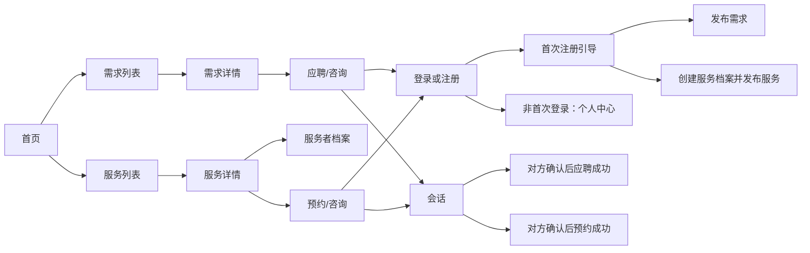

# T01 页面与路由清单

审计日期：2026-08-04
审计范围：`src/app`、页面直接依赖的组件、登录回跳逻辑。

## 1. 当前页面清单

| 区域 | 路由 | 当前实现 | 目标判断 |
|---|---|---|---|
| 首页 | `/`、`/home-v2` | 两套首页入口 | REFACTOR：合并为唯一正式首页 |
| 类型说明 | `/care-types`、`/care-types/home-visits`、`/care-types/boarding`、`/care-types/custom` | 已有介绍页 | REUSE：补齐三语言和统一术语 |
| 使用说明 | `/how-it-works`、`/how-it-works/needs`、`/how-it-works/services` | 已有说明页 | REUSE |
| 需求浏览 | `/public/needs` | 有列表和筛选 UI | REFACTOR：正式路径迁至 `/needs`，补全游标、时间和状态过滤 |
| 需求详情 | `/public/needs/[id]`、拦截式弹窗 | 有详情 | REFACTOR：详情读取应允许游客；交互必须接入后端 |
| 服务者浏览 | `/public/sitters` | 仅骨架和筛选框 | REBUILD |
| 引导发布需求 | `/needs/create`、`/needs/create/preview` | 三类需求表单较完整，草稿存本地 | REFACTOR：作为正式发布体验，接入持久化 |
| 旧版发布需求 | `/dashboard/needs/new` | 已接 `createNeed`，字段较少 | RETIRE：短期保留作为回退，不继续扩展 |
| 需求管理 | `/dashboard/needs`、`/[id]/edit` | 有列表和编辑 | REFACTOR：统一模型和权限 |
| 个人中心 | `/dashboard` | 有概览 | REFACTOR：非首次登录直接进入，不弹消息引导 |
| 服务档案 | `/dashboard/serviceprofile`、`/edit` | 有开关和基础字段 | REFACTOR：补充首次开通引导、批量操作和目标地址契约 |
| 服务发布/编辑 | `/dashboard/serviceprofile/services/new`、`/[id]/edit` | 有旧模型表单 | REFACTOR：拆分三模式并读取服务档案默认值 |
| 消息 | `/dashboard/messages` | 纯模拟数据 | REBUILD |
| 匹配 | `/dashboard/matches` | 模拟数据且残留 `test` | REBUILD |
| 通知 | `/dashboard/notifications` | 占位页 | REBUILD |
| 设置 | `/dashboard/settings` | 本地状态和模拟保存 | REBUILD |
| 邮箱验证 | `/auth/verify` | 主体逻辑被注释 | REBUILD |

## 2. 目标新增页面

| 目标路由 | 页面职责 | 优先级 |
|---|---|---|
| `/onboarding/profile` | 首次注册头像、昵称 | P0 |
| `/onboarding/intent` | 选择发布需求或提供服务 | P0 |
| `/needs`、`/needs/[id]` | 游客可访问的需求列表与详情 | P0 |
| `/services`、`/services/[id]` | 游客可访问的服务列表与详情 | P0 |
| `/providers/[id]` | 服务者公开档案与服务集合 | P0 |
| `/applications`、`/applications/[id]` | 应聘发起、处理和状态 | P0 |
| `/bookings`、`/bookings/[id]` | 预约确认、撤销、容量和状态 | P0 |
| `/messages/[conversationId]` | 真实会话 | P0 |
| `/favorites` | 含已过期需求的收藏夹 | P1 |
| `/profile`、`/profile/pets`、`/profile/locations` | 用户资料、宠物、地图位置 | P0 |
| `/knowledge`、`/knowledge/[category]` | 按宠物和事项分类的外链知识库 | P1 |

## 3. 核心页面关系

## 4. 自验收

- [x] 枚举了所有现存 `page.tsx` 对应的业务页面。
- [x] 标出了重复入口、占位页面和缺失页面。
- [x] 每个页面给出 REUSE / REFACTOR / REBUILD / RETIRE 判断。
- [x] 页面关系覆盖游客、首次注册、非首次登录、应聘与预约主路径。

**T01 页面清单验收结论：通过。**
