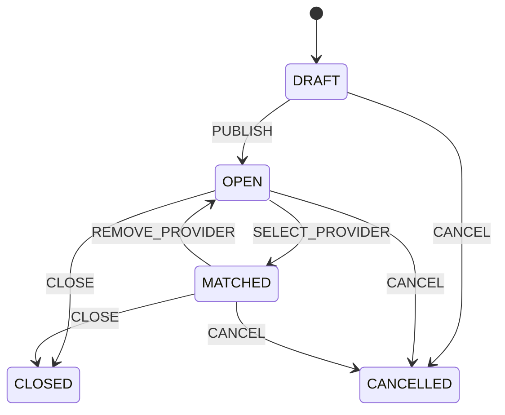

# T05 领域状态机

## Need

`EXPIRED` 不入库：任意读取时以 `endDate <= now` 推导。只有 `OPEN && endDate > now` 可公开、咨询、应聘和参与匹配。移除已选服务者时保留原 Application/Booking 历史，尚未过期才重新公开，新应聘创建新 attempt。

## Application

PENDING 可由需求所有者 ACCEPT/DECLINE、由应聘者 CANCEL，或随需求结束变为 NEED_ENDED。ACCEPTED 可被取消或随需求结束；其他终态不可逆。其他候选收到 NEED_ENDED，不使用带有个人否定含义的拒绝文案。

## Booking

PENDING 经服务提供者 CONFIRM 后才是预约成功；也可 REJECT/CANCEL。CONFIRMED 可 COMPLETE/CANCEL。服务暂停只阻止新请求，不改变已有 Booking。

## Service

DRAFT→ACTIVE；ACTIVE 可 PAUSE 或 ARCHIVE；PAUSED 可 RESUME 或 ARCHIVE。删除对应 ARCHIVE，历史预约及快照保留。

## Conversation

同一参与方和业务上下文使用一个 ACTIVE 会话；咨询升级为应聘/预约时写 SYSTEM 消息。用户归档后可 REOPEN，不物理删除消息。

## 稳定错误码

- `INVALID_STATE_TRANSITION`
- `NEED_EXPIRED`
- `NEED_NOT_OPEN`
- `DUPLICATE_ACTIVE_ATTEMPT`
- `SERVICE_NOT_ACTIVE`
- `BOARDING_CAPACITY_EXCEEDED`
- `FORBIDDEN_RESOURCE_ACTION`
- `CONFLICTING_UPDATE`

## 自验收

- [x] Need、Application、Booking、Service、Conversation 均有合法命令定义。
- [x] 过期、撤销匹配、暂停服务、重复 attempt 和寄养容量规则明确。
- [x] 代码实现不提供任意 `updateStatus(status)` 入口。

**T05 状态机验收结论：通过。**
